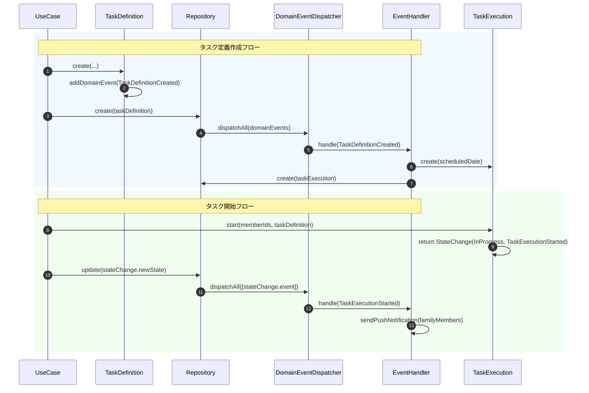

# ドメインモデル

## 概要

本ドキュメントは、家事タスク管理アプリケーション「Housework」のドメインモデルを定義します。
DDDの戦術的パターン（Entity、Value Object、Aggregate、Domain Event、Domain Service）を活用した設計です。

---

## 集約（Aggregate）一覧

```mermaid
classDiagram
    namespace MemberAggregate {
        class Member {
            <<Aggregate Root>>
            +MemberId id
            +MemberName name
            +MemberEmail email
            +FamilyRole familyRole
            +PasswordHash password
            +create(name, email, familyRole, password, existingMembersName)
            +reconstruct(id, name, email, familyRole, password)
            +updateName(newName, existingMembersName)
            +updateEmail(newEmail)
            +updateFamilyRole(newRole)
        }

        class MemberId { <<Value Object>> +UUID value }
        class MemberName { <<Value Object>> +String value }
        class MemberEmail { <<Value Object>> +String value }
        class PasswordHash { <<Value Object>> +String value }
        class PlainPassword { <<Value Object>> +String value }
        class FamilyRole { <<Enum>> FATHER MOTHER SISTER BROTHER }
    }

    Member *-- MemberId
    Member *-- MemberName
    Member *-- MemberEmail
    Member *-- PasswordHash
    Member *-- FamilyRole

    namespace TaskDefinitionAggregate {
        class TaskDefinition {
            <<Aggregate Root / extends AggregateRoot>>
            +TaskDefinitionId id
            +TaskDefinitionName name
            +TaskDefinitionDescription description
            +ScheduledTimeRange scheduledTimeRange
            +TaskScope scope
            +MemberId ownerMemberId
            +TaskSchedule schedule
            +Int version
            +Boolean isDeleted
            +Int point
            +create(...) TaskDefinition
            +reconstruct(...) TaskDefinition
            +update(...) TaskDefinition
            +delete() TaskDefinition
        }

        class TaskDefinitionId { <<Value Object>> +UUID value }
        class TaskDefinitionName { <<Value Object>> +String value }
        class TaskDefinitionDescription { <<Value Object>> +String value }
        class ScheduledTimeRange {
            <<Value Object>>
            +Instant startTime
            +Instant endTime
            +durationMinutes: Int
        }

        class TaskSchedule { <<Sealed Class>> +isShouldCarryOut(date) Boolean }
        class Recurring { +RecurrencePattern pattern +LocalDate startDate +LocalDate endDate }
        class OneTime { +LocalDate deadline }

        class RecurrencePattern { <<Sealed Class>> +matchesDate(date) Boolean }
        class Daily { +Boolean skipWeekends }
        class Weekly { +DayOfWeek dayOfWeek }
        class Monthly { +Int dayOfMonth }

        class TaskScope { <<Enum>> FAMILY PERSONAL }
    }

    TaskDefinition *-- TaskDefinitionId
    TaskDefinition *-- TaskDefinitionName
    TaskDefinition *-- TaskDefinitionDescription
    TaskDefinition *-- ScheduledTimeRange
    TaskDefinition *-- TaskSchedule
    TaskSchedule <|-- Recurring
    TaskSchedule <|-- OneTime
    Recurring *-- RecurrencePattern
    RecurrencePattern <|-- Daily
    RecurrencePattern <|-- Weekly
    RecurrencePattern <|-- Monthly

    namespace TaskExecutionAggregate {
        class TaskExecution {
            <<Sealed Class / Aggregate Root>>
            +TaskExecutionId id
            +TaskDefinitionId taskDefinitionId
            +Instant scheduledDate
            +List~MemberId~ assigneeMemberIds
        }

        class NotStarted {
            +start(memberIds, taskDefinition) StateChange~InProgress~
            +cancel(taskDefinition) StateChange~Cancelled~
        }

        class InProgress {
            +TaskSnapshot taskSnapshot
            +Instant startedAt
            +complete(definitionIsDeleted) StateChange~Completed~
            +cancel(definitionIsDeleted) StateChange~Cancelled~
        }

        class Completed {
            +TaskSnapshot taskSnapshot
            +Instant startedAt
            +Instant completedAt
            +Int earnedPoint
        }

        class Cancelled {
            +TaskSnapshot? taskSnapshot
            +Instant? startedAt
            +Instant cancelledAt
        }

        class TaskSnapshot {
            <<Value Object>>
            +TaskDefinitionName frozenName
            +TaskDefinitionDescription frozenDescription
            +ScheduledTimeRange frozenScheduledTimeRange
            +Int frozenPoint
            +Int definitionVersion
            +Instant capturedAt
        }

        class StateChange~T~ {
            <<Generic Class>>
            +T newState
            +TaskExecutionEvent event
        }
    }

    TaskExecution <|-- NotStarted
    TaskExecution <|-- InProgress
    TaskExecution <|-- Completed
    TaskExecution <|-- Cancelled

    InProgress *-- TaskSnapshot
    Completed *-- TaskSnapshot

    TaskExecution ..> TaskDefinition : taskDefinitionId
    TaskExecution ..> Member : assigneeMemberIds
    TaskDefinition ..> Member : ownerMemberId
```



---

## 1. Member集約

### 概要
家族メンバーを表現する集約。認証情報（パスワードハッシュ）を含む。

### 構成要素

| 要素 | 種類 | 説明 |
|------|------|------|
| `Member` | Entity (Aggregate Root) | メンバーエンティティ |
| `MemberId` | Value Object | UUIDベースの識別子 |
| `MemberName` | Value Object | メンバー名（一意制約） |
| `MemberEmail` | Value Object | メールアドレス（正規表現検証） |
| `PasswordHash` | Value Object | BCryptハッシュ化済みパスワード |
| `PlainPassword` | Value Object | 平文パスワード（5〜72文字） |
| `FamilyRole` | Enum | 家族内の役割 |

### 不変条件（Invariants）

```kotlin
require(value.isNotBlank()) { "Member name cannot be blank" }

private val EMAIL_REGEX = "^[A-Za-z0-9+_.-]+@[A-Za-z0-9.-]+$".toRegex()
require(value.isNotBlank() && EMAIL_REGEX.matches(value))

require(value.length >= 5) { "パスワードは5文字以上" }
require(value.length <= 72) { "パスワードは72文字以下" }

require(existingMembersName.none { it.value == name.value }) {
    "既存のユーザ名と重複しています"
}
```

### ファクトリメソッド

```kotlin
fun create(
    name: MemberName,
    email: MemberEmail,
    familyRole: FamilyRole,
    password: PasswordHash,
    existingMembersName: List<MemberName>
): Member

fun reconstruct(
    id: MemberId,
    name: MemberName,
    email: MemberEmail,
    familyRole: FamilyRole,
    password: PasswordHash
): Member
```

---

## 2. TaskDefinition集約

### 概要
タスクのテンプレート/カタログを表現する集約。定期タスクまたは単発タスクのスケジュールを持つ。
`AggregateRoot`を継承し、ドメインイベントの蓄積機能を持つ。

### 構成要素

| 要素 | 種類 | 説明 |
|------|------|------|
| `TaskDefinition` | Entity (Aggregate Root) | タスク定義エンティティ |
| `TaskDefinitionId` | Value Object | UUIDベースの識別子 |
| `TaskDefinitionName` | Value Object | タスク名 |
| `TaskDefinitionDescription` | Value Object | タスク説明 |
| `ScheduledTimeRange` | Value Object | 実行予定時間範囲 |
| `TaskSchedule` | Sealed Class | スケジュール（Recurring/OneTime） |
| `RecurrencePattern` | Sealed Class | 繰り返しパターン（Daily/Weekly/Monthly） |
| `TaskScope` | Enum | FAMILY（全員）/ PERSONAL（個人） |

### 不変条件（Invariants）

```kotlin
require(startTime < endTime) {
    "開始時間は終了時間より前である必要があります"
}

init {
    if (scope == TaskScope.PERSONAL) {
        require(ownerMemberId != null) {
            "個人タスクにはオーナーIDが必須です。"
        }
    }
}

require(dayOfMonth in 1..28) {
    "dayOfMonthは1以上28以下である必要があります"
}
```

### スケジュール判定ロジック

```kotlin
sealed class TaskSchedule {
    abstract fun isShouldCarryOut(date: LocalDate): Boolean
}

data class Recurring(
    val pattern: RecurrencePattern,
    val startDate: LocalDate,
    val endDate: LocalDate?
) : TaskSchedule() {
    override fun isShouldCarryOut(date: LocalDate): Boolean {
        if (date < startDate) return false
        if (endDate != null && date > endDate) return false
        return pattern.matchesDate(date)
    }
}

sealed class RecurrencePattern {
    abstract fun matchesDate(date: LocalDate): Boolean

    data class Daily(val skipWeekends: Boolean) : RecurrencePattern() {
        override fun matchesDate(date: LocalDate): Boolean {
            if (skipWeekends) {
                return date.dayOfWeek != DayOfWeek.SATURDAY &&
                       date.dayOfWeek != DayOfWeek.SUNDAY
            }
            return true
        }
    }

    data class Weekly(val dayOfWeek: DayOfWeek) : RecurrencePattern() {
        override fun matchesDate(date: LocalDate): Boolean {
            return date.dayOfWeek == dayOfWeek
        }
    }

    data class Monthly(val dayOfMonth: Int) : RecurrencePattern() {
        override fun matchesDate(date: LocalDate): Boolean {
            return date.dayOfMonth == dayOfMonth
        }
    }
}
```

### ドメインイベント発行

```kotlin
fun delete(): TaskDefinition {
    val deleted = this.copy(isDeleted = true)
    deleted.addDomainEvent(
        TaskDefinitionDeleted(
            taskDefinitionId = this.id,
            name = this.name,
        )
    )
    return deleted
}
```

---

## 3. TaskExecution集約（状態機械）

### 概要
タスクの実行インスタンスを表現する集約。**Sealed Classによる型安全な状態機械**を実装。
状態遷移時に`StateChange<T>`を返し、新しい状態とドメインイベントをペアで提供する。

### 状態遷移図

```
┌─────────────┐
│  NotStarted │
└──────┬──────┘
       │
       ├──── start(memberIds, taskDefinition) ───► InProgress
       │                                              │
       │                                              ├── complete() ──► Completed
       │                                              │
       │                                              └── cancel() ───► Cancelled
       │
       └──── cancel(taskDefinition) ─────────────────► Cancelled
```

### 状態別の構造と不変条件

#### NotStarted（未開始）
```kotlin
data class NotStarted(
    override val id: TaskExecutionId,
    override val taskDefinitionId: TaskDefinitionId,
    override val scheduledDate: Instant,
    override val assigneeMemberIds: List<MemberId> = emptyList()
) : TaskExecution() {
    fun start(memberIds: List<MemberId>, taskDefinition: TaskDefinition): StateChange<InProgress>
    fun cancel(taskDefinition: TaskDefinition): StateChange<Cancelled>
}
```

#### InProgress（進行中）
```kotlin
data class InProgress(
    override val id: TaskExecutionId,
    override val taskDefinitionId: TaskDefinitionId,
    override val scheduledDate: Instant,
    override val assigneeMemberIds: List<MemberId>,
    val taskSnapshot: TaskSnapshot,
    val startedAt: Instant
) : TaskExecution() {
    init {
        require(assigneeMemberIds.isNotEmpty()) {
            "進行中タスクには担当者が1人以上必要です。"
        }
    }

    fun complete(definitionIsDeleted: Boolean): StateChange<Completed>
    fun cancel(definitionIsDeleted: Boolean): StateChange<Cancelled>
}
```

#### Completed（完了）
```kotlin
data class Completed(
    override val id: TaskExecutionId,
    override val taskDefinitionId: TaskDefinitionId,
    override val scheduledDate: Instant,
    override val assigneeMemberIds: List<MemberId>,
    val taskSnapshot: TaskSnapshot,
    val startedAt: Instant,
    val completedAt: Instant,
    val earnedPoint: Int
) : TaskExecution() {
    init {
        require(startedAt.isBefore(completedAt)) {
            "完了日時は開始日時より後である必要があります。"
        }
        require(assigneeMemberIds.isNotEmpty()) {
            "完了タスクには担当者が1人以上必要です。"
        }
    }
}
```

#### Cancelled（キャンセル）
```kotlin
data class Cancelled(
    override val id: TaskExecutionId,
    override val taskDefinitionId: TaskDefinitionId,
    override val scheduledDate: Instant,
    override val assigneeMemberIds: List<MemberId>,
    val taskSnapshot: TaskSnapshot?,
    val startedAt: Instant?,
    val cancelledAt: Instant
) : TaskExecution()
```

### StateChangeパターン

```kotlin
data class StateChange<out T : TaskExecution>(
    val newState: T,
    val event: TaskExecutionEvent
)

fun start(memberIds: List<MemberId>, taskDefinition: TaskDefinition): StateChange<InProgress> {
    val snapshot = TaskSnapshot.create(taskDefinition)
    val now = Instant.now()

    return StateChange(
        newState = InProgress(
            id = this.id,
            taskDefinitionId = this.taskDefinitionId,
            scheduledDate = this.scheduledDate,
            assigneeMemberIds = memberIds,
            taskSnapshot = snapshot,
            startedAt = now
        ),
        event = TaskExecutionStarted(
            taskExecutionId = this.id,
            assigneeMemberIds = memberIds,
            taskName = snapshot.frozenName,
            occurredAt = now,
            taskScope = taskDefinition.scope
        )
    )
}
```

### ポイント按分ロジック

```kotlin
fun complete(definitionIsDeleted: Boolean): StateChange<Completed> {
    val now = Instant.now()
    val earnedPointPerMember = taskSnapshot.frozenPoint / assigneeMemberIds.size

    return StateChange(
        newState = Completed(
            earnedPoint = earnedPointPerMember
        ),
        event = TaskExecutionCompleted(...)
    )
}
```

---

## 4. ドメインイベント

### イベント基盤

```kotlin
interface DomainEvent {
    val occurredAt: Instant
}

interface DomainEventDispatcher {
    fun dispatchAll(events: List<DomainEvent>, session: DSLContext)
}

interface DomainEventHandler<E: DomainEvent> {
    val eventType: Class<E>
    fun handle(event: E, session: DSLContext)
}
```

### AggregateRoot基底クラス

```kotlin
abstract class AggregateRoot {
    private val _domainEvents = mutableListOf<DomainEvent>()

    val domainEvents: List<DomainEvent>
        get() = _domainEvents.toList()

    protected fun addDomainEvent(event: DomainEvent) {
        _domainEvents.add(event)
    }

    fun clearDomainEvents() {
        _domainEvents.clear()
    }
}
```

### TaskDefinition関連イベント

#### TaskDefinitionCreated
```kotlin
data class TaskDefinitionCreated(
    val taskDefinitionId: TaskDefinitionId,
    val name: TaskDefinitionName,
    val description: TaskDefinitionDescription,
    val scheduledTimeRange: ScheduledTimeRange,
    val scope: TaskScope,
    val ownerMemberId: MemberId? = null,
    val schedule: TaskSchedule,
    override val occurredAt: Instant = Instant.now()
): DomainEvent
```

**発行タイミング**: `TaskDefinition.create()`
**ハンドラー**: `CreateTaskExecutionOnTaskDefinitionCreatedHandler`
- 今日実行対象であれば`TaskExecution.NotStarted`を自動生成

#### TaskDefinitionDeleted
```kotlin
data class TaskDefinitionDeleted(
    val taskDefinitionId: TaskDefinitionId,
    val name: TaskDefinitionName,
    val description: TaskDefinitionDescription,
    val scheduledTimeRange: ScheduledTimeRange,
    val scope: TaskScope,
    val ownerMemberId: MemberId? = null,
    val schedule: TaskSchedule,
    override val occurredAt: Instant = Instant.now()
): DomainEvent
```

**発行タイミング**: `TaskDefinition.delete()`、`CompleteTaskExecutionUseCase`（OneTime完了時）
**ハンドラー**: `TaskDefinitionDeletedHandler`
- 未完了の`TaskExecution`（NotStarted/InProgress）を一括キャンセル

### TaskExecution関連イベント

```kotlin
sealed interface TaskExecutionEvent: DomainEvent {
    val taskExecutionId: TaskExecutionId
    val taskName: TaskDefinitionName
}
```

#### TaskExecutionCreated
```kotlin
data class TaskExecutionCreated(
    override val taskExecutionId: TaskExecutionId,
    override val taskName: TaskDefinitionName,
    override val occurredAt: Instant
) : TaskExecutionEvent
```

**発行タイミング**: `TaskExecution.create()`

#### TaskExecutionStarted
```kotlin
data class TaskExecutionStarted(
    override val taskExecutionId: TaskExecutionId,
    val assigneeMemberIds: List<MemberId>,
    override val taskName: TaskDefinitionName,
    override val occurredAt: Instant,
    val taskScope: TaskScope
) : TaskExecutionEvent
```

**発行タイミング**: `NotStarted.start()`
**ハンドラー**: `FamilyTaskStartedPushNotificationHandler`
- FAMILYスコープの場合、他の家族メンバーにPush通知

#### TaskExecutionCompleted
```kotlin
data class TaskExecutionCompleted(
    override val taskExecutionId: TaskExecutionId,
    val assigneeMemberIds: List<MemberId>,
    override val taskName: TaskDefinitionName,
    override val occurredAt: Instant,
    val taskScope: TaskScope
) : TaskExecutionEvent
```

**発行タイミング**: `InProgress.complete()`
**ハンドラー**: `FamilyTaskCompletedPushNotificationHandler`
- FAMILYスコープの場合、他の家族メンバーにPush通知

#### TaskExecutionCancelled
```kotlin
data class TaskExecutionCancelled(
    override val taskExecutionId: TaskExecutionId,
    override val taskName: TaskDefinitionName,
    override val occurredAt: Instant
) : TaskExecutionEvent
```

**発行タイミング**: `NotStarted.cancel()`、`InProgress.cancel()`

### イベントフロー図



---

## 5. ドメインサービス

### TaskGenerationService

```kotlin
@ImplementedBy(TaskGenerationServiceImpl::class)
interface TaskGenerationService {
    fun generateDailyTaskExecution(
        today: LocalDate,
        session: DSLContext
    ): List<TaskExecution.NotStarted>
}
```

**責務**:
- 毎日のスケジューラーから呼び出される
- アクティブな`TaskDefinition`から該当日のタスクを特定
- `isShouldCarryOut(today)`で実行対象か判定
- 重複を避けて`TaskExecution.NotStarted`を生成

**設計意図**:
- ドメイン層にはインターフェースのみ配置
- 実装（DBアクセス含む）はユースケース層の`TaskGenerationServiceImpl`に配置
- ドメイン層の純粋性を保つ

### TaskDefinitionAuthService

```kotlin
@ImplementedBy(TaskDefinitionAuthServiceImpl::class)
interface TaskDefinitionAuthService {
    fun canEdit(taskDefinition: TaskDefinition, memberId: MemberId): Boolean
    fun canDelete(taskDefinition: TaskDefinition, memberId: MemberId): Boolean

    fun requireEditPermission(taskDefinition: TaskDefinition, memberId: MemberId)
    fun requireDeletePermission(taskDefinition: TaskDefinition, memberId: MemberId)
}
```

**責務**:
- タスク定義の編集/削除権限を判定
- ビジネスルール:
  - `PERSONAL`スコープ: オーナーのみ編集・削除可能
  - `FAMILY`スコープ: 全員編集・削除可能

---

## 6. 値オブジェクトのバリデーション一覧

| 値オブジェクト | バリデーション | 型 |
|---|---|---|
| `MemberId` | なし（UUID生成） | `@JvmInline value class` |
| `MemberName` | `isNotBlank()` | `data class` |
| `MemberEmail` | `isNotBlank()` + 正規表現 | `@JvmInline value class` |
| `PlainPassword` | 5〜72文字 | `@JvmInline value class` |
| `PasswordHash` | `isNotBlank()` | `@JvmInline value class` |
| `TaskDefinitionId` | なし（UUID生成） | `@JvmInline value class` |
| `TaskDefinitionName` | `isNotBlank()` | `data class` |
| `TaskDefinitionDescription` | なし | `data class` |
| `ScheduledTimeRange` | `startTime < endTime` | `data class` |
| `RecurrencePattern.Monthly` | `dayOfMonth in 1..28` | `sealed class` |
| `TaskExecutionId` | なし（UUID生成） | `@JvmInline value class` |

---

## 7. タイムゾーン設定

```kotlin
object AppTimeZone {
    val ZONE: ZoneId = ZoneId.of("Asia/Tokyo")
}
```

**目的**:
- 日本国内のアプリケーション向け
- Docker/クラウド環境でのUTC誤解を回避
- スケジューラーや日付計算で一貫性を確保

---

## 8. Mail（インフラ層境界のドメインオブジェクト）

```kotlin
data class Mail(
    val to: MemberEmail,
    val subject: String,
    val body: String
) {
    init {
        require(subject.isNotBlank()) { "メールの件名は必須です" }
        require(body.isNotBlank()) { "メールの本文は必須です" }
        require(subject.length <= 255) { "件名は255文字以内で入力してください" }
    }
}

interface MailSender {
    fun send(mail: Mail)
    fun sendMultiple(mails: List<Mail>)
}
```

---

## 9. リポジトリインターフェース

### MemberRepository
```kotlin
interface MemberRepository {
    fun create(member: Member, session: DSLContext): Member
    fun update(member: Member, session: DSLContext): Member
    fun findById(id: MemberId, session: DSLContext): Member?
    fun findByName(name: MemberName, session: DSLContext): Member?
    fun findAll(session: DSLContext): List<Member>
    fun findAllNames(session: DSLContext): List<MemberName>
    fun findByIds(ids: List<MemberId>, session: DSLContext): List<Member>
}
```

### TaskDefinitionRepository
```kotlin
interface TaskDefinitionRepository {
    fun create(taskDefinition: TaskDefinition, session: DSLContext): TaskDefinition
    fun update(taskDefinition: TaskDefinition, session: DSLContext): TaskDefinition
    fun findById(id: TaskDefinitionId, session: DSLContext): TaskDefinition?
    fun findAllActiveTaskDefinition(today: LocalDate, session: DSLContext): List<TaskDefinition>
    fun findByIds(ids: List<TaskDefinitionId>, session: DSLContext): List<TaskDefinition>
    fun count(session: DSLContext): Int
    fun findAll(limit: Int, offset: Int, session: DSLContext): List<TaskDefinition>
}
```

### TaskExecutionRepository
```kotlin
interface TaskExecutionRepository {
    fun create(taskExecution: TaskExecution, session: DSLContext): TaskExecution
    fun update(taskExecution: TaskExecution, session: DSLContext): TaskExecution
    fun findById(id: TaskExecutionId, session: DSLContext): TaskExecution?
    fun findByDefinitionAndDate(defId: TaskDefinitionId, date: LocalDate, session: DSLContext): TaskExecution?
    fun findByDefinitionId(defId: TaskDefinitionId, session: DSLContext): List<TaskExecution>
}
```

---

## 10. 設計原則まとめ

| 原則 | 適用状況 |
|------|----------|
| **Aggregate Root経由のアクセス** | ✅ 外部からはRoot経由でのみ操作 |
| **不変条件の強制** | ✅ init ブロック、ファクトリメソッドで検証 |
| **値オブジェクトの不変性** | ✅ `val`プロパティ、`data class`/`value class` |
| **ID参照による集約間関係** | ✅ `MemberId`、`TaskDefinitionId`で参照 |
| **ドメインイベント** | ✅ 状態遷移時にイベント発行 |
| **Sealed Classによる型安全性** | ✅ TaskExecution、TaskSchedule、RecurrencePattern |
| **ファクトリメソッド** | ✅ `create()`と`reconstruct()`の分離 |
