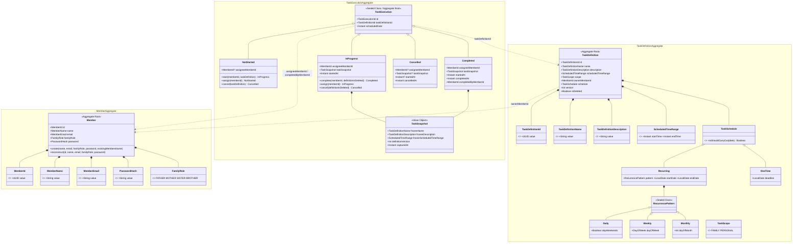

# ドメインモデル

```mermaid
classDiagram
    %% ==========================================================
    %% 1. Member集約
    %% ==========================================================
    namespace MemberAggregate {
        class Member {
            <<Aggregate Root>>
            +MemberId id
            +MemberName name
            +MemberEmail email
            +FamilyRole familyRole
            +PasswordHash password
            +create(name, email, familyRole, password, existingMembersName)
            +reconstruct(id, name, email, familyRole, password)
        }

        class MemberId { <<Value Object>> +UUID value }
        class MemberName { <<Value Object>> +String value }
        class MemberEmail { <<Value Object>> +String value }
        class PasswordHash { <<Value Object>> +String value }
        class FamilyRole { <<Enum>> FATHER MOTHER SISTER BROTHER }
    }

    Member *-- MemberId
    Member *-- MemberName
    Member *-- MemberEmail
    Member *-- PasswordHash
    Member *-- FamilyRole

    %% ==========================================================
    %% 2. TaskDefinition集約
    %% ==========================================================
    namespace TaskDefinitionAggregate {
        class TaskDefinition {
            <<Aggregate Root>>
            +TaskDefinitionId id
            +TaskDefinitionName name
            +TaskDefinitionDescription description
            +ScheduledTimeRange scheduledTimeRange
            +TaskScope scope
            +MemberId ownerMemberId
            +TaskSchedule schedule
            +Int version
            +Boolean isDeleted
        }

        class TaskDefinitionId { <<Value Object>> +UUID value }
        class TaskDefinitionName { <<Value Object>> +String value }
        class TaskDefinitionDescription { <<Value Object>> +String value }
        class ScheduledTimeRange { <<Value Object>> +Instant startTime +Instant endTime }

        class TaskSchedule { <<Sealed Class>> +isShouldCarryOut(date) Boolean }
        class Recurring { +RecurrencePattern pattern +LocalDate startDate +LocalDate endDate }
        class OneTime { +LocalDate deadline }

        class RecurrencePattern { <<Sealed Class>> }
        class Daily { +Boolean skipWeekends }
        class Weekly { +DayOfWeek dayOfWeek }
        class Monthly { +Int dayOfMonth }

        class TaskScope { <<Enum>> FAMILY PERSONAL }
    }

    TaskDefinition *-- TaskDefinitionId
    TaskDefinition *-- TaskDefinitionName
    TaskDefinition *-- TaskDefinitionDescription
    TaskDefinition *-- ScheduledTimeRange
    TaskDefinition *-- TaskSchedule
    TaskSchedule <|-- Recurring
    TaskSchedule <|-- OneTime
    Recurring *-- RecurrencePattern
    RecurrencePattern <|-- Daily
    RecurrencePattern <|-- Weekly
    RecurrencePattern <|-- Monthly

    %% ==========================================================
    %% 3. TaskExecution集約
    %% ==========================================================
    namespace TaskExecutionAggregate {
        class TaskExecution {
            <<Sealed Class / Aggregate Root>>
            +TaskExecutionId id
            +TaskDefinitionId taskDefinitionId
            +Instant scheduledDate
        }

        class NotStarted {
            +MemberId? assigneeMemberId
            +start(memberId, taskDefinition) InProgress
            +assign(memberId) NotStarted
            +cancel(taskDefinition) Cancelled
        }

        class InProgress {
            +MemberId assigneeMemberId
            +TaskSnapshot taskSnapshot
            +Instant startedAt
            +complete(memberId, definitionIsDeleted) Completed
            +assign(memberId) InProgress
            +cancel(definitionIsDeleted) Cancelled
        }

        class Completed {
            +MemberId assigneeMemberId
            +TaskSnapshot taskSnapshot
            +Instant startedAt
            +Instant completedAt
            +MemberId completedByMemberId
        }

        class Cancelled {
            +MemberId? assigneeMemberId
            +TaskSnapshot? taskSnapshot
            +Instant? startedAt
            +Instant cancelledAt
        }

        class TaskSnapshot {
            <<Value Object>>
            +TaskDefinitionName frozenName
            +TaskDefinitionDescription frozenDescription
            +ScheduledTimeRange frozenScheduledTimeRange
            +Int definitionVersion
            +Instant capturedAt
        }
    }

    TaskExecution <|-- NotStarted
    TaskExecution <|-- InProgress
    TaskExecution <|-- Completed
    TaskExecution <|-- Cancelled

    InProgress *-- TaskSnapshot
    Completed *-- TaskSnapshot

    %% ==========================================================
    %% 4. 集約間の関係（ID参照）
    %% ==========================================================
    TaskExecution ..> TaskDefinition : taskDefinitionId
    TaskExecution ..> Member : assigneeMemberId / completedByMemberId
    TaskDefinition ..> Member : ownerMemberId
```
