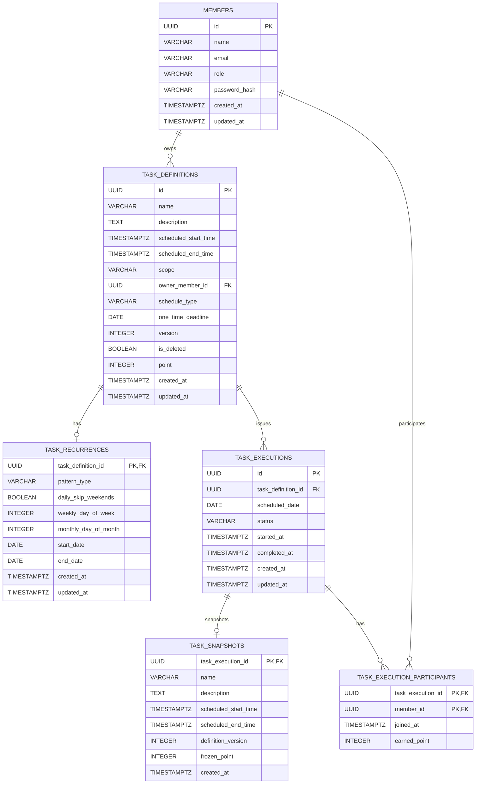

# RDB ER図

```mermaid
erDiagram
    MEMBERS {
        UUID id PK
        VARCHAR name
        VARCHAR email
        VARCHAR role
        VARCHAR password_hash
        TIMESTAMPTZ created_at
        TIMESTAMPTZ updated_at
    }

    TASK_DEFINITIONS {
        UUID id PK
        VARCHAR name
        TEXT description
        TIMESTAMPTZ scheduled_start_time
        TIMESTAMPTZ scheduled_end_time
        VARCHAR scope
        UUID owner_member_id FK
        VARCHAR schedule_type
        DATE one_time_deadline
        INTEGER version
        BOOLEAN is_deleted
        INTEGER point
        TIMESTAMPTZ created_at
        TIMESTAMPTZ updated_at
    }

    TASK_RECURRENCES {
        UUID task_definition_id PK, FK
        VARCHAR pattern_type
        BOOLEAN daily_skip_weekends
        INTEGER weekly_day_of_week
        INTEGER monthly_day_of_month
        DATE start_date
        DATE end_date
        TIMESTAMPTZ created_at
        TIMESTAMPTZ updated_at
    }

    TASK_EXECUTIONS {
        UUID id PK
        UUID task_definition_id FK
        DATE scheduled_date
        VARCHAR status
        TIMESTAMPTZ started_at
        TIMESTAMPTZ completed_at
        TIMESTAMPTZ created_at
        TIMESTAMPTZ updated_at
    }

    TASK_EXECUTION_PARTICIPANTS {
        UUID task_execution_id PK, FK
        UUID member_id PK, FK
        TIMESTAMPTZ joined_at
        INTEGER earned_point
    }

    TASK_SNAPSHOTS {
        UUID task_execution_id PK, FK
        VARCHAR name
        TEXT description
        TIMESTAMPTZ scheduled_start_time
        TIMESTAMPTZ scheduled_end_time
        INTEGER definition_version
        INTEGER frozen_point
        TIMESTAMPTZ created_at
    }

    MEMBERS ||--o{ TASK_DEFINITIONS : owns
    TASK_DEFINITIONS ||--o| TASK_RECURRENCES : has

    TASK_DEFINITIONS ||--o{ TASK_EXECUTIONS : issues
    TASK_EXECUTIONS ||--o| TASK_SNAPSHOTS : snapshots

    TASK_EXECUTIONS ||--o{ TASK_EXECUTION_PARTICIPANTS : has
    MEMBERS ||--o{ TASK_EXECUTION_PARTICIPANTS : participates
```
