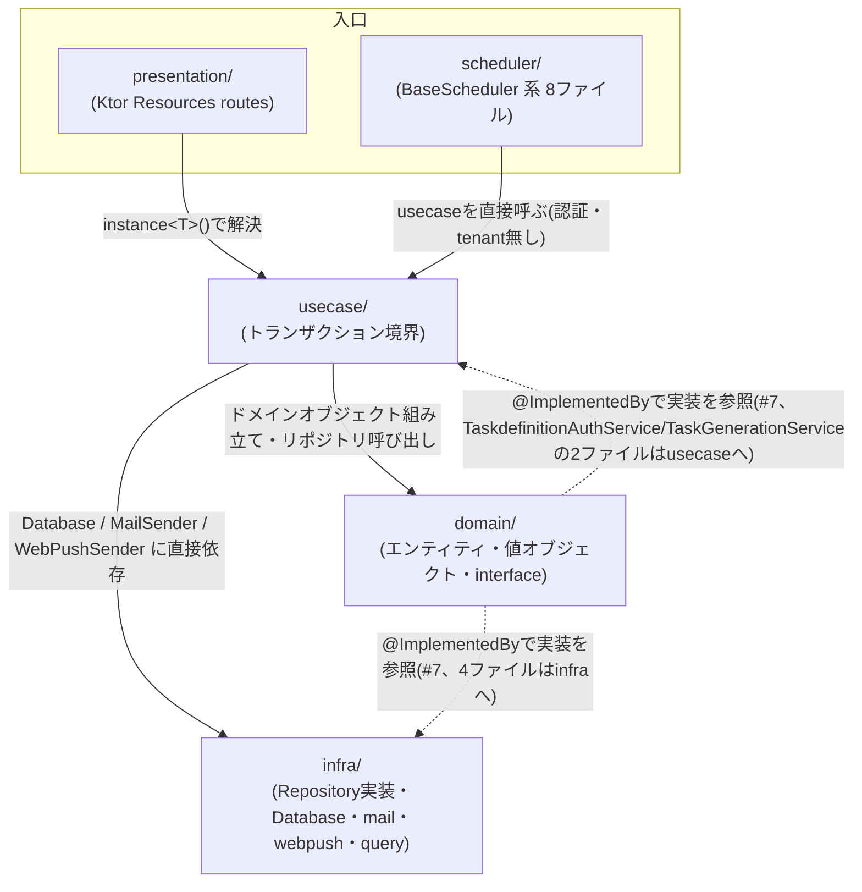

# マルチテナント化 キャッチアップ報告書

- 作成日: 2026-09-24
- 対象: 統合ブランチ `feature/topic-multitenant`(コミット `e01a23cc` = main + migration V20〜V22)
- 目的: [multi-tenant-handoff.md](multi-tenant-handoff.md) §5 のとおり、実装に入る前にコードベースの理解を示し、人間のレビュー(チェックポイント H1)を受ける
- 作り方: 第 1〜4 章は Sonnet が下書きし、別の Sonnet が主張を 1 つずつコードで確認して直した。そのうえで親エージェントが行番号・issue の引用・公式ドキュメントを突き合わせてレビューし、誤りや不正確な記述を直し(例: outbox 導入の理由、MemberAvailability を「未実装」とした記述、通知 UseCase の例外処理の説明)、抜けていた論点を足した(例: ローカル DB の衝突、本番の PostgreSQL のバージョン、送信結果に応じた DB 更新、#50 に必要なシグネチャ変更)。第 5 章は親エージェントが書いた。レビュー時の追記は本文中に「レビュー時に親エージェントが追記」と明記した
- 根拠の書き方: コードは `path:line`(`backend/src/main/kotlin/com/task/` からの相対)、issue は `#番号 本文` / `#番号 コメント`。推測には「推測:」を付けた

## レビューの前に: 要点

1. **ローカル DB がそのままでは使えない。** 手元の DB には shopping の migration(V22〜V25)が適用済みで、統合ブランチの V20〜V22 と番号が衝突している。shopping のデータに触らずに進めるため、マルチテナント作業専用の DB コンテナ(PostgreSQL 17)を別に立てることを提案する(5.1 の 1)。
2. **本番の PostgreSQL は 17.7 だった。** 資料はすべて 16 前提。RLS の振る舞いは同じだが、テストとリハーサルは 17 で行う(5.1 の 2)。
3. **現状、RLS もテナントの概念もコードに無い。** DB アクセスは 32 箇所で、すべてオーナー接続。認証は「ログイン済みか」だけを見ていて、どの家族かは見ていない(第 2 章 2.4、第 3 章)。
4. **通知の宛先の「家族全員」は `findAll` で取っている。** tenant スコープの接続を渡せば自動で自分の家族だけになるが、オーナー接続のまま渡すと全家族に通知が飛ぶ。移行で一番事故が起きやすい所(第 3 章の特記事項)。
5. **ドメインの設計判断は守る。** TaskExecution の状態機械、開始時のスナップショット凍結、ポイントを Member に持たせない設計は、マルチテナント化で壊さない。same-tenant の検証(#50)には、完了・キャンセルのメソッドの引数を変える必要がある(第 1 章)。
6. **本番移行の前提は確認済み。** 本番の DB ユーザーはロールを作れる。接続数にも余裕がある。V19 まで適用済みであることも確認した(4.10.1)。
7. **GCP の無料トライアルは 90 日で切れる。** 切れる前に、有料化するか outbox を旧方式に戻すかを決める必要がある。今決める必要はない(5.1 の 3)。

判断をお願いしたいのは 5.1 の 5 項目です。

---

## (1) ドメインの意思決定

### 集約が Member / TaskDefinition / TaskExecution の 3 つで、TaskExecution が sealed class の状態機械になっている理由

**なぜそうなっているか**

- `TaskExecution` は `NotStarted → InProgress → Completed | Cancelled` という一方向の状態機械であり、Kotlin の `sealed class` で状態ごとに別クラスを作ることで「その状態でしか呼べない操作」をコンパイラに強制させている。たとえば `Completed`(終端状態)には遷移メソッドが一切定義されておらず、`InProgress` に `start()` は存在しない。存在しないメソッドは呼び出しコードが書けないため、不正な遷移は実行時例外ではなくコンパイルエラーになる。
- 集約が 3 つなのは現在の実態であり、当初は `MemberAvailability`(メンバーの空き時間)も集約として存在したが、`V13__drop_member_availabilities.sql` で `time_slots` / `member_availabilities` テーブルごと削除されている。`domain/` 配下には現在この集約に対応するパッケージは存在しない。

**コード上の根拠**

- `taskExecution/TaskExecution.kt:17` `sealed class TaskExecution` の定義。
- `taskExecution/TaskExecution.kt:23-89` `NotStarted` — メソッドは `start()`(30-58行)と `cancel()`(60-65行、内部で `toCancelledState()` を 68-88行に定義)のみ。`InProgress` や `Completed` へ直接進むメソッドは無い。
- `taskExecution/TaskExecution.kt:91-166` `InProgress` — `init` ブロックで `require(assigneeMemberIds.isNotEmpty())`(100-102行、「進行中タスクには担当者が1人以上必要です。」)。メソッドは `complete()`(104-137行)と `cancel()`(139-144行、内部で `toCancelledState()` を 146-165行に定義)のみで、`start()` は定義されていない。
- `taskExecution/TaskExecution.kt:168-186` `Completed` — `init` ブロックで `require(startedAt.isBefore(completedAt))`(179-181行)と `require(assigneeMemberIds.isNotEmpty())`(182-184行)。遷移メソッドは無い(終端状態)。
- `taskExecution/TaskExecution.kt:188-196` `Cancelled` — フィールドのみのデータクラスで遷移メソッドは無い(終端状態)。`taskSnapshot: TaskSnapshot?`(193行)がnullableである点は次項で扱う。
- `Cancelled` が `NotStarted` からも `InProgress` からも作られること: `NotStarted.cancel()`(60-65行、内部で68-88行の `toCancelledState()`)と、`InProgress.cancel()`(139-144行、内部で146-165行の `toCancelledState()`)がそれぞれ独立に実装されている(共通化されていない=DRYではないが、各状態の持つフィールドが異なる ── `InProgress` は `taskSnapshot`/`startedAt` を必ず持つが `NotStarted` は持たない ── ため、そのまま共通化はできない)。
- `MemberAvailability` の消滅: `backend/db/migration/V13__drop_member_availabilities.sql:1-5`。コメントは「V13: MemberAvailability集約の削除」とあるだけで、削除理由そのものはこのファイルには書かれていない。作成は `V2__create_member_availabilities.sql`、物理削除に関する `V10__member_availabilities_physical_delete.sql` というファイルが存在することは `grep` で確認したが、内容は読む範囲外のため未確認(第 5 章)。

**マルチテナント化への含意**

- `tenantId` を `TaskExecution` に持たせる場合、`sealed class TaskExecution` の抽象プロパティ(`id`/`taskDefinitionId`/`scheduledDate`/`assigneeMemberIds` と同じ並び、`TaskExecution.kt:18-21`)に `tenantId` を追加し、4つのサブクラス全部のコンストラクタに反映する必要がある。状態ごとに別クラスという設計はそのまま活きるので、状態機械としての安全性は保たれる。
- 状態遷移メソッドは same-tenant 不変条件(#29、#50)の差し込み点になる。#50 本文の検証ポイント表は `start` / `cancel` / `complete` で `taskDefinition.tenantId == execution.tenantId` を検証するとしている。ただし引数が揃っていない。`NotStarted.start()` と `NotStarted.cancel()` は `TaskDefinition` を受け取る(`TaskExecution.kt:30-33`、`:60`)。一方 `InProgress.complete()` は `definitionIsDeleted: Boolean` と `taskScope` だけ(`:104-107`)、`InProgress.cancel()` は Boolean だけ(`:139`)を受け取る。#50 を実装するには、この 2 つのシグネチャを `TaskDefinition`(または `tenantId` を持つ軽量な参照)を受け取る形に変える必要がある。呼び出し側は `CompleteTaskExecutionUseCaseImpl.kt:31` と `CancelTaskExecutionUseCaseImpl.kt:33-35`。
- `MemberAvailability` は既に消えているので、tenant_id 付与や RLS 適用の対象集約は Member / TaskDefinition / TaskExecution の 3 つ(+ 新設される Tenant)で足りる。

---

### `StateChange<T>`(新状態 + イベント)を返す設計の意図

**なぜそうなっているか**

- `TaskDefinition` は `AggregateRoot` を継承して `addDomainEvent()` でイベントを内部に蓄積する方式(`domainEvents` プロパティで後から取り出す)だが、`TaskExecution` はイミュータブルな `sealed class` で `AggregateRoot` を継承していない。状態遷移のたびに新しいインスタンスを生成する関数型的な作りのため、「蓄積」ではなく「戻り値として新状態とイベントをペアで返す」方式にすることで、呼び出し側(UseCase)に「新しい状態の保存」と「イベントのディスパッチ」を両方セットでやらせる強制力を持たせている。

**コード上の根拠**

- `taskExecution/StateChange.kt:5-8` `data class StateChange<out T : TaskExecution>(val newState: T, val event: TaskExecutionEvent)`。
- 使用例: `NotStarted.start()` は `StateChange(newInProgressState, startEvent)` を返す(`TaskExecution.kt:57`)。
- 「保存 → イベントのディスパッチ」の順序(いずれも同一トランザクション内、`database.withTransaction { session -> ... }` のブロック内):
  - `usecase/taskExecution/start/StartTaskExecutionUseCaseImpl.kt:20`(`withTransaction` 開始)、`:46` `taskExecutionRepository.update(startedExecution, session)` → `:47` `domainEventDispatcher.dispatchAll(listOf(stateChange.event), session)`。
  - `usecase/taskExecution/complete/CompleteTaskExecutionUseCaseImpl.kt:22`(`withTransaction` 開始)、`:45` `taskExecutionRepository.update(completedExecution, session)` → `:47` `domainEventDispatcher.dispatchAll(listOf(stateChange.event), session)`。
  - `usecase/taskExecution/cancel/CancelTaskExecutionUseCaseImpl.kt:20`(`withTransaction` 開始)、`:47` `taskExecutionRepository.update(cancelledExecution,session)` → `:48` `domainEventDispatcher.dispatchAll(listOf(stateChange.event), session)`。
  - いずれも「先に DB へ新状態を書き込み、次に同じ `session`(= 同一トランザクション)でイベントをディスパッチする」という順序で統一されている。

**マルチテナント化への含意**

- outbox の tenant 伝播は「エンベロープ方式」(`OutboxRecord.tenantId` に載せ、イベント payload 自体には載せない)と決まっている(`doc/multi-tenant-handoff.md` §8 決定事項ログ)。`StateChange` が返す `TaskExecutionEvent` 自体の型は変えずに、outbox へ書く側(将来 outbox 化する場合)で `tenantId` を別添えにする設計と整合する。
- 「保存 → 同一トランザクション内でディスパッチ」という順序自体は `Database.withTransaction(tenantId)` に置き換わっても変わらない(トランザクション境界の中身の話であり、境界の取り方とは独立)。

---

### `TaskSnapshot` が開始時に定義を凍結する理由

**なぜそうなっているか**

- `TaskDefinition` は編集(`update()`)や削除(`delete()`)が可能なテンプレートであり、`version` を持って変化していく。一方 `TaskExecution` は「その時点の内容で実行された記録」なので、後から定義側の名前・説明・時間・ポイントを変更しても、既に開始済み/完了済みの実行記録の表示内容や獲得ポイントが遡って変わってしまうと困る。そのため `InProgress` に遷移する瞬間の `TaskDefinition` の内容を `TaskSnapshot` としてコピーし、以降はそのコピーだけを参照する。

**コード上の根拠**

- `TaskSnapshot.create()` の呼び出し箇所: `taskExecution/TaskExecution.kt:45`(`NotStarted.start()` の中で `taskSnapshot = TaskSnapshot.create(taskDefinition)`)。
- `TaskSnapshot` の定義: `taskExecution/TaskExecution.kt:274-296`。`frozenPoint`(278行)は `taskDefinition.point` をそのままコピーする(290行)。`definitionVersion`(279行)も `taskDefinition.version` をコピー(291行)。
- `NotStarted → Cancelled` のとき snapshot が `null`: `taskExecution/TaskExecution.kt:76` `taskSnapshot = null`(`NotStarted.toCancelledState()` 内)。まだ `start()` されていないので凍結すべき内容がそもそも存在しないため。対して `InProgress → Cancelled` では `taskSnapshot = this.taskSnapshot`(`TaskExecution.kt:153`)と非 null の値を引き継ぐ。
- 完了時のポイントが `frozenPoint` から計算されること: `taskExecution/TaskExecution.kt:115` `val earnedPointPerMember = taskSnapshot.frozenPoint / assigneeMemberIds.size`(`InProgress.complete()` 内、114行のコメントで「ポイント按分計算（ビジネスロジック）」と明記)。`Int / Int` の整数除算なので端数は切り捨てられる(例: `frozenPoint = 10`、担当者3人 → `10 / 3 = 3`、余りの1ポイントは誰にも配分されない)。
- `task_snapshots` テーブル: `V15__add_points_to_tasks.sql:13-18` で `frozen_point` カラムを追加(「タスク開始時点で凍結されたポイント」とコメントあり、18行)。永続化は `infra/taskExecution/TaskExecutionRepositoryImpl.kt:106-117` の `insertSnapshot()` で行われ、`InProgress` 状態の `update()`(84行の `insertSnapshot(taskExecution.id.value, taskExecution.taskSnapshot, session)`)から呼ばれる。

**マルチテナント化への含意**

- `TaskSnapshot` はそれ自体が値オブジェクトで独自の識別子を持たないため、`tenantId` を持つ必要があるのは親の `TaskExecution`(ひいては `task_snapshots` テーブルの行)であって、`TaskSnapshot` 型自体に `tenantId` フィールドを増やす必要はない。実際 `V21__apply_multi_tenant.sql:45-47` では `task_snapshots` テーブルに直接 `tenant_id` 列を追加し、`:105-108` で RLS ポリシーも設定しており、テーブル単位での隔離という形になっている。

---

### ポイントが TaskExecution 集約の内側で閉じていて、Member 集約に残高が無い理由

**なぜそうなっているか**

- 現状「ポイントを使う(消費する)」機能が無く、獲得記録を都度合計して表示するだけで十分なため、`Member` に可変の残高フィールドを持たせていない。もし `Member` に残高を持たせると、`TaskExecution` の完了・キャンセルのたびに `Member` 側へ同期するイベント処理(集約間の結果整合性)が必要になり、複雑さが増す。現状はそのコストを払わず、`task_execution_participants.earned_point` を都度 `SUM` して導出する設計になっている。

**コード上の根拠**

- `Completed.earnedPoint` の計算式: `taskExecution/TaskExecution.kt:115` `val earnedPointPerMember = taskSnapshot.frozenPoint / assigneeMemberIds.size`。`Int` 同士の除算(整数除算)なので端数切り捨て。
- participants への永続化: `infra/taskExecution/TaskExecutionRepositoryImpl.kt:119-129` `distributeProratedPoints()`。120-121行のコメント「ポイント計算はDomain層（InProgress.complete()）で実行済み。Repository層はその値を永続化するだけ」のとおり、`UPDATE task_execution_participants SET earned_point = :earnedPoint WHERE task_execution_id = ... AND member_id IN (assigneeMemberIds)`(124-128行)で担当者全員に同じ値をセットする。
- 合計を `SUM` で出しているクエリ: `infra/query/MemberStatsQueryServiceImpl.kt:35-61`(`todayEarnedPointByMember`)。`DSL.sum(DSL.when(TASK_EXECUTIONS.ID.isNotNull, TASK_EXECUTION_PARTICIPANTS.EARNED_POINT).otherwise(0))` を `COALESCE(..., 0)` で包み、`MEMBERS` に `TASK_EXECUTION_PARTICIPANTS` と `TASK_EXECUTIONS`(`STATUS = 'COMPLETED'` かつ当日完了)を左外部結合して `GROUP BY MEMBERS.ID` している。`grep -rn -i "earned_point|EARNED_POINT|earnedPoint" backend/src/main/kotlin/com/task/infra/query` の結果はこのファイルのみで、「今日」に絞らない全期間累計を出すクエリは見つからなかった(第 5 章)。
- `Member` クラスにポイント関連フィールドが無いこと: `domain/member/Member.kt:5-11` のプライマリコンストラクタは `id` / `name` / `email` / `familyRole` / `password` のみで、ポイントや残高に相当するフィールドは無い。

**マルチテナント化への含意**

- `task_execution_participants` には `V21__apply_multi_tenant.sql:50-51` で既に `tenant_id` 列と RLS(`:110-113`)が追加されている。ポイント合計はテナントスコープの `Database.withTransaction(tenantId)` 内で `SUM` するだけで自然にテナント内のみの集計になり、`Member` 自体に状態が無いので `Member ↔ TaskExecution` 間で残高の同期整合性を気にする必要が無い(#29 の same-tenant 不変条件も「参加者としての `Member` が同一テナントか」だけを見ればよい)。

---

### `members.name` が tenant 内一意、`members.email` がグローバル一意になる理由

**なぜそうなっているか**

- ログイン方式を `email + password` に切り替えるにあたり、email を「テナントを跨いだ認証識別子」として使う必要がある(ログインの時点ではまだどのテナントのユーザーか確定していないため、テナントで絞り込まずグローバルに検索できる一意キーが要る)。一方 `name` は元々「メンバー名の重複禁止」という表示名の制約でしかなく、複数の家族(テナント)が同じ名前(例:「お父さん」)を使えないと不便なので、`(tenant_id, name)` の複合一意制約に緩める。

**コード上の根拠**

- `#21 本文`: 「`members.email` はグローバル一意を維持する方針（認証で使いやすい）」「`name` は tenant スコープのまま扱い、テナントごとの同名を許容する」。
- `#21 コメント(kotetsu1225, 2026-09-18T19:25Z = 日本時間 2026-09-19)`: 「register = tenant + 最初のメンバーの作成。2 人目以降は `POST /api/member/create`。招待機能は作らない」「`tenants.email` は最初のメンバーの email」。
- `backend/db/migration/V21__apply_multi_tenant.sql:70-78`(Step 3 のコメント「UNIQUE制約のテナントスコープ化 / members.name を (tenant_id, name) に変更 / 異なるテナントで同じメンバー名を許可するため」)、実処理は `:74` `DROP INDEX idx_members_name;` と `:75` `CREATE UNIQUE INDEX idx_members_tenant_name ON members(tenant_id, name);`。`:77` のコメントに「members.email はグローバルユニークを維持(認証に使用するため変更なし)」と明記。
- `email` のグローバル一意制約自体は multi-tenant 化以前の `V11__add_email_to_members.sql:10` `ALTER TABLE members ADD CONSTRAINT members_email_key UNIQUE (email);` で既に導入済みで、V21 はこれを変更していない(name 側だけを緩めている)。

**マルチテナント化への含意**

- ログインは `email` だけでテナント非依存に `Member` を検索する必要があるため RLS バイパス(`DatabaseWithoutRLS`)を維持する設計になっている(`#21 Decision`: 「Login は tenant確定前処理として RLSバイパスを維持する」)。ログイン成功後に確定した `tenantId` を JWT に載せ、以降のリクエストはその `tenantId` で `Database.withTransaction(tenantId)` を使う。
- `CreateMember`(2 人目以降の追加)は呼び出し元メンバーの `tenantId` が既に分かっているので、tenant スコープのトランザクションで実行する対象になる。

---

### `TaskDefinitionDeleted` だけが outbox に載り、他のイベントがプロセス内ディスパッチである現状

**なぜそうなっているか**

- outbox は 2026-02-08 に「結果整合性用」として導入された(`V18__create_outbox.sql` の `COMMENT ON TABLE outbox IS 'ドメインイベントのOutboxテーブル（結果整合性用）'`、コミット `4c1b3175` と `c42af796`)。Pub/Sub の決定(2026-09-22)より 7 か月前で、Pub/Sub のためではない。`TaskDefinitionDeleted` が outbox に載るのは、定義の削除が**別集約である TaskExecution の多数の行**(未開始・進行中のもの)のキャンセルを引き起こすためで、1 トランザクションで 2 集約を同時に更新せず、結果整合で後から追従させる設計になっている(#14 コメントの表 3 行目「TaskDefinition →(outbox)TaskExecution / 結果整合」)。推測: 他のイベント(通知・次回実行の生成)は同じトランザクション内で処理しても不都合が小さかったため、プロセス内ディスパッチのまま残っている。
- ただし `TaskDefinitionDeleted` は 2 つの発生源(手動削除 `DeleteTaskDefinitionUseCaseImpl` と、単発タスク完了時の自動論理削除 `CompleteTaskExecutionUseCaseImpl`)があり、outbox 化されているのは前者の経路だけで、後者は元からあったプロセス内ディスパッチ(`InMemoryDomainEventDispatcher`)のままになっている。さらにそのプロセス内ディスパッチの受け皿である `TaskDefinitionDeletedHandler` は Guice の `Multibinder` に登録されておらず、後者の経路ではイベントが実質握りつぶされる。この非対称性は issue #14 に整理されている。

**コード上の根拠**

- outbox へ書いている箇所(手動削除の経路): `usecase/taskDefinition/delete/DeleteTaskDefinitionUseCaseImpl.kt:32-42`。`deletedTaskDefinition.domainEvents.forEach { event -> if (event is TaskDefinitionDeleted) { val outboxRecord = OutboxRecord.create(...); outboxRepository.save(outboxRecord, session) } }`。このクラスのコンストラクタ(`:14-19`)には `DomainEventDispatcher` が注入されておらず、`domainEventDispatcher.dispatchAll(...)` は一度も呼ばれない。
- プロセス内ディスパッチのままの箇所(単発タスク完了の経路): `usecase/taskExecution/complete/CompleteTaskExecutionUseCaseImpl.kt:49-55`。「単発タスクは完了したらタスク定義も論理削除して〜」というコメント(49行)のとおり `taskDefinition.delete()`(51行)し、`domainEventDispatcher.dispatchAll(deletedDefinition.domainEvents, session)`(53行)でイベントをディスパッチしている。ここに outbox への書き込みは無い。
- `Multibinder` に登録されているハンドラ一覧(`Config.kt:161-168`):

| ハンドラ | 対象イベント | 登録状態(`Config.kt` の行) |
|---|---|---|
| `CreateTaskExecutionOnTaskDefinitionCreatedHandler` | `TaskDefinitionCreated` | 登録済み(`:165`) |
| `EmailNotificationHandler` | 型は `DomainEvent`(全イベント、`infra/event/handler/EmailNotificationHandler.kt:24`)。`:32` で `TaskExecutionEvent` 以外を捨て、`:35` で `memberRepository.findAll(session)` を「家族全員」として使う | 登録済み(`:166`) |
| `FamilyTaskStartedPushNotificationHandler` | `TaskExecutionStarted`(`doc/domain-model.md:571` 記載) | 登録済み(`:167`) |
| `FamilyTaskCompletedPushNotificationHandler` | `TaskExecutionCompleted`(`doc/domain-model.md:586` 記載) | 登録済み(`:168`) |
| `TaskDefinitionDeletedHandler`(`usecase/taskDefinition/handler/TaskDefinitionDeletedHandler.kt`) | `TaskDefinitionDeleted` | **未登録** |

- `ProcessOutboxEventsUseCaseImpl` が処理するイベント種別: `usecase/outbox/ProcessOutboxEventsUseCaseImpl.kt:54-60`。`when (record.eventType) { "TaskDefinitionDeleted" -> processTaskDefinitionDeleted(record); else -> { logger.warn("Unknown event type: ${record.eventType}"); markAsProcessed(record) } }`。outbox には事実上 `TaskDefinitionDeleted` しか書かれないので、これ以外の分岐は現状通らない。
- `#14 コメント(kotetsu1225, 2026-09-22、集約外整合の棚卸し)` の要点(UseCase 単位の表より抜粋): 3行目「DeleteTaskDefinition | TaskDefinition →(outbox)TaskExecution | 結果整合 | `TaskDefinitionDeleted`」、5行目「CompleteTaskExecution | TaskExecution + OneTime なら TaskDefinition 論理削除 | 同一 Tx | `TaskExecutionCompleted`, `TaskDefinitionDeleted` | (a) Completed に獲得ポイントが無い(#32 で必要) (b) ここで出る `TaskDefinitionDeleted` は outbox に書かれず、`TaskDefinitionDeletedHandler` も Multibinder 未登録のため捨てられている(`Config.kt:165-168`)」と明記されている。同コメントは判断が必要な点として「5(b) OneTime 完了時の `TaskDefinitionDeleted` が捨てられているのは意図か。経路によらず outbox に載せるべきでは」を挙げている(未解決)。

**マルチテナント化への含意**

- `doc/multi-tenant-handoff.md` §1「やらないこと」に「プロセス内ディスパッチのイベント(TaskDefinitionCreated / TaskExecution 系)を Pub/Sub に移すこと(#14 の範囲)」と明記されており、この不整合そのものの解消は今回のマルチテナント化のスコープ外(直さない)。
- `outbox` テーブルには `V21__apply_multi_tenant.sql:62-63` で `tenant_id` 列が追加される。V21 の `:61` のコメントは「outbox（RLSは適用しない: スケジューラが全テナント横断で処理するため）」だが、**この方針は 2026-09-19 のオーナー決定で置き換えられた**。tenants / outbox / completed_domain_events にも RLS を適用し、V24(#38)で入れる(handoff §8、#34 決定事項)。横断で読むのは outbox リレー(#72)だけで、DatabaseWithoutRLS の許可リストに入っている。
- outbox へ書く箇所(`OutboxRecord.create(...)` の呼び出し)は `DeleteTaskDefinitionUseCaseImpl.kt:34-39` の 1 箇所だけなので、`OutboxRecord.tenantId` を詰める書き込み側の改修はここで完結する(#49)。読み出し側はリレー(#72)と subscriber(#61)が tenantId を使う。`CompleteTaskExecutionUseCaseImpl` の OneTime 削除の経路は outbox を通らないので、ここに outbox を足すことはしない(#14 の範囲)。ただしこの UseCase 自体は U4(#54)で tenant スコープへ移行する。

---

### ADR #19 の 4 つの決定

`#19 本文`(Status: Accepted、Date: 2026-02-22、Parent discussion: #13)より、決定・理由(ADR原文からの引用)・却下した代替案の順で整理する。

| # | 決定 | 理由(ADR原文からの引用) | 却下した代替案 |
|---|---|---|---|
| 1 | DB接続点(Connection Point)を RLS 適用有無で分離する。`Database` を RLS適用用、`DatabaseWithoutRLS` を RLSバイパス用の接続点として使う | 「接続点ごとにライフサイクルや責務を分離しやすい」「接続種別の設定漏れによるデグレを防ぎやすい」「呼び出しコードから意図（RLS適用/バイパス）が明確になる」 | 記載なし(ADR本文・親issue #13 のコメントのいずれにも、比較検討した代替案の明示的な記述は無い) |
| 2 | テナント横断バッチは「横断取得」(RLSバイパスで横断取得してよい)と「テナントごとの処理」(書き込み/状態変更はテナント単位に分ける)を分離する。外部通信はトランザクション内で行わない | 「外部通信はDBの関心事ではない」「長時間トランザクションによるコネクション占有を避ける」「他テナントの失敗を波及させない」 | 記載なし |
| 3 | テナントを跨がない処理は `Database`(RLS適用)を基本とし、RLSの有無だけに依存せずアプリ層の入力/文脈でもテナント横断を起こしにくい設計に寄せる | 「RLSの有無だけに依存せず、アプリ層の入力/文脈でもテナント横断を起こしにくい設計に寄せる」※ | 記載なし |
| 4 | ドメイン不変条件としての same-tenant 検証のため、必要な集約/Entity に `tenantId` を持たせる方向で進める(どの Entity に持たせるかは影響範囲調査の上で段階的に適用) | 「目的は『集約間の関連付けにおいて、同一テナントであること』をドメインで検証すること」「RLSはアクセス制御であり、集約間関連の意味的整合性（same-tenant invariant）とは責務が異なる」 | 記載なし |

※ 決定1・2・4には ADR 本文に独立した「理由」見出しがあるが、決定3にはそれが無い。上表の決定3「理由」欄は、ADR の決定3の箇条書き3つ目(「RLSの有無だけに依存せず…」)をそのまま転記したもので、決定文と重複している。

ADR が決めなかった 3 点(`#19 本文` の "Notes (Open discussion, not fixed in this ADR)")は、その後すべて決まっている。

| ADR の未決事項 | その後の決定 | 出どころ |
|---|---|---|
| アプリ層の tenant context の表現(明示引数 / request-scope / coroutine context) | UseCase の `Input` に `TenantId` を明示引数で渡す | #21、handoff §7.1 |
| ログイン時の tenant 解決方式 | email + password で RLS バイパスのログイン → JWT の `tenantId` クレームで以後のリクエストの tenant を確定 | #21、#34 決定事項(2026-09-19) |
| `tenant_id` の永続化をアプリで明示設定するか DB の default / trigger で補うか | アプリで明示設定。子テーブルは親集約の `tenantId` から引く | handoff §8(2026-09-19、分割時の方針) |

決定 2 の対象 5 本(`#19 本文`)のうち `ProcessOutboxEvents` は、Pub/Sub 化の決定(2026-09-22)で「リレー(#72、横断取得)」と「subscriber(#61、イベントごとに tenant スコープ)」に分かれる。決定 2 の「横断取得とテナントごとの処理を分離する」をそのまま満たす形になっている。

ADR の `Consequences / Negative` には全決定共通のトレードオフとして「`tenantId` 伝播（API→UseCase→Domain→Repository→Outbox）の実装コストが増える」「既存UseCase/Repository/QueryServiceに段階的移行が必要」「認証/ログインの識別子設計（tenant解決方法）を再整理する必要がある」が挙げられている(`#19 本文`)。個別の決定ごとに「なぜ他の案ではなくこれを選んだか」を比較した記述は無いため、上表の「却下した代替案」列はすべて「記載なし」とした(第 5 章)。

---

### この章のまとめ: マルチテナント化で壊してはいけないもの

- `TaskExecution` は状態ごとに別クラス(`NotStarted`/`InProgress`/`Completed`/`Cancelled`)という sealed class の設計そのもの。`tenantId` を足すときは共通の抽象プロパティとして 4 クラス全部に反映し、「その状態にしか無いメソッド」という制約を崩さない。
- `StateChange<T>` を戻り値にして「新状態の保存 → 同一トランザクション内でのイベントディスパッチ」という順序を UseCase 側(`StartTaskExecutionUseCaseImpl.kt:46-47` など)で徹底しているパターン。`Database.withTransaction(tenantId)` に置き換わっても、この順序自体は維持する。
- 各状態クラスの `init`/メソッド内の不変条件(`InProgress` は担当者1人以上、`Completed` は `startedAt < completedAt` かつ担当者1人以上、`complete()`/`cancel()` の `require(!definitionIsDeleted)` など)。tenant 対応の改修でこれらの `require` を迂回するコードを増やさない。
- `TaskSnapshot` による「開始時点の `TaskDefinition` を凍結する」という設計。`TaskDefinition` に `tenantId` を足しても、スナップショット自体は値オブジェクトのままでよく、コピー元・コピー先が同一テナントであることだけ気を付ける。
- ポイントは `Member` に残高を持たせず `task_execution_participants.earned_point` の `SUM` から都度導出する設計。tenant_id でスコープされた `SUM` になっていることを崩さない(＝テナント横断で合算してしまう改修をしない)。
- `members.name`(tenant内一意)と `members.email`(グローバル一意)の役割分担、およびログインが RLS バイパスで email から `tenantId` を確定するという流れ(`#21 Decision`)を混同しない。
- `TaskDefinitionDeleted` の outbox 経路とプロセス内ディスパッチ経路の不整合(#14)は今回のスコープ外(直さない)。`tenant_id` を outbox に足す改修は `DeleteTaskDefinitionUseCaseImpl.kt:34-39` の `OutboxRecord.create(...)` 側だけで完結させ、`CompleteTaskExecutionUseCaseImpl` 側の経路には手を入れない。
- ADR #19 の「RLS はアクセス制御、`tenantId` によるドメイン不変条件は集約間の意味的整合性」という責務分担の考え方(決定4)を、実装の随所で混同しない。


---

## (2) レイヤと依存の実態

### 2.1 層ごとの責務と実パッケージ

| 層 | 実パッケージ(`backend/src/main/kotlin/com/task/` 以下) | 責務 | 代表クラス |
|---|---|---|---|
| domain | `domain/`直下(`AppTimeZone.kt`, `AggregateRoot.kt`)、`domain/member`, `domain/taskDefinition`(+`domain/taskDefinition/event`)、`domain/taskExecution`(+`domain/taskExecution/event`)、`domain/task/service`, `domain/event`, `domain/mail` | エンティティ・値オブジェクト・不変条件・ドメインイベント。リポジトリ/ドメインサービスの **interface** 定義 | `Member`, `TaskDefinition`, `TaskExecution`(sealed class), `MemberRepository`(interface), `DomainEvent`(interface) |
| usecase(application) | `usecase/member`, `usecase/taskDefinition`(+`handler`), `usecase/taskExecution`, `usecase/task`(+`service`), `usecase/auth`, `usecase/outbox`, `usecase/memberMeta`, `usecase/pushSubscription`, `usecase/execution`, `usecase/query` | トランザクション境界(`Database.withTransaction`)。ドメイン組み立て・リポジトリ呼び出し・ドメインイベントのプロセス内ディスパッチ・認可判定の呼び出し | `CreateMemberUseCaseImpl`, `DeleteTaskDefinitionUseCaseImpl`, `TaskGenerationServiceImpl`, `ProcessOutboxEventsUseCaseImpl` |
| infra | `infra/member`, `infra/taskDefinition`, `infra/taskExecution`, `infra/memberMeta`, `infra/pushSubscription`, `infra/outbox`, `infra/query`, `infra/event`(+`handler`, +`handler/support`), `infra/mail`, `infra/webpush`, `infra/security`, `infra/database`, `infra/config` | リポジトリ実装(集約単位CRUD、`session: DSLContext`を引数で受ける)、読み取り専用JOINの`*QueryServiceImpl`、outbox、mail/WebPush送信、JWT/BCrypt、`Database`ファサード、**イベントハンドラの実装本体**(メール・push送信) | `MemberRepositoryImpl`, `DashboardQueryServiceImpl`, `Database`, `JwtService`, `EmailNotificationHandler` |
| presentation | `presentation/`(`Auth.kt`, `Members.kt`, `TaskDefinitions.kt`, `TaskExecutions.kt`, `TaskGenerations.kt`, `Dashboard.kt`, `CompletedTasks.kt`, `PushSubscriptions.kt`, `Health.kt`, `GuicePlugin.kt`, `JwtAuthPlugin.kt`) | Ktor Resourcesのルート定義、リクエストDTO⇔ドメイン変換、`principal`取得、Guiceの`instance<T>()`でusecase解決、`StatusPages`(`Application.kt:92-99`) | `fun Route.members()`, `GuicePlugin`, `configureJwtAuth` |
| scheduler | `scheduler/`(`BaseScheduler.kt`, `DailyScheduler.kt`, `IntervalScheduler.kt`, `DailyTaskGenerationScheduler.kt`, `DailyNotCompletedTaskNotificationScheduler.kt`, `NotDailyTaskReminderScheduler.kt`, `NotDailyTomorrowTaskNotificationScheduler.kt`, `OutboxEventProcessorScheduler.kt`) | HTTPを経由しない、もう一つの入口。usecaseを直接呼ぶ | `DailyTaskGenerationScheduler`, `OutboxEventProcessorScheduler` |

**CLAUDE.mdの記述とのズレ**(実態は`find backend/src/main/kotlin/com/task -maxdepth 1 -type d`などで確認)
- `CLAUDE.md:117`はpresentation層のパッケージを`route/`としているが、実際のパッケージ名は`presentation/`であり、`route/`というディレクトリはリポジトリ内に存在しない(トップレベルは`domain` `infra` `presentation` `scheduler` `usecase`の5つ)。
- `CLAUDE.md:106-121`のツリーには`scheduler/`が一切登場しない。実際にはHTTPとは独立した「もう一つの入口」として8ファイルが存在する(詳細は2.4節)。
- `CLAUDE.md:108-113`はdomain配下を`member/`, `memberAvailability/`, `task/definition/`, `task/execution/`としているが、実際は`domain/member`, `domain/taskDefinition`(+`event`), `domain/taskExecution`(+`event`), `domain/task/service`(+`domain/event`, `domain/mail`)であり、`memberAvailability/`ディレクトリ自体が存在しない。CLAUDE.md の「Pending」欄は MemberAvailability を未実装としているが、実際は**実装された後に削除された**(2025-12 に実装・UI まで作られ、2026-01-27 のコミット `19ff7297`「fix: MemberAvailabilityの削除」と `V13__drop_member_availabilities.sql` で削除)。
- `CLAUDE.md:118-120`はinfra配下を`database/`, `repository/`としているが、実際には集約ごとに`infra/member`, `infra/taskDefinition`, `infra/taskExecution`, `infra/memberMeta`, `infra/pushSubscription`, `infra/outbox`, `infra/query`, `infra/event`, `infra/mail`, `infra/webpush`, `infra/security`, `infra/config`, `infra/database`の13サブパッケージに分かれており、`repository/`という単一ディレクトリは存在しない。
- `CLAUDE.md:114-116`はusecase配下を`member/`, `task/`の2つだけとしているが、実際は10サブパッケージ(上表参照)。

### 2.2 依存の向きと逆転している箇所

`@ImplementedBy`は全部で34ファイルにあり(`grep -rl "@ImplementedBy" backend/src/main/kotlin/com/task | wc -l` = 34)、うち6ファイルがdomain層(`grep -rl "@ImplementedBy" backend/src/main/kotlin/com/task/domain`)、残り28ファイルはusecase層自身のinterfaceがusecase層のImplを指すもの(層をまたがないDIパターンで、それ自体は逆転ではない)。domain層の6ファイルはいずれもdomain→下位層への依存を生んでいる。

| ファイル:行(`@ImplementedBy`) | domainのinterface | import行 | 参照先 | 参照先の層 |
|---|---|---|---|---|
| `domain/member/MemberRepository.kt:7` | `MemberRepository` | `:4` | `infra.member.MemberRepositoryImpl` | infra |
| `domain/member/PasswordHasher.kt:14` | `PasswordHasher` | `:4` | `infra.security.BCryptPasswordHasher` | infra |
| `domain/taskDefinition/TaskDefinitionRepository.kt:8` | `TaskDefinitionRepository` | `:4` | `infra.taskDefinition.TaskDefinitionRepositoryImpl` | infra |
| `domain/taskExecution/TaskExecutionRepository.kt:18` | `TaskExecutionRepository` | `:6` | `infra.taskExecution.TaskExecutionRepositoryImpl` | infra |
| `domain/task/service/TaskdefinitionAuthService.kt:8` | `TaskDefinitionAuthService` | `:6` | `usecase.task.service.TaskDefinitionAuthServiceImpl` | **usecase**(infraを飛び越えている) |
| `domain/task/service/TaskGenerationService.kt:9` | `TaskGenerationService` | `:5` | `usecase.task.service.TaskGenerationServiceImpl` | **usecase** |

これはissue #7が指摘している内容と一致する。#7本文は根拠として`domain/taskDefinition/TaskDefinitionRepository.kt:3-13`と`domain/task/service/TaskGenerationService.kt:5-14`(「domainインターフェースがusecase実装(TaskGenerationServiceImpl)を直接参照」)を引用している。特に`TaskdefinitionAuthService.kt`と`TaskGenerationService.kt`の2件はdomainがinfraを素通りしてusecaseの実装クラスを直接importしており、想定される依存順序(presentation/scheduler→usecase→domain、domain⇢infra)を二重に破っている。

その他の越境・逆転:
- `MemberMetaRepository`(`infra/memberMeta/MemberMetaRepository.kt:6`)、`PushSubscriptionRepository`(`infra/pushSubscription/PushSubscriptionRepository.kt:13`)、`OutboxRepository`(`infra/outbox/OutboxRepository.kt:6`)、`CompletedDomainEventRepository`(`infra/outbox/CompletedDomainEventRepository.kt:6`)は、そもそも**interface自体がinfra層に置かれている**(`@ImplementedBy`は付いておらず、`Config.kt:83`, `Config.kt:84`, `Config.kt:99`, `Config.kt:100`で明示的にbindされている)。`PushSubscriptionRepository.kt:6-11`のコメントは「ビジネスルールを持たない技術的概念だからinfraに置いた」という設計意図を明記している。同様の技術的概念である`WebPushSender`(`infra/webpush/WebPushSender.kt:7`、`@ImplementedBy`無し、`Config.kt:151`で明示bind)もinfra層に置かれているが、対して同じ「送信」系の`MailSender`は`domain/mail/MailSender.kt`と**domain層**に置かれており、同種の技術的概念でも配置基準が一貫していない。
- `@ImplementedBy`を伴わない、もう1件のdomain→usecaseの型依存: `domain/taskExecution/TaskExecutionRepository.kt:7`が`import com.task.usecase.taskExecution.get.GetTaskExecutionsUseCase`しており、`findAllWithFilter`の引数型`GetTaskExecutionsUseCase.FilterSpec`(`:57`)と`countWithFilter`の引数型(`:63`)として使われている。domainのリポジトリinterfaceのメソッドシグネチャがusecase層のネスト型に直接依存しており、2.2冒頭で数えた「34ファイル」の`@ImplementedBy`一覧には現れない、別経路の逆転である。
- usecaseがinfraの型`Database`に直接依存している例: `presentation/Auth.kt:8`(import)/`:87`(instance取得)、`usecase/task/GenerateDailyExecutionsUseCaseImpl.kt:5`/`:8`、`usecase/taskDefinition/update/UpdateTaskDefinitionUseCaseImpl.kt:7`/`:11`、`usecase/taskDefinition/delete/DeleteTaskDefinitionUseCaseImpl.kt:8`/`:15`、`usecase/outbox/ProcessOutboxEventsUseCaseImpl.kt:7`/`:18`、`usecase/taskExecution/complete/CompleteTaskExecutionUseCaseImpl.kt:10`/`:15`、`usecase/taskExecution/start/StartTaskExecutionUseCaseImpl.kt:9`/`:13`。`Database`はDIコンテナ経由のインフラファサードという位置づけで、handoff文書もこの依存自体は問題視しておらず、§7.1は`Database`のシグネチャ(`withTransaction(tenantId, block)`への変更)のみを求めている。

### 2.3 DI(Guice)の実態

`Config.kt`の`bind`一覧(explicit bind、全件):

| 行 | bind対象 | 実装/インスタンス |
|---|---|---|
| `Config.kt:79` | `Database` | `asEagerSingleton()`(起動時に即インスタンス化) |
| `Config.kt:81` | `MemberRepository` | `MemberRepositoryImpl` |
| `Config.kt:82` | `TaskDefinitionRepository` | `TaskDefinitionRepositoryImpl` |
| `Config.kt:83` | `PushSubscriptionRepository` | `PushSubscriptionRepositoryImpl` |
| `Config.kt:84` | `MemberMetaRepository` | `MemberMetaRepositoryImpl` |
| `Config.kt:86` | `CreateMemberUseCase` | `CreateMemberUseCaseImpl` |
| `Config.kt:87` | `UpdateMemberUseCase` | `UpdateMemberUseCaseImpl` |
| `Config.kt:88` | `GetMembersUseCase` | `GetMembersUseCaseImpl` |
| `Config.kt:89` | `GetMemberUseCase` | `GetMemberUseCaseImpl` |
| `Config.kt:91` | `CreateTaskDefinitionUseCase` | `CreateTaskDefinitionUseCaseImpl` |
| `Config.kt:92` | `UpdateTaskDefinitionUseCase` | `UpdateTaskDefinitionUseCaseImpl` |
| `Config.kt:93` | `DeleteTaskDefinitionUseCase` | `DeleteTaskDefinitionUseCaseImpl` |
| `Config.kt:94` | `GetTaskDefinitionsUseCase` | `GetTaskDefinitionsUseCaseImpl` |
| `Config.kt:95` | `GetTaskDefinitionUseCase` | `GetTaskDefinitionUseCaseImpl` |
| `Config.kt:97` | `DomainEventDispatcher` | `InMemoryDomainEventDispatcher` |
| `Config.kt:99` | `OutboxRepository` | `OutboxRepositoryImpl` |
| `Config.kt:100` | `CompletedDomainEventRepository` | `CompletedDomainEventRepositoryImpl` |
| `Config.kt:101` | `ProcessOutboxEventsUseCase` | `ProcessOutboxEventsUseCaseImpl` |
| `Config.kt:103-104` | `SendDailyNotCompletedTaskNotificationsUseCase` | `SendDailyNotCompletedTaskNotificationsUseCaseImpl` |
| `Config.kt:105` | `RegisterPushSubscriptionUseCase` | `RegisterPushSubscriptionUseCaseImpl` |
| `Config.kt:106` | `SaveMemberMetaUseCase` | `SaveMemberMetaUseCaseImpl` |
| `Config.kt:129`/`138`/`141` | `MailSender` | `mail.provider`設定値により`SmtpMailSender`/`SendGridMailSender`/`LoggingMailSender`のいずれか(if/when分岐) |
| `Config.kt:151` | `WebPushSender` | `WebPushSenderImpl` |
| `Config.kt:153` | `LoginUseCase` | `LoginUseCaseImpl` |
| `Config.kt:155` | `DashboardQueryService` | `DashboardQueryServiceImpl` |
| `Config.kt:156` | `MemberStatsQueryService` | `MemberStatsQueryServiceImpl` |
| `Config.kt:157` | `CompletedTaskQueryService` | `CompletedTaskQueryServiceImpl` |
| `Config.kt:159` | `GetCompletedTasksUseCase` | `GetCompletedTasksUseCaseImpl` |
| `Config.kt:178` | `JwtConfig` | `toInstance(jwtConfig)` |
| `Config.kt:180` | `JwtService` | `toInstance(JwtService(jwtConfig))` |

上記の`bind`に無いusecase(例: `StartTaskExecutionUseCase`, `CompleteTaskExecutionUseCase`, `CancelTaskExecutionUseCase`, `CreateTaskExecutionUseCase`, `GetTaskExecutionUseCase`, `GetTaskExecutionsUseCase`, `UpdateAssignTaskExecutionUseCase`, `GenerateDailyExecutionsUseCase`, `SendNotDailyTaskRemindersUseCase`, `SendNotDailyTomorrowTaskNotificationsUseCase`, `GetPushSubscriptionUseCase`, `GetUserMetasUseCase`, notifications系QueryService 3つ)は、Guiceの**JIT(Just-In-Time)束縛**で解決される。前掲28ファイルの`@ImplementedBy(XxxImpl::class)`により、`Config.kt`に明示的な`bind`が無くても`injector.getInstance(XxxUseCase::class.java)`が呼ばれた時点でGuiceが自動的に実装クラスへ束縛する。ただし`CreateTaskExecutionUseCase`(`usecase/taskExecution/create/CreateTaskExecutionUseCase.kt:10`)については、`grep -rln "CreateTaskExecutionUseCase" backend/src/main/kotlin/com/task`が自分自身の定義ファイルと`CreateTaskExecutionUseCaseImpl.kt`の2件しか返さず、`instance<CreateTaskExecutionUseCase>()`や`injector.getInstance(...)`の呼び出し箇所がコード中に見つからない。実際にTaskExecutionを新規作成する唯一の経路(`usecase/taskDefinition/handler/CreateTaskExecutionOnTaskDefinitionCreatedHandler.kt:45-54`)は`TaskExecution.create(...)`ドメインファクトリと`taskExecutionRepository.create(...)`を直接呼んでおり、この`CreateTaskExecutionUseCase`を経由しない。JIT束縛が可能というだけで、実際には呼ばれていない(推測: 使われなくなった経路が削除されずに残っている)可能性が高い。

Multibinderに登録されたハンドラは4つ(`Config.kt:161-168`):

| 行 | ハンドラ | 対象イベント |
|---|---|---|
| `Config.kt:165` | `CreateTaskExecutionOnTaskDefinitionCreatedHandler` | `TaskDefinitionCreated` |
| `Config.kt:166` | `EmailNotificationHandler` | `DomainEvent`(実装は`TaskExecutionEvent`のみ処理) |
| `Config.kt:167` | `FamilyTaskStartedPushNotificationHandler` | `TaskExecutionStarted` |
| `Config.kt:168` | `FamilyTaskCompletedPushNotificationHandler` | `TaskExecutionCompleted` |

`usecase/taskDefinition/handler/TaskDefinitionDeletedHandler.kt`(`DomainEventHandler<TaskDefinitionDeleted>`を実装)はこのMultibinderに**登録されていない**。`InMemoryDomainEventDispatcher.dispatch`(`infra/event/InMemoryDomainEventDispatcher.kt:22-28`)は`handlers`セット(=Multibinderで登録された集合)を順に回すだけ(`:25`で`handler.handle(event, session)`)なので、`TaskDefinitionDeleted`をプロセス内ディスパッチしても`TaskDefinitionDeletedHandler`は呼ばれず、イベントは静かに捨てられる。handoff文書§12とissue #14コメントもこれを確認済みの既知事項として記録している。

`Database`は`Config.kt:79`で`asEagerSingleton()`指定されており、Guiceインジェクタ生成時(`presentation/GuicePlugin.kt:22`の`Guice.createInjector(pluginConfig.modules)`)に他クラスから参照される前に即座にインスタンス化される。

### 2.4 入口が2つあること

**HTTP入口**(`Application.kt`のrouting block、`:168-185`):
- `authenticate("jwt")`の**外側**(`:169-172`): `GET /health`(`:169-171`、ベタ書きの`call.respondText("ok")`)と`auth()`(`:172` → `presentation/Auth.kt`の`POST /api/auth/register`・`/login`)。認証不要の公開API。
- `authenticate("jwt")`の**内側**(`:174-183`): `health()`(`/api/health/mail`)、`members()`、`taskDefinitions()`、`taskExecutions()`、`taskGenerations()`、`dashboard()`、`completedTasks()`、`pushSubscriptions()`。

principalの取り方は一様ではない:
- `presentation/TaskDefinitions.kt:290-291`(Update)、`:326-327`(Delete)、`presentation/PushSubscriptions.kt:86-88`ほか3箇所(`:114-115`, `:137-138`, `:158-159`)は`call.principal<JWTPrincipal>()`から`subject`(=memberId)を読み、`requesterId`/`memberId`としてUseCase Inputに渡している。
- 一方`presentation/Members.kt`(list/get/create/update)、`presentation/Dashboard.kt`、`presentation/CompletedTasks.kt`、`presentation/TaskExecutions.kt`(start/complete/cancel/assign含む全ルート)は**`principal`を一切読んでいない**。`Members.kt:103`の`instance<GetMembersUseCase>().execute()`は引数無しで全メンバーを返し、`TaskExecutions.kt:208`の`assigneeMemberIds`はリクエストボディの値をそのまま使う。現状はJWTで「ログイン済みかどうか」だけを見ており、「誰が」「どの家族の」データを操作しているかはほぼ検証されていない(単一家族前提だから成立している)。
- `presentation/`に`AuthenticatedMember`型は存在しない(`grep -rn "AuthenticatedMember" backend/src/main/kotlin/com/task`は0件)。handoff §7.1が定義する`AuthenticatedMember(memberId, tenantId)`は未実装。

**scheduler入口**(`scheduler/`、8ファイル): `BaseScheduler`(抽象、`scheduler/BaseScheduler.kt:27`、コルーチンループ・delay・start/stopを持つ)を頂点に、`DailyScheduler`(`scheduler/DailyScheduler.kt:13`、指定時刻に1日1回)と`IntervalScheduler`(`scheduler/IntervalScheduler.kt:12`、指定分間隔)の2つの抽象サブクラスが分岐し、5つの具象クラスがぶら下がる。

| 具象クラス | 継承元 | 実行時刻/間隔 | 呼ぶUseCase | 起動行(`Application.kt`) |
|---|---|---|---|---|
| `DailyTaskGenerationScheduler` | `DailyScheduler` | 毎日06:00(`scheduler/DailyTaskGenerationScheduler.kt:9`のデフォルト値。`Application.kt:106-108`はオーバーライドせず呼び出し) | `GenerateDailyExecutionsUseCase`(`scheduler/DailyTaskGenerationScheduler.kt:15`) | `:141` |
| `DailyNotCompletedTaskNotificationScheduler` | `DailyScheduler` | `NOTIFICATION_SCHEDULE_TIME`環境変数(`Application.kt:110-120`)、未設定/パース失敗時は19:00 | `SendDailyNotCompletedTaskNotificationsUseCase`(`scheduler/DailyNotCompletedTaskNotificationScheduler.kt:16`) | `:145` |
| `NotDailyTomorrowTaskNotificationScheduler` | `DailyScheduler` | 毎日20:00(`scheduler/NotDailyTomorrowTaskNotificationScheduler.kt:10`のデフォルト。`Application.kt:127-129`はオーバーライドせず) | `SendNotDailyTomorrowTaskNotificationsUseCase`(`:16-17`) | `:149` |
| `NotDailyTaskReminderScheduler` | `IntervalScheduler` | 5分間隔(`scheduler/NotDailyTaskReminderScheduler.kt:17`のデフォルト) | `SendNotDailyTaskRemindersUseCase`(`:23-24`) | `:153` |
| `OutboxEventProcessorScheduler` | `BaseScheduler`(直接) | 10秒間隔(`Application.kt:135-138`で明示的に`intervalSeconds = 10`) | `ProcessOutboxEventsUseCase`(`scheduler/OutboxEventProcessorScheduler.kt:18`) | `:157` |

schedulerには`authenticate`も`principal`も存在せず、認証・tenantの概念なしにUseCaseを直接呼ぶ。`GenerateDailyExecutionsUseCase`はこのschedulerとHTTP(`presentation/TaskGenerations.kt:61`の`POST /api/task-generations/daily`、`:79`の`/daily/{date}`)の**両方**から呼ばれる唯一のUseCaseで、issue #57本文がこれを裏付けている:「このUseCaseだけは2経路から呼ばれる」「HTTP側はprincipalを読まず、現状は誰が叩いても全家族分を生成する」。

### 2.5 イベントの配信経路

2つの経路がある。

**(a) プロセス内ディスパッチ**: 各UseCaseが`database.withTransaction { session -> ... }`の中で`domainEventDispatcher.dispatchAll(events, session)`を呼ぶ(例: `usecase/taskExecution/start/StartTaskExecutionUseCaseImpl.kt:20`〜`:47`、`usecase/taskExecution/complete/CompleteTaskExecutionUseCaseImpl.kt:22`〜`:47`、`usecase/taskDefinition/handler/CreateTaskExecutionOnTaskDefinitionCreatedHandler.kt:53`)。`InMemoryDomainEventDispatcher.dispatchAll`(`infra/event/InMemoryDomainEventDispatcher.kt:15-19`)は同じ`session: DSLContext`を各`DomainEventHandler.handle(event, session)`にそのまま渡す(`:25`)ため、ハンドラの処理は呼び出し元と**同一トランザクション**の中で同期的に実行される。コミット/ロールバックの単位が「UseCase本体+全ハンドラ」になる。

**(b) outbox経由**: `usecase/taskDefinition/delete/DeleteTaskDefinitionUseCaseImpl.kt:32-42`のように、UseCase自身が`OutboxRecord.create(...)`(`infra/outbox/OutboxRecord.kt:20-40`)を組み立てて`outboxRepository.save(outboxRecord, session)`(`DeleteTaskDefinitionUseCaseImpl.kt:40`)を同一トランザクション内で呼ぶ。この行は`InMemoryDomainEventDispatcher`を経由しない。書き込まれたレコードは`scheduler/OutboxEventProcessorScheduler.kt`(10秒間隔、`Application.kt:135-138`)が`ProcessOutboxEventsUseCaseImpl.execute`(`usecase/outbox/ProcessOutboxEventsUseCaseImpl.kt:26`)経由で**別トランザクション**(`:30`の`withSession`で一覧取得→`:67`の`withTransaction`で1件ずつ処理)にてポーリングし、`completedDomainEventRepository.exists(eventId, session)`(`:68`)で冪等性を判定してから処理する。現状`processEvent`(`:53-61`)が扱えるのは`"TaskDefinitionDeleted"`のみで、それ以外は`Unknown event type`としてログを出し処理済み扱いにする(`:56-59`)。なお、この処理は現時点ではアプリ内のポーリングで完結しており、GCP Pub/Subへはまだ送られていない(Pub/Sub 導入は #69〜#73 の対象で、クライアント基盤は #71。今回のコードに Pub/Sub 関連のクライアントコードは無い)。

2経路の違い:

| 観点 | (a) プロセス内 | (b) outbox |
|---|---|---|
| トランザクション | 発火元と同一 | 発火元とは別(ポーリング時に新規) |
| 対象イベント | `Multibinder`に登録された4ハンドラが拾う型すべて | 現状`TaskDefinitionDeleted`のみ、かつ`DeleteTaskDefinitionUseCaseImpl`から直接outboxに書かれた分だけ |
| 冪等性 | 無し(呼ばれれば毎回実行) | `CompletedDomainEventRepository`で`eventId`ベースに保証 |
| 失敗時の扱い | UseCaseの例外処理次第(通知系ハンドラはtry/catchでログのみ、メイン処理は継続) | `record.incrementRetry`(`ProcessOutboxEventsUseCaseImpl.kt:131-135`で呼び出し)でリトライ、`maxRetries`超過で`FAILED` |

なお、`usecase/taskExecution/complete/CompleteTaskExecutionUseCaseImpl.kt:50-55`でOneTimeタスク完了時に発生する`TaskDefinitionDeleted`は`domainEventDispatcher.dispatchAll`(経路a、`:53`)で流されるが、`TaskDefinitionDeletedHandler`がMultibinder未登録(2.3節)のため何も起きず、かつ(b)のようにoutboxへ書く処理もこの経路には無いため、**このイベントはどこにも届かない**。issue #14コメントがこの欠落を「5(b)」として明記している。

### 2.6 外部通信(メール・Web Push)がトランザクション内で起きている箇所

| 箇所 | トランザクション開始 | 外部通信の呼び出し |
|---|---|---|
| `infra/event/handler/EmailNotificationHandler.kt` | 呼び出し元UseCase側の`withTransaction`(例: `StartTaskExecutionUseCaseImpl.kt:20`) | `:100`の`mailSender.sendMultiple(mails)`(SMTP/SendGrid、`try`/`catch`は`:99-104`、それを囲む`if (mails.isNotEmpty())`は`:98-105`) |
| `infra/event/handler/FamilyTaskStartedPushNotificationHandler.kt` | 同上 | `:24-31`(`try`は`:23-34`)→`infra/event/handler/support/FamilyTaskPushNotificationService.kt:54-60`の`webPushSender.sendWebPushToMember(...)` |
| `infra/event/handler/FamilyTaskCompletedPushNotificationHandler.kt` | `CompleteTaskExecutionUseCaseImpl.kt:22` | 同上のサービス経由(`:24-31`) |
| `usecase/task/SendDailyNotCompletedTaskNotificationsUseCaseImpl.kt` | `:26` | `:56-62`の`webPushSender.sendWebPushToMember(...)`を対象メンバー数分ループ |
| `usecase/task/SendNotDailyTomorrowTaskNotificationsUseCaseImpl.kt` | `:35` | `:76`の同上 |
| `usecase/task/SendNotDailyTaskRemindersUseCaseImpl.kt` | `:42` | `:75`の同上 |

前者3つは「ドメインイベント→ハンドラ」パターン(2.5節の経路a)。後者3つは通知系UseCaseがハンドラ機構を介さず自分で`Database.withTransaction`を開き、対象メンバーをループしながら外部送信する**別系統**のパターン。

外部通信の失敗がロールバックにつながらないようにする方法は 2 系統で違う。ハンドラ側は `try/catch` でログのみに留める(`EmailNotificationHandler.kt:99-104`、`FamilyTask*PushNotificationHandler.kt:23-34`)。通知系 UseCase 側には `try/catch` が無く、`WebPushSender.sendWebPushToMember` が例外を投げずに `sealed class SendResult`(`infra/webpush/WebPushSender.kt:15-19`。例外は `WebPushSenderImpl.kt:60` で捕まえて `Failed` に変換)を返し、UseCase が `when (result)` で分岐する(`SendDailyNotCompletedTaskNotificationsUseCaseImpl.kt:64-72`)。

どちらも DB トランザクションを外部 I/O 待ちの間保持し続ける点は共通で、対象メンバー数が多いほどトランザクションが長くなる。

**マルチテナント化への含意(#58〜#60)**: 通知系 UseCase は、送信結果が `SubscriptionExpired` のとき**同じトランザクション内で** `pushSubscriptionRepository.deactivate(subscription.id, session)` を呼んでいる(`SendDailyNotCompletedTaskNotificationsUseCaseImpl.kt:68-69`)。外部通信をトランザクションの外へ出すと(ADR #19 決定 2)、この「送信結果に応じた DB 更新」は、送信後に**別のテナントスコープのトランザクション**で行う必要がある。「取得 tx → tx 外で送信 → 結果の反映 tx」の 3 段になる。

### 2.7 リポジトリとクエリサービスの使い分け

- **リポジトリ**(`domain/*Repository`+`infra/*RepositoryImpl`、および`infra/memberMeta`, `infra/pushSubscription`, `infra/outbox`の各Repository): 集約単位のCRUD。全メソッドが`session: DSLContext`を引数で受け取る(例: `domain/taskExecution/TaskExecutionRepository.kt:25,31,37`ほか)。1集約=1リポジトリの原則を保っている。
- **クエリサービス**(`usecase/query/*`のinterface 6つ + `infra/query/*Impl`): 複数集約にまたがるJOINを行う読み取り専用の口。ファイル名とinterfaceの対応は1:1。

| interface(`usecase/query/`) | 実装(`infra/query/`) | bind方法 |
|---|---|---|
| `dashboard/DashboardQueryService.kt` | `DashboardQueryServiceImpl.kt` | `Config.kt:155`で明示bind |
| `member/MemberStatsQueryService.kt` | `MemberStatsQueryServiceImpl.kt` | `Config.kt:156`で明示bind |
| `execution/CompletedTaskQueryService.kt` | `CompletedTaskQueryServiceImpl.kt` | `Config.kt:157`で明示bind |
| `notifications/NotificationTargetQueryService.kt` | `NotificationTargetQueryServiceImpl.kt` | `@ImplementedBy`(JIT) |
| `notifications/TomorrowNotDailyTaskQueryService.kt` | `TomorrowNotDailyTaskQueryServiceImpl.kt` | `@ImplementedBy`(JIT) |
| `notifications/UpcomingNotDailyTaskQueryService.kt` | `UpcomingNotDailyTaskQueryServiceImpl.kt` | `@ImplementedBy`(JIT) |

CLAUDE.mdの「Repository Pattern」節はリポジトリのみを説明しており、クエリサービスという第二の読み取り経路には触れていない。

### 2.8 認可の置き場所

`domain/task/service/TaskdefinitionAuthService.kt`(ファイル名は小文字の"d"で始まる`Taskdefinition`)が`TaskDefinitionAuthService`(大文字Dのinterface名、`:9`)を定義し、`canEdit`/`canDelete`/`requireEditPermission`/`requireDeletePermission`を宣言する(`:10-14`)。`@ImplementedBy(TaskDefinitionAuthServiceImpl::class)`(`:8`、importは`:6`)がその実装を指す。

実装クラス`TaskDefinitionAuthServiceImpl`は`usecase/task/service/TaskDefinitionAuthorizationService.kt:10`にあり、`TaskScope.FAMILY`なら常に許可、`TaskScope.PERSONAL`なら`ownerMemberId == memberId`のときのみ許可という単純なロジック(`:12-21`)。呼び出し元は`usecase/taskDefinition/update/UpdateTaskDefinitionUseCaseImpl.kt:13`と`usecase/taskDefinition/delete/DeleteTaskDefinitionUseCaseImpl.kt:17`の2箇所のみで、いずれも`TaskDefinitionAuthService`型のフィールドとして注入されている。

ここで注意が必要なのは、**`usecase/task/service/TaskDefinitionAuthorizationService.kt`というファイルの中に、`TaskDefinitionAuthorizationService`という名前のクラスやinterfaceは存在しない**ということ(`grep -rn "TaskDefinitionAuthorizationService" backend/src/main/kotlin/com/task`はファイルパス自体以外に一致しない)。ファイル名は「Authorization」だが、中身は`TaskDefinitionAuthServiceImpl`という別名のクラスであり、domain側のinterface名`TaskDefinitionAuthService`に対応させるための実装ファイルという位置づけになっている。つまり「usecase/task/service/TaskDefinitionAuthorizationServiceとdomain/task/service/TaskdefinitionAuthServiceの関係」は**ファイル名の対応関係**であって、型としての対応関係ではない(型としての対応は`TaskDefinitionAuthService`インターフェースと`TaskDefinitionAuthServiceImpl`実装クラスの間にある)。認可ロジック自体はusecase層に置かれており、domain層はinterfaceの器を提供しているだけ、という構造になっている(第 5 章)。

### 2.9 依存関係図(mermaid)



2.2節の表のとおり、domain層の6ファイルの`@ImplementedBy`のうち4ファイル(`MemberRepository`, `PasswordHasher`, `TaskDefinitionRepository`, `TaskExecutionRepository`)はinfraの実装を指すが、残り2ファイル(`TaskdefinitionAuthService`, `TaskGenerationService`)はinfraを飛び越えてusecaseの実装を直接指す。上のmermaidは両方の逆転を別の矢印として描いている。

### 2.10 マルチテナント化でTenantIdがどう流れるか

現状のコードに`TenantId`・`AuthenticatedMember`という型は存在しない(`grep -rn "TenantId\|AuthenticatedMember" backend/src/main/kotlin/com/task`は0件)。以下はhandoff §7.1(共通契約、`doc/multi-tenant-handoff.md:218-239`)の契約と、issue #56・#57本文から読み取れる**計画**であり、実装済みではない。

現状の起点となる箇所(参考値):
- JWT: `infra/security/JwtService.kt:21-27`の`generateToken`は`withSubject(member.id.value.toString())`(`:23`)のみで`tenantId`クレームは無い(他に`name`(`:26`)、`role`(`:27`)クレームがある)。
- ログイン: `presentation/Auth.kt:113-122`は`{name, password}`を受け取る(handoff §7.2が求める`{email, password}`ではない、現状の姿)。

| 層 | 現状 | 計画(handoff §7.1) | 主な変更対象(現状のファイル) |
|---|---|---|---|
| JWT | `sub`=memberId、`tenantId`クレーム無し(`infra/security/JwtService.kt:23`) | `tenantId`(UUID文字列)クレームを追加 | `infra/security/JwtService.kt`、`presentation/JwtAuthPlugin.kt` |
| presentation | `call.principal<JWTPrincipal>()`を個別に読む箇所が4ファイルのみ(2.4節)、`AuthenticatedMember`型は無い | `ApplicationCall.authenticatedMember(): AuthenticatedMember`(`memberId`, `tenantId`)を新設し、全ルートで`call.authenticatedMember().tenantId`から取得 | `presentation/`配下の各ルートファイル |
| usecase Input | `TenantId`引数を持つUseCaseは無い | `Input`に`tenantId: TenantId`を明示引数として追加(例: `GenerateDailyExecutionsUseCase.Input`、issue #57本文) | `usecase/**/*.kt`の`Input`データクラス群 |
| `Database` | `withTransaction(block)`/`withSession(block)`の2メソッドのみ、tenant引数無し(`infra/database/Database.kt:56,89`) | `withTransaction(tenantId: TenantId, block)`が`housework_app`プールで`set_config('app.current_tenant_id', ?, true)`を実行してからblockを呼ぶ。互換パス(引数無し版)は`@Deprecated`を経て#65で削除 | `infra/database/Database.kt` |
| DB(RLS) | 本番(V19 まで適用)には RLS が無い。統合ブランチには `V21__apply_multi_tenant.sql` があり、8 テーブルのポリシーが `current_setting('app.current_tenant_id')` を参照する形で定義済み(未適用。詳細は第 4 章) | `set_config`された`app.current_tenant_id`をRLSポリシーが参照し、行を絞り込む。tenants / outbox / completed_domain_events にも V24 で RLS を足す(#38) | `backend/db/migration/V21〜V24` |
| scheduler | `GenerateDailyExecutionsUseCase`等5つのUseCaseをテナント概念無しに1回だけ呼ぶ(`scheduler/DailyTaskGenerationScheduler.kt:15`ほか) | issue #56の`TenantBatchRunner`(仮称、issue本文の例示コード)が`DatabaseWithoutRLS.withSession`+`TenantRepository.findAllActiveIds`で全ACTIVEテナントを列挙し、テナントごとに`block`をtry/catchで実行(1テナントの失敗を他に波及させない) | `scheduler/*.kt`、新設される`TenantBatchRunner`相当のクラス |
| outbox | `OutboxRecord`に`tenantId`フィールド無し(`infra/outbox/OutboxRecord.kt:6-17`) | `OutboxRecord`に`tenantId`を持たせ、Pub/Sub送信時のmessage attributesに`tenantId`を含める(handoff §7.4) | `infra/outbox/OutboxRecord.kt`、`infra/outbox/OutboxRepositoryImpl.kt` |

`GenerateDailyExecutionsUseCase`は現状HTTP(`presentation/TaskGenerations.kt:61,79`)とscheduler(`scheduler/DailyTaskGenerationScheduler.kt:15`)の両方から呼ばれる唯一のUseCaseであるため(2.4節)、issue #57のスコープでは「HTTP経路は`call.authenticatedMember().tenantId`を渡し、scheduler経路は#56のヘルパーでテナントごとに呼ぶ」という**入口ごとに異なるtenantId取得方法**を1つのUseCase Inputに集約する設計になる(issue #57本文のスコープ節)。


---

## (3) DB アクセスの棚卸し

### 抽出方法と件数

実行したコマンド:

```
grep -rn -E "\.(withTransaction|withSession)\b" /Users/idatoratetsu/Desktop/housework/backend/src/main
```

生の件数: 34 件。

除外した行(実呼び出しではなく KDoc 内の例示):
- `infra/database/Database.kt:20` — `* database.withTransaction { session -> ... }`
- `infra/database/Database.kt:25` — `* database.withSession { session -> ... }`

最終件数: **32 件**(34 − 2)。内訳は `withTransaction` **30 件** + `withSession` **2 件**。

この件数は `doc/multi-tenant-handoff.md:104`「`Database` の呼び出しは `withTransaction` 30 箇所 + `withSession` 2 箇所(計 32)」、および issue #65 本文「`withTransaction` 30 箇所 + `withSession` 2 箇所(grep で実数確認済み)」と一致した。差異なし。

---

### 一覧(32 件)

表の読み方: 「触るテーブル」列で `(ハンドラ経由)` と注記した行は、その tx/session の中で `domainEventDispatcher.dispatchAll` により**同じトランザクション内で**呼ばれるドメインイベントハンドラ(`InMemoryDomainEventDispatcher.dispatch`、`infra/event/InMemoryDomainEventDispatcher.kt:24` の `handler.eventType.isAssignableFrom(event::class.java)` で一致したハンドラ全て)が触るテーブルを含む。登録済みハンドラは `Config.kt:165-168` の 4 つ(`CreateTaskExecutionOnTaskDefinitionCreatedHandler` / `EmailNotificationHandler` / `FamilyTaskStartedPushNotificationHandler` / `FamilyTaskCompletedPushNotificationHandler`)。

| No | 場所(path:line) | 呼び出し元(クラス.メソッド) | 入口 | 種別 | 触るテーブル | R・W | スコープ | 移行先issue | 備考 |
|---|---|---|---|---|---|---|---|---|---|
| 1 | infra/query/DashboardQueryServiceImpl.kt:58 | DashboardQueryServiceImpl.fetchDashboardData | GET /api/dashboard | session | TASK_EXECUTIONS, TASK_DEFINITIONS, TASK_RECURRENCES, TASK_SNAPSHOTS, TASK_EXECUTION_PARTICIPANTS, MEMBERS | R | tenant-local | #55 | QueryService が `Database` を直接注入されている唯一の箇所(usecase 層を経由せず presentation/Dashboard.kt:119 から直接呼ばれる)。#55 で `withTransaction(tenantId)` に変更予定。 |
| 2 | usecase/outbox/ProcessOutboxEventsUseCaseImpl.kt:30 | ProcessOutboxEventsUseCaseImpl.execute | OutboxEventProcessorScheduler(10秒間隔) | session | OUTBOX | R | 横断・許可リスト候補 | #72 | outbox の `PENDING` を取得。現在は「取得→即処理」が一体だが、#72 で「取得+publish+`PUBLISHED`更新」に純化される予定(推測の按分。下記※参照)。 |
| 3 | usecase/outbox/ProcessOutboxEventsUseCaseImpl.kt:67 | ProcessOutboxEventsUseCaseImpl.processTaskDefinitionDeleted | OutboxEventProcessorScheduler | tx | COMPLETED_DOMAIN_EVENTS, TASK_EXECUTIONS, TASK_SNAPSHOTS, TASK_EXECUTION_PARTICIPANTS, OUTBOX | R+W | 横断・要分割 | #61 | `TaskExecution.Cancelled` を直接生成して `update` するが `domainEventDispatcher.dispatchAll` は呼ばれない(通知は飛ばない)。`taskExecutionRepository.findByDefinitionId`(`infra/taskExecution/TaskExecutionRepositoryImpl.kt:350-366`)が `snapshotField` / `participantsField` の multiset で `TASK_SNAPSHOTS` / `TASK_EXECUTION_PARTICIPANTS` も読む。#72 が先にこのファイルからイベント処理コードを削除し、#61 がそれに rebase する(#61 本文に明記)。 |
| 4 | usecase/outbox/ProcessOutboxEventsUseCaseImpl.kt:126 | ProcessOutboxEventsUseCaseImpl.markAsProcessed | OutboxEventProcessorScheduler | tx | OUTBOX | W | 横断・許可リスト候補 | #72 | `processEvent` の `else` 分岐(eventType 不明時)のみで呼ばれる。既知バグ #11(未知イベントをサイレントに `PROCESSED` 化)。今回のスコープ外だが、#72 のリレー化(未知 eventType もそのまま publish)で自然に解消されると #72 本文に明記。 |
| 5 | usecase/outbox/ProcessOutboxEventsUseCaseImpl.kt:132 | ProcessOutboxEventsUseCaseImpl.markAsFailed | OutboxEventProcessorScheduler | tx | OUTBOX | W | 横断・許可リスト候補 | #72 | `execute` の catch 節。publish 失敗時のリトライ増分として #72 のリレーに引き継がれる想定(推測の按分。下記※参照)。 |
| 6 | usecase/taskDefinition/delete/DeleteTaskDefinitionUseCaseImpl.kt:22 | DeleteTaskDefinitionUseCaseImpl.execute | POST /api/task-definitions/{taskDefinitionId}/delete | tx | TASK_DEFINITIONS, TASK_RECURRENCES, OUTBOX | R+W | tenant-local | #53 | 専用の `delete()` ではなく汎用 `update()` を呼ぶため、論理削除でも `TASK_RECURRENCES` が delete→re-insert される。`TaskDefinitionDeleted` は `dispatchAll` されず `outboxRepository.save` で直接 outbox に書かれる。 |
| 7 | usecase/taskDefinition/update/UpdateTaskDefinitionUseCaseImpl.kt:16 | UpdateTaskDefinitionUseCaseImpl.execute | POST /api/task-definitions/{taskDefinitionId}/update | tx | TASK_DEFINITIONS, TASK_RECURRENCES | R+W | tenant-local | #53 | |
| 8 | usecase/taskDefinition/get/GetTaskDefinitionUseCaseImpl.kt:15 | GetTaskDefinitionUseCaseImpl.execute | GET /api/task-definitions/{taskDefinitionId} | tx | TASK_DEFINITIONS, TASK_RECURRENCES | R | tenant-local | #53 | |
| 9 | usecase/taskDefinition/create/CreateTaskDefinitionUseCaseImpl.kt:18 | CreateTaskDefinitionUseCaseImpl.execute | POST /api/task-definitions/create | tx | TASK_DEFINITIONS, TASK_RECURRENCES, (ハンドラ経由)TASK_EXECUTIONS, TASK_SNAPSHOTS, TASK_EXECUTION_PARTICIPANTS, MEMBERS | R+W | tenant-local | #53 | `TaskDefinitionCreated` を dispatchAll → `CreateTaskExecutionOnTaskDefinitionCreatedHandler` が条件成立時に TaskExecution を生成し、さらに `TaskExecutionCreated` を dispatchAll → `EmailNotificationHandler` が MEMBERS を読むがメールは送らない(Created は空リスト)。#53 本文「ハンドラ2つがtenantスコープのsessionで正しく動くことを確認」に対応。 |
| 10 | usecase/pushSubscription/GetPushSubscriptionUseCaseImpl.kt:13 | GetPushSubscriptionUseCaseImpl.execute | GET /api/push-subscriptions/my | tx | PUSH_SUBSCRIPTIONS | R | tenant-local | #52 | |
| 11 | usecase/pushSubscription/RegisterPushSubscriptionUseCaseImpl.kt:18 | RegisterPushSubscriptionUseCaseImpl.execute | POST /api/push-subscriptions | tx | PUSH_SUBSCRIPTIONS, MEMBER_METAS | R+W | tenant-local | #52 | `push_subscriptions.endpoint` はグローバル一意のまま(handoff §12)。RLS 下では他テナントの同一 endpoint が見えず upsert が INSERT に進み一意制約違反になり得る(扱いは #48 で決定)。 |
| 12 | usecase/member/GetMemberUseCaseImpl.kt:15 | GetMemberUseCaseImpl.execute | GET /api/member/{memberId} | tx | MEMBERS | R | tenant-local | #51 | |
| 13 | usecase/member/CreateMemberUseCaseImpl.kt:21 | CreateMemberUseCaseImpl.execute | POST /api/member/create, POST /api/auth/register(presentation/Auth.kt:77 経由) | tx | MEMBERS | R+W | tenant-local(/api/member/create 側) | #51 | 現状は2つの入口が同一コードを共有する。/api/member/create 側は #51 でそのまま tenant スコープに移行。/api/auth/register 側は #44 で新設の `RegisterFamilyUseCase` に置き換わり、この行は register からは呼ばれなくなる予定。 |
| 14 | usecase/taskDefinition/get/GetTaskDefinitionsUseCaseImpl.kt:17 | GetTaskDefinitionsUseCaseImpl.execute | GET /api/task-definitions | tx | TASK_DEFINITIONS, TASK_RECURRENCES | R | tenant-local | #53 | |
| 15 | usecase/member/UpdateMemberUseCaseImpl.kt:15 | UpdateMemberUseCaseImpl.execute | POST /api/member/{memberId}/update | tx | MEMBERS | R+W | tenant-local | #51 | |
| 16 | usecase/memberMeta/SaveMemberMetaUseCaseImpl.kt:12 | SaveMemberMetaUseCaseImpl.execute | POST /api/push-subscriptions/permission-answer | tx | MEMBER_METAS | R+W | tenant-local | #52 | |
| 17 | usecase/auth/LoginUseCaseImpl.kt:18 | LoginUseCaseImpl.execute | POST /api/auth/login | tx | MEMBERS | R | 横断・許可リスト候補 | #43 | 現状は `findByName`(name でログイン)。#43 で `email` + `DatabaseWithoutRLS.withTransaction` に置き換え、`findByName` は削除予定。 |
| 18 | usecase/memberMeta/GetUserMetasUseCaseImpl.kt:12 | GetUserMetasUseCaseImpl.execute | GET /api/push-subscriptions/is-push-notification-permission-answer | tx | MEMBER_METAS | R | tenant-local | #52 | |
| 19 | usecase/member/GetMembersUseCaseImpl.kt:19 | GetMembersUseCaseImpl.execute | GET /api/member | tx | MEMBERS, TASK_DEFINITIONS, TASK_EXECUTIONS, TASK_EXECUTION_PARTICIPANTS(いずれも `MemberStatsQueryService.fetchMemberStats` 経由) | R | tenant-local | #51 | `execute()` は引数なし。principal を読んでいないため現状は誰の呼び出しでも同じ結果になる。 |
| 20 | usecase/task/SendNotDailyTomorrowTaskNotificationsUseCaseImpl.kt:35 | SendNotDailyTomorrowTaskNotificationsUseCaseImpl.execute | NotDailyTomorrowTaskNotificationScheduler | tx | MEMBERS, TASK_DEFINITIONS, TASK_RECURRENCES(いずれも `TomorrowNotDailyTaskQueryService` 経由), TASK_EXECUTIONS, TASK_SNAPSHOTS, TASK_EXECUTION_PARTICIPANTS(`taskExecutionRepository.findByDefinitionAndDate` 経由), PUSH_SUBSCRIPTIONS | R+W | 横断・要分割 | #60 | Web Push 送信がトランザクション内で行われている。#60 で「取得→送信→後処理」の3段構成(送信は tx 外)に変更予定。`TomorrowNotDailyTaskQueryServiceImpl` はオーナー接続のまま呼ぶと全テナント×全テナントの組み合わせになる(#60 本文)。 |
| 21 | usecase/execution/GetCompletedTasksUseCaseImpl.kt:21 | GetCompletedTasksUseCaseImpl.execute | GET /api/completed-tasks | tx | TASK_EXECUTIONS, TASK_DEFINITIONS, TASK_SNAPSHOTS, TASK_EXECUTION_PARTICIPANTS, MEMBERS | R | tenant-local | #55 | `CompletedTaskQueryServiceImpl.assigneeMembersField()`(`infra/query/CompletedTaskQueryServiceImpl.kt:44-46`)が `TASK_EXECUTION_PARTICIPANTS` と `MEMBERS` を JOIN して担当者名を取得する。 |
| 22 | usecase/task/SendDailyNotCompletedTaskNotificationsUseCaseImpl.kt:26 | SendDailyNotCompletedTaskNotificationsUseCaseImpl.execute | DailyNotCompletedTaskNotificationScheduler | tx | TASK_EXECUTIONS, TASK_DEFINITIONS, TASK_RECURRENCES, TASK_SNAPSHOTS, MEMBERS(いずれも `NotificationTargetQueryService` 経由), PUSH_SUBSCRIPTIONS | R+W | 横断・要分割 | #58 | Web Push 送信がトランザクション内。#58 で3段構成に変更予定。`NotificationTargetQueryServiceImpl:68-70` の `select(MEMBERS.ID) from(MEMBERS)` はオーナー接続だと全テナント分を返す(#58 本文)。 |
| 23 | usecase/task/GenerateDailyExecutionsUseCaseImpl.kt:12 | GenerateDailyExecutionsUseCaseImpl.execute | POST /api/task-generations/daily, POST /api/task-generations/daily/{date}, DailyTaskGenerationScheduler | tx | TASK_DEFINITIONS, TASK_RECURRENCES, TASK_EXECUTIONS, TASK_SNAPSHOTS, TASK_EXECUTION_PARTICIPANTS, (ハンドラ経由)MEMBERS | R+W | 横断・要分割 | #57 | この UseCase だけが HTTP 2 経路 + スケジューラ 1 経路の計 3 箇所から呼ばれる(handoff §12)。HTTP側は現状 principal を読んでおらず、誰が叩いても全家族分を生成する(#57 本文)。`TaskExecution.create` の `dispatchAll(TaskExecutionCreated)` → `EmailNotificationHandler` が MEMBERS を読む(メール送信なし)。 |
| 24 | usecase/taskExecution/complete/CompleteTaskExecutionUseCaseImpl.kt:22 | CompleteTaskExecutionUseCaseImpl.execute | POST /api/task-executions/{taskExecutionId}/complete | tx | TASK_EXECUTIONS, TASK_SNAPSHOTS, TASK_DEFINITIONS, TASK_RECURRENCES(`taskDefinitionRepository.findById` の毎回の読み取り、およびOneTime完了時のupdate経由), TASK_EXECUTION_PARTICIPANTS, (ハンドラ経由)MEMBERS, PUSH_SUBSCRIPTIONS | R+W | tenant-local | #54 | OneTime タスク完了時に `taskDefinition.delete()` の `domainEvents`(`TaskDefinitionDeleted`)を `dispatchAll` するが、`TaskDefinitionDeletedHandler` は `Config.kt` の Multibinder に未登録(handoff §12)。かつ `DeleteTaskDefinitionUseCaseImpl` と異なり `outboxRepository.save` を呼ばないため、この経路の `TaskDefinitionDeleted` は outbox にも載らない(handoff §12「OneTime完了時の`TaskDefinitionDeleted`は outbox にも載らない」と一致)。 |
| 25 | usecase/task/SendNotDailyTaskRemindersUseCaseImpl.kt:42 | SendNotDailyTaskRemindersUseCaseImpl.execute | NotDailyTaskReminderScheduler | tx | TASK_DEFINITIONS, TASK_RECURRENCES, TASK_EXECUTIONS(いずれも `UpcomingNotDailyTaskQueryService` 経由), MEMBERS, PUSH_SUBSCRIPTIONS | R+W | 横断・要分割 | #59 | Web Push 送信がトランザクション内。#59 で3段構成に変更予定。 |
| 26 | usecase/taskExecution/start/StartTaskExecutionUseCaseImpl.kt:20 | StartTaskExecutionUseCaseImpl.execute | POST /api/task-executions/{taskExecutionId}/start | tx | TASK_EXECUTIONS, TASK_DEFINITIONS, TASK_RECURRENCES(`taskDefinitionRepository.findById` 経由), TASK_SNAPSHOTS, TASK_EXECUTION_PARTICIPANTS, (ハンドラ経由)MEMBERS, PUSH_SUBSCRIPTIONS | R+W | tenant-local | #54 | `TaskExecutionStarted` dispatchAll → `EmailNotificationHandler`(MEMBERS 読み、メール送信) + `FamilyTaskStartedPushNotificationHandler`(MEMBERS 読み、PUSH_SUBSCRIPTIONS 読み書き)。 |
| 27 | usecase/taskExecution/cancel/CancelTaskExecutionUseCaseImpl.kt:20 | CancelTaskExecutionUseCaseImpl.execute | POST /api/task-executions/{taskExecutionId}/cancel | tx | TASK_EXECUTIONS, TASK_SNAPSHOTS, TASK_EXECUTION_PARTICIPANTS, TASK_DEFINITIONS, TASK_RECURRENCES, (ハンドラ経由)MEMBERS | R+W | tenant-local | #54 | `taskExecutionRepository.findById` / `taskDefinitionRepository.findById` の multiset 読み取りで `TASK_SNAPSHOTS` / `TASK_EXECUTION_PARTICIPANTS` / `TASK_RECURRENCES` も読む。`TaskExecutionCancelled` dispatchAll → `EmailNotificationHandler`(全員へメール、MEMBERS 読み)。Push系ハンドラの `eventType` は Cancelled と一致しないため発火しない(キャンセル時は push 通知なし)。 |
| 28 | usecase/taskExecution/get/GetTaskExecutionUseCaseImpl.kt:17 | GetTaskExecutionUseCaseImpl.execute | GET /api/task-executions/{taskExecutionId} | tx | TASK_EXECUTIONS, TASK_SNAPSHOTS, TASK_EXECUTION_PARTICIPANTS | R | tenant-local | #54 | `findById`(`infra/taskExecution/TaskExecutionRepositoryImpl.kt:147-163`)は `participantsField` multiset も select する。 |
| 29 | usecase/taskExecution/create/CreateTaskExecutionUseCaseImpl.kt:18 | CreateTaskExecutionUseCaseImpl.execute | (入口なし) | tx | TASK_EXECUTIONS, TASK_EXECUTION_PARTICIPANTS, (ハンドラ経由)MEMBERS | W | tenant-local(想定) | #54 | `grep -rn "CreateTaskExecutionUseCase" backend/src/main` で確認した限り、presentation / scheduler / 他 usecase / ハンドラのいずれからも呼ばれていない。ヒットするのは `@ImplementedBy(CreateTaskExecutionUseCaseImpl::class)` の宣言行のみで、実行時に到達しない可能性がある(デッドコードの疑い)。#54 は「7つのUseCase」としてこれを対象に含めている。 |
| 30 | usecase/taskExecution/get/GetTaskExecutionsUseCaseImpl.kt:17 | GetTaskExecutionsUseCaseImpl.execute | GET /api/task-executions | tx | TASK_EXECUTIONS, TASK_SNAPSHOTS, TASK_EXECUTION_PARTICIPANTS | R | tenant-local | #54 | `findAll` / `findAllWithFilter`(`infra/taskExecution/TaskExecutionRepositoryImpl.kt:165-224`)は `snapshotField` multiset も select する。 |
| 31 | usecase/taskExecution/assign/UpdateAssignTaskExecutionUseCaseImpl.kt:15 | UpdateAssignTaskExecutionUseCaseImpl.execute | POST /api/task-executions/{taskExecutionId}/assign | tx | TASK_EXECUTIONS, TASK_SNAPSHOTS, TASK_EXECUTION_PARTICIPANTS | R+W | tenant-local | #54 | `findById` と `updateAssigneeMember`(`infra/taskExecution/TaskExecutionRepositoryImpl.kt:368-408`)の select が `snapshotField` multiset も読む。 |
| 32 | presentation/Auth.kt:91 | Route.auth()内 `post<Auth.Register>` ハンドラ(presentation層、UseCase を介さずルートから直接呼ぶ) | POST /api/auth/register | tx | MEMBERS | R | 横断・許可リスト候補 | #44 | presentation 層から直接 `database.withTransaction` を呼ぶ唯一の箇所。#44 本文「`Auth.kt:87-95` にある『登録直後に `Database.withTransaction` で member を引き直して JWT を作る』処理を UseCase の戻り値に置き換え、ルートから DB アクセスを無くす」により、この行自体が削除される予定。 |

※ outbox の 4 行(No.2, 3, 4, 5)について、issue #65 の棚卸し表はこの 4 件をまとめて「#72(リレー化で `DatabaseWithoutRLS` へ)/ #61(処理側は `withTransaction(tenantId)`)」と記載しており、行ごとの内訳までは明記していない。上表での行ごとの割り当て(:30→#72, :67→#61, :126→#72, :132→#72)は**推測**であり、根拠は次の記述: #61 本文「`ProcessOutboxEventsUseCaseImpl` からイベント処理コードを削除する(#72 がリレーに置き換える)」、#72 本文のスコープ「`PENDING` を取得し…publish…`PUBLISHED` に更新する。publish 失敗は `incrementRetry`(既存)で `FAILED` に落とす」。

---

### 集計

**入口別**

| 入口区分 | 件数 | 該当 No |
|---|---|---|
| HTTP のみ | 23 | 1, 6, 7, 8, 9, 10, 11, 12, 13, 14, 15, 16, 17, 18, 19, 21, 24, 26, 27, 28, 30, 31, 32 |
| スケジューラのみ | 7 | 2, 3, 4, 5, 20, 22, 25 |
| 両方(HTTP + スケジューラ) | 1 | 23 |
| 入口なし | 1 | 29 |
| **合計** | **32** | |

**種別別**

| 種別 | 件数 | 該当 No |
|---|---|---|
| tx(`withTransaction`) | 30 | 3〜32 のうち No.2 以外全て(= No.1, 2 を除く残り30件。すなわち 3,4,5,6,7,8,9,10,11,12,13,14,15,16,17,18,19,20,21,22,23,24,25,26,27,28,29,30,31,32) |
| session(`withSession`) | 2 | 1, 2 |
| **合計** | **32** | |

**移行先issue別**

| issue | 件数 | 該当 No |
|---|---|---|
| #43 | 1 | 17 |
| #44 | 1 | 32 |
| #51 | 4 | 12, 13, 15, 19 |
| #52 | 4 | 10, 11, 16, 18 |
| #53 | 5 | 6, 7, 8, 9, 14 |
| #54 | 7 | 24, 26, 27, 28, 29, 30, 31 |
| #55 | 2 | 1, 21 |
| #57 | 1 | 23 |
| #58 | 1 | 22 |
| #59 | 1 | 25 |
| #60 | 1 | 20 |
| #61 | 1 | 3 |
| #72 | 3 | 2, 4, 5 |
| **合計** | **32** | |

いずれの集計も合計 32 に一致した。なお No.13(`CreateMemberUseCaseImpl.kt:21`)は集計上 #51 に1件として計上しており、register 経由での #44 との関係は二重計上していない(上表の備考欄を参照)。

---

### DatabaseWithoutRLS の許可リストとの対応

handoff §4 の 6:「`DatabaseWithoutRLS` の利用には理由コメントが必須。許可リスト: ログイン(#43)、サインアップ(#44)、テナント列挙(#56)、outbox リレー(#72)。それ以外で使いたくなったら人間に聞く。」

| 許可リスト項目 | 現状32件との対応 |
|---|---|
| ログイン(#43) | No.17(`LoginUseCaseImpl.kt:18`)が対応。現状は互換パスの通常 `Database.withTransaction` であり `DatabaseWithoutRLS` ではまだない。#43 で置き換え予定。 |
| サインアップ(#44) | No.32(`Auth.kt:91`)と、No.13 のうち register 経由の呼び出し(`CreateMemberUseCaseImpl.kt:21`)の2箇所が現在の register フローを構成する。どちらも現状は通常の `Database`(互換パス)。#44 本文により、これらは新設の `RegisterFamilyUseCase` 1本の `DatabaseWithoutRLS.withTransaction` に統合され、現行の2箇所は register からは呼ばれなくなる。 |
| テナント列挙(#56) | **現状コードに存在しない。** `Tenant` 集約・`TenantRepository.findAllActiveIds` 自体が #39 で新設される予定で、今回棚卸しした32件の中に対応する箇所は無い。新規に生まれる `DatabaseWithoutRLS` 利用箇所。 |
| outbox リレー(#72) | No.2(`:30` findPending)が該当。No.4(`:126`)・No.5(`:132`)も #72 のリレーの publish 成功時 `PUBLISHED` 更新・失敗時 `incrementRetry` に引き継がれると推測される(上表※参照)。No.3(`:67`)のイベント処理本体だけは subscriber(#61)に移り、イベントごとの `withTransaction(tenantId)` になる。 |

---

### withSession 2件の扱い

handoff §7.1「tenant スコープの `withSession` は作らない(`SET LOCAL` 相当はトランザクション内でしか効かない)。参照系も `withTransaction(tenantId)`。」という決定のもとで、2件は次のように移行される。

1. **No.1 `DashboardQueryServiceImpl.kt:58`** → #55 本文「`DashboardQueryServiceImpl` の `withSession` を `withTransaction(tenantId)` に変える」の通り、tenant スコープの `withTransaction(tenantId)` に置き換わる。§7.1 の決定どおり、tenant スコープでは `withSession` という選択肢自体が無くなるため。
2. **No.2 `ProcessOutboxEventsUseCaseImpl.kt:30`** → #72 のリレーで `DatabaseWithoutRLS.withTransaction`(`FOR UPDATE SKIP LOCKED` 付き、#72 本文)に置き換わる。こちらは tenant スコープの話ではなく、横断読み取りのためもともとオーナー接続を使う箇所であり、`DatabaseWithoutRLS` にも `withSession` は存在する(§7.1 の型定義)が、#72 は明示的に `withTransaction` を使う設計になっている(取得と `PUBLISHED` 更新を同一トランザクションで行うため)。

---

### 特記事項

- **`presentation/Auth.kt` の `register` が presentation 層から直接 `withTransaction` を呼ぶ**: No.32(`Auth.kt:91`)。他の31件はすべて usecase 層(または `infra/query/DashboardQueryServiceImpl` のような query service)経由であり、presentation 層から直接 `Database` を呼ぶのはここだけ。
- **tx 内で外部通信するもの**: No.20・22・25(通知バッチ3本。`WebPushSender.sendWebPushToMember` をトランザクション内で呼ぶ)、および No.24・26・27(`dispatchAll` 経由でハンドラがトランザクション内で `MailSender.sendMultiple` / `WebPushSender.sendWebPushToMember` を呼ぶ)。ADR #19 決定2「外部通信をトランザクション内で行わない」はバッチ(#58〜#60)を対象に整理されており、プロセス内ハンドラ側の分離は #14 の範囲(#54 本文に「今回は直さない」と明記)。
- **`GenerateDailyExecutionsUseCase` の二重入口**: handoff §12 は「HTTP とスケジューラの両方から呼ばれる」と表現しているが、実際には HTTP だけで2経路(`POST /api/task-generations/daily` と `POST /api/task-generations/daily/{date}`)あり、スケジューラ(`DailyTaskGenerationScheduler`)と合わせて**計3箇所**から No.23 の `withTransaction` に到達する。
- **`ProcessOutboxEventsUseCaseImpl` の tx 構造**: 取得(`findPending`)は No.2 の `withSession` で1回だけ行い、処理は取得した outbox レコードごとに `execute` 内の `forEach` の中で個別に `withTransaction` を開く(正常処理は No.3、未知イベントは No.4、例外時は No.5)。つまり1回のスケジューラ実行で、取得用の session が1回 + レコード件数分の tx が張られる構造になっている。
- **「家族全員」を `findAll` で取っている箇所は、渡す session によって意味が変わる**: `EmailNotificationHandler.kt:35` は `memberRepository.findAll(session)` を「通知先の家族全員」として使う。No.24・26・27 のハンドラ経由の行と、通知バッチの No.20・22・25 が該当する。tenant スコープの session(`housework_app` + `set_config`)を渡せば RLS で自テナントだけになるが、オーナー接続の session を渡すと**全テナントのメンバーに通知が飛ぶ**(handoff §12)。U4(#54)と B2〜B4(#58〜#60)の移行で、ハンドラに届く session が必ず tenant スコープになっていることをテストで確認する必要がある。
- **通知バッチの「W」は送信結果の反映**: No.20・22・25 が R+W なのは、Web Push の結果が `SubscriptionExpired` のときに同じ tx 内で `pushSubscriptionRepository.deactivate` を呼ぶため(例: `SendDailyNotCompletedTaskNotificationsUseCaseImpl.kt:68-69`)。送信を tx の外へ出すと、この更新は送信後の別 tx で行う必要がある(第 2 章 2.6)。
- **1リクエストで tx が複数回張られる箇所**: `POST /api/auth/register` は、`CreateMemberUseCase.execute`(No.13、`CreateMemberUseCaseImpl.kt:21`)の tx と、`Auth.kt` 自身が作成済みメンバーを読み直す tx(No.32、`Auth.kt:91`)の**計2回**、別々のトランザクションが張られる。


---

## (4) インフラと本番の理解

### 4.1 ローカル構成

`docker-compose.yml` は 3 サービス構成。

| サービス | コンテナ名 | イメージ / ビルド | ポート(host:container) | ボリューム | env の渡し方 |
|---|---|---|---|---|---|
| postgres | `housework-db` | `postgres:16-alpine`(docker-compose.yml:8) | `5432:5432`(docker-compose.yml:15-16) | `postgres_data:/var/lib/postgresql/data`、`./backend/docker/postgres/init.sql:/docker-entrypoint-initdb.d/init.sql`(docker-compose.yml:17-19) | `environment:` に `POSTGRES_USER`/`POSTGRES_PASSWORD`/`POSTGRES_DB`/`TZ` を直書き(docker-compose.yml:10-14) |
| backend | `housework-backend` | `./backend/Dockerfile` からビルド(docker-compose.yml:33-35) | `8080:8080`(docker-compose.yml:43-44) | なし | `environment:` に `JDBC_DATABASE_URL`/`PGUSER`/`PGPASSWORD`/`TZ` を直書き(docker-compose.yml:38-42)。コメント(:38)に「`application.conf` が参照する環境変数に合わせる」とある |
| frontend | `housework-frontend` | `./frontend/Dockerfile` からビルド(docker-compose.yml:62-64) | `3000:80`(docker-compose.yml:66-67) | なし | 指定なし(nginx 配信のみ) |

`init.sql` のマウント(`docker-compose.yml:19`)は postgres 公式イメージの `/docker-entrypoint-initdb.d/` 機構により、**データボリュームが空の初回起動時のみ**実行される。中身(`backend/docker/postgres/init.sql:1-17`)は `uuid-ossp` 拡張の有効化・タイムゾーン設定と、`housework_app` ロールが無ければ作成する `DO $$ ... $$` ブロック(パスワードは直書きだが値はここには書かない)。

#### ローカル DB の現在の Flyway 適用状況(2026-09-24、読み取り専用で確認)

`select version, description, success from flyway_schema_history order by installed_rank` の結果(23 行、そのまま):

```
 version |                     description                     | success
---------+-----------------------------------------------------+---------
 1       | create members                                      | t
 2       | create member availabilities                        | t
 3       | create task definitions                             | t
 4       | create task recurrences                             | t
 5       | create task executions                              | t
 6       | create task snapshots                               | t
 7       | alter members role                                  | t
 8       | add password hash to members                        | t
 9       | fix task executions cancelled constraint            | t
 10      | member availabilities physical delete               | t
 11      | add email to members                                | t
 12      | replace estimated minutes with scheduled time range | t
 13      | drop member availabilities                          | t
 14      | add task execution participants                     | t
 15      | add points to tasks                                 | t
 16      | create push subscriptions                           | t
 17      | create member metas                                 | t
 18      | create outbox                                       | t
 19      | create completed domain events                      | t
 22      | create shopping lists                               | t
 23      | create shopping list stores                         | t
 24      | create shopping items                                | t
 25      | create shopping list assignees                      | t
```

`\dt` の結果(15 テーブル、そのまま):

```
 public | completed_domain_events     | table | housework
 public | flyway_schema_history       | table | housework
 public | member_metas                | table | housework
 public | members                     | table | housework
 public | outbox                      | table | housework
 public | push_subscriptions          | table | housework
 public | shopping_list_assignees     | table | housework
 public | shopping_list_items         | table | housework
 public | shopping_list_stores        | table | housework
 public | shopping_lists              | table | housework
 public | task_definitions            | table | housework
 public | task_execution_participants | table | housework
 public | task_executions             | table | housework
 public | task_recurrences            | table | housework
 public | task_snapshots              | table | housework
```

`select rolname, rolsuper, rolbypassrls, rolcanlogin from pg_roles where rolname like 'housework%'` の結果:

```
  rolname  | rolsuper | rolbypassrls | rolcanlogin
-----------+----------+--------------+-------------
 housework | t        | t            | t
```

**まとめ**
- **V20 以降(tenants, apply_multi_tenant)はローカル DB に未適用。** `flyway_schema_history` に V20/V21 の行が無い。
- **`housework_app` ロールは存在しない。**(ロール一覧に `housework` の 1 行のみ。V21 が未適用なので当然)
- **shopping 系テーブルは存在する**(`shopping_list_assignees` / `shopping_list_items` / `shopping_list_stores` / `shopping_lists` の 4 テーブル)。`tenants` テーブルは存在しない。

**食い違い(重要)**: `flyway_schema_history` の V22〜V25 は "create shopping lists" 〜 "create shopping list assignees" だが、現在このリポジトリのディスク上にある `backend/db/migration/` の V22 は `V22__add_tenant_id_constraints.sql`(NOT NULL + FK、内容は shopping と無関係)であり、V23〜V25 のファイルは存在しない(V20/V21 の tenants 系ファイルのみが存在する)。つまり**このローカル DB(`postgres_data` ボリューム)は、現在チェックアウトしている migration ファイル群とは異なる適用履歴を持っている**(おそらく `feature/shopping-list-bc` を一度チェックアウトして起動したときに、その時点の V22〜V25(shopping 系)がこの同じボリュームに適用された)。推測: この状態のまま `backend` コンテナを起動する、または `./gradlew flywayMigrate` を実行すると、Flyway はディスク上の V22 ファイルの内容/チェックサムが `flyway_schema_history` に記録された V22("create shopping lists")と一致しないため検証エラーになる可能性が高い。ガードレールにより実際にアプリを起動して確認してはいない(未検証)。

**この状態が #36 以降の作業に与える影響(レビュー時に親エージェントが追記)**: Gradle の Flyway と jOOQ の接続先は `backend/build.gradle.kts:91-93`、`:107-109` で `jdbc:postgresql://localhost:5432/housework` に固定されている。つまり #36 が `./gradlew generateJooq`(= `flywayMigrate` → 生成)を実行すると、shopping の V22〜V25 が記録済みのこの DB に対して走る。Flyway の検証で失敗するか、成功しても shopping テーブル入りの生成物になり、handoff §12 の「再生成は shopping テーブルを含まない DB から」を満たせない。ローカル DB を作り直すと shopping の作業データが消えるので、ガードレール 4(shopping に触らない)に反する。提案する解決策:

1. マルチテナント作業専用の DB コンテナを別に立てる(例: コンテナ名 `housework-mt-db`、ポート 5433、イメージは本番に合わせて `postgres:17`。4.10.1 参照)。ロールはクラスタ単位で作られるので、V21 の `CREATE ROLE housework_app` を既存コンテナに流さないためにもコンテナを分ける。
2. `build.gradle.kts` の Flyway / jOOQ の URL・ユーザー・パスワードを、環境変数か Gradle プロパティで上書きできるようにする(既定値は今のまま)。#36 の中で行う。

---

### 4.2 backend の起動と Flyway

- `backend/Dockerfile:49` の起動命令は `ENTRYPOINT ["java", "-jar", "app.jar"]`。この Dockerfile に `CMD` 命令は無く、`ENTRYPOINT` のみで起動する。
- migration のコピー先: ビルドステージで `COPY db ./db`(Dockerfile:17、`WORKDIR /app` は Dockerfile:6)。ランタイムステージでビルド成果物から `COPY --from=builder --chown=appuser:appgroup /app/db ./db`(Dockerfile:39、こちらの `WORKDIR` も `/app`、Dockerfile:31)。結果としてコンテナ内では migration ファイルは `/app/db/migration/*.sql` に置かれる。
- **`DatabaseConfig.runMigrations` は `dataSource` の lazy 初期化の中で呼ばれる**(`infra/database/DatabaseConfig.kt:31-35`)。
  ```kotlin
  val dataSource: HikariDataSource by lazy {
      val config = ConfigFactory.load()
      val dbConfig = config.getConfig("database")
      runMigrations(dbConfig)   // ← ここ(35行目)
      ...
  }
  ```
  Kotlin の `by lazy` は「最初にプロパティへアクセスした時点」で初期化ブロックが走る。つまり Flyway の実行は**アプリ起動時(`main()` 実行時)ではなく、コード上のどこかで初めて `DatabaseConfig.dataSource` に触れた瞬間**(Guice 経由で `Database`/リポジトリが実際に SQL を発行しようとしたタイミング)まで遅延される。
- **location が実行時と Gradle で異なる**。実行時(`runMigrations` 内、`infra/database/DatabaseConfig.kt:108`)は `.locations("filesystem:/app/db/migration")`(Docker コンテナ内の絶対パス)。Gradle の Flyway プラグイン設定(`build.gradle.kts:94`)は `locations = arrayOf("filesystem:db/migration")`(プロジェクトルートからの相対パス)。両者は別々に設定されており、片方を直しても他方には影響しない。
- **Docker 外で `./gradlew run` すると 0 件で通る理由**: `./gradlew run` は `DatabaseConfig.kt` 経由で `filesystem:/app/db/migration`(絶対パス)を見に行くが、Docker コンテナ外のホスト上にはこのパスは存在しない(または無関係の中身)。`doc/multi-tenant-handoff.md:380` に「Docker 外で `./gradlew run` すると migration が 0 件で静かに通る」と明記されている。ガードレールで `gradle` の実行が禁止されているため、この動作自体を今回自分では再現・検証していない(handoff の記述を根拠として採用)。

**読んでいて気づいた、記述の裏取りに関わる点(参考)**
- `backend/gradle.properties:5` に `org.gradle.java.home=/Users/idatoratetsu/Library/Java/JavaVirtualMachines/ms-21.0.8/Contents/Home` という、特定の開発者のローカル環境にしか存在しない絶対パスがそのままコミットされている(commit `949c7964`、2025-12-28)。`backend/Dockerfile:4` のビルドステージは `gradle:8.5-jdk21` イメージを使うため、このパスはコンテナ内に存在しない。推測: このプロパティが Docker ビルド時にも読み込まれるなら `./gradlew`(または `gradle`)がこの `java.home` の存在チェックで失敗する可能性があるが、実際に Docker ビルドを実行して確認してはいない(ガードレールで `docker`/`gradle` の実行を避けたため未検証)。
- `application.conf:1-9` の `ktor { deployment { port ... } application { modules = [...] } }` ブロックは、`io.ktor.server.netty.EngineMain` などの設定駆動起動で使われる項目だが、`Application.kt:44-47` の `fun main()` は `System.getenv("PORT")` を直接読んで `embeddedServer(Netty, port = port, module = Application::module)` を明示的に呼んでおり、`EngineMain` は import・使用されていない(`grep -rn "EngineMain" backend/src/main/kotlin` は 0 件)。このため `ktor {}` ブロック自体は実際には読まれていないように見える(一方で `database`/`jwt`/`mail`/`webpush` の各ブロックは `ConfigFactory.load()` 経由で実際に読まれている: `Config.kt:108`、`DatabaseConfig.kt:33`)。

---

### 4.3 接続プール

- HikariCP のプールは **`DatabaseConfig`(object、シングルトン)が保持する 1 本だけ**(`infra/database/DatabaseConfig.kt:31` `val dataSource: HikariDataSource by lazy { ... }`)。`Database` クラス(`infra/database/Database.kt`)の `withTransaction`(:56)と `withSession`(:89)はどちらも `DatabaseConfig.dataSource.connection.use { ... }`(:58, :91)を呼んでおり、更新系・参照系のどちらも同じ 1 本のプールを共有している。
- 設定値(`DatabaseConfig.kt:38-66`、値は `application.conf` の `database.*` から):
  - `driverClassName`/`jdbcUrl`/`username`/`password`: `application.conf` の `database.driverClassName`/`jdbcUrl`/`username`/`password`(:40-43)
  - `maximumPoolSize = dbConfig.getInt("maximumPoolSize")`(:46)。既定値は `application.conf:33` の `10`(これを上書きする環境変数は無い)
  - `connectionTestQuery = "SELECT 1"`(:50)
  - `poolName = "HouseworkHikariPool"`(:53)
  - `idleTimeout = 600000`(ミリ秒 = 10 分、:57)
  - `maxLifetime = 1800000`(ミリ秒 = 30 分、:61)
  - `connectionTimeout = 30000`(ミリ秒 = 30 秒、:65)
- **#37 の計画**: これに加えて `housework_app` 用の 2 本目の HikariCP プール(issue #37 本文では `appDataSource` 相当)を `DatabaseConfig` に追加し、「Flyway は必ずオーナー接続で先に流し終えてから app プールを作る」設計にする(issue #37 スコープ)。現時点のコードにはこの 2 本目のプールはまだ無く、`DatabaseConfig` に `dataSource` が 1 つあるのみ。

---

### 4.4 環境変数

`grep -rn -E 'getenv|getProperty|\$\{\?' backend/src/main` で見つかった、コードが実際に読む名前の完全な表。

| 環境変数名 | 読む場所(path:line) | 用途 |
|---|---|---|
| `PORT` | `Application.kt:45` | サーバーの待受ポート(未設定なら 8080)。`application.conf:4` にも `${?PORT}` があるが 4.2 の通り実際には未参照の可能性がある |
| `PGHOST` | `application.conf:16` | DB 接続ホスト(既定 `localhost`) |
| `PGPORT` | `application.conf:18` | DB 接続ポート(既定 `5432`) |
| `PGDATABASE` | `application.conf:20` | DB 名(既定 `housework`) |
| `JDBC_DATABASE_URL` | `application.conf:27` | JDBC URL を直接上書き(ローカルの docker-compose はこれを使う、`docker-compose.yml:39`)。推測: 本番 Railway では `PGHOST` 等から組み立てている(Railway の変数は値を読まない方針のため未確認) |
| `PGUSER` | `application.conf:30` | DB 接続ユーザー名(既定 `housework`、オーナーロール) |
| `PGPASSWORD` | `application.conf:32` | DB 接続パスワード(既定値あり、ローカル用) |
| `JWT_SECRET` | `application.conf:38` | JWT 署名鍵 |
| `CORS_ALLOWED_ORIGINS` | `Application.kt:67` | 許可する CORS オリジン(カンマ区切り。未設定なら `localhost:3000` 系にフォールバック、:71-74) |
| `MAIL_PROVIDER` | `application.conf:53` | メール送信方式。`"smtp"` / `"sendgrid"` / それ以外(ログ出力のみ)の 3 通り(`Config.kt:111-143`) |
| `SMTP_HOST` | `application.conf:57` | SMTP ホスト |
| `SMTP_PORT` | `application.conf:59` | SMTP ポート |
| `SMTP_USE_STARTTLS` | `application.conf:63` | STARTTLS 使用フラグ |
| `SMTP_STARTTLS_REQUIRED` | `application.conf:65` | STARTTLS 必須フラグ |
| `SMTP_USE_SSL` | `application.conf:67` | SSL 使用フラグ |
| `SMTP_SSL_TRUST` | `application.conf:73` | JavaMail の SSL trust 設定 |
| `SMTP_CONNECTION_TIMEOUT_MS` | `application.conf:76` | 接続タイムアウト(ms) |
| `SMTP_TIMEOUT_MS` | `application.conf:78` | 送信タイムアウト(ms) |
| `SMTP_USER` | `application.conf:80` | SMTP 認証ユーザー |
| `SMTP_PASSWORD` | `application.conf:82` | SMTP 認証パスワード |
| `SMTP_FROM_ADDRESS` | `application.conf:84` | 送信元アドレス |
| `SMTP_FROM_NAME` | `application.conf:86` | 送信元表示名 |
| `SENDGRID_API_KEY` | `application.conf:93` | SendGrid API キー |
| `SENDGRID_FROM_ADDRESS` | `application.conf:95` | SendGrid 送信元アドレス |
| `SENDGRID_FROM_NAME` | `application.conf:97` | SendGrid 送信元表示名 |
| `VAPID_PUBLIC_KEY` | `application.conf:107` | Web Push VAPID 公開鍵 |
| `VAPID_PRIVATE_KEY` | `application.conf:110` | Web Push VAPID 秘密鍵 |
| `VAPID_SUBJECT` | `application.conf:113` | Web Push VAPID 連絡先(`mailto:`/`https:`) |
| `NOTIFICATION_SCHEDULE_TIME` | `Application.kt:111`(`getenv`)、`Application.kt:112`(`getProperty` フォールバック) | 通知バッチのスケジュール時刻("HH" または "HH:mm"。未設定/不正なら 19:00、:113-119) |

`DotenvLoader`(`infra/config/DotenvLoader.kt`)は `.env` または `backend/.env` があれば読み込み、既に環境変数/システムプロパティに存在しないキーだけ `System.setProperty` に積む(条件判定 :37、`System.setProperty` 呼び出しは :38)。`Application.kt:50` の `DotenvLoader.loadIfPresent()` が `module()` の先頭で呼ばれるため、上の環境変数はローカルでは `.env` 経由でも供給されうる。

#### `.env.example` との差分

`backend/.env.example` に書かれている名前: `PORT`、`DATABASE_URL`、`DATABASE_USER`、`DATABASE_PASSWORD`、`JWT_SECRET`、`CORS_ALLOWED_ORIGINS`、`ENVIRONMENT`。

| 区分 | 変数名 |
|---|---|
| 両方にある | `PORT`、`JWT_SECRET`、`CORS_ALLOWED_ORIGINS` |
| `.env.example` にだけある(コードは読まない) | `DATABASE_URL`、`DATABASE_USER`、`DATABASE_PASSWORD`、`ENVIRONMENT` |
| コードにだけある(`.env.example` に記載なし) | `PGHOST`、`PGPORT`、`PGDATABASE`、`JDBC_DATABASE_URL`、`PGUSER`、`PGPASSWORD`、`MAIL_PROVIDER`、`SMTP_HOST`、`SMTP_PORT`、`SMTP_USE_STARTTLS`、`SMTP_STARTTLS_REQUIRED`、`SMTP_USE_SSL`、`SMTP_SSL_TRUST`、`SMTP_CONNECTION_TIMEOUT_MS`、`SMTP_TIMEOUT_MS`、`SMTP_USER`、`SMTP_PASSWORD`、`SMTP_FROM_ADDRESS`、`SMTP_FROM_NAME`、`SENDGRID_API_KEY`、`SENDGRID_FROM_ADDRESS`、`SENDGRID_FROM_NAME`、`VAPID_PUBLIC_KEY`、`VAPID_PRIVATE_KEY`、`VAPID_SUBJECT`、`NOTIFICATION_SCHEDULE_TIME` |

#### 今回追加する予定の環境変数(値は書かない)

| 変数名 | 担当 issue |
|---|---|
| `APP_PGUSER` | #37 |
| `APP_PGPASSWORD` | #37 |
| `PUBSUB_PROJECT_ID` | #71(`application.conf` に `pubsub.projectId` として導入。env 名の文字列自体は #71 本文には出てこない)/ #73(`PUBSUB_PROJECT_ID` という env 名を明記) |
| `PUBSUB_ENABLED` | #71(`pubsub.enabled` として導入。env 名の文字列自体は #71 本文には出てこない)/ #73(`PUBSUB_ENABLED=true` という env 名を明記) |
| `PUBSUB_EMULATOR_HOST` | #71(`emulatorHost = ${?PUBSUB_EMULATOR_HOST}` と明記されている) |
| `GOOGLE_CREDENTIALS_JSON` または `GOOGLE_APPLICATION_CREDENTIALS` | #71(コード側の分岐、両方の env 名が明記されている)/ #73(本番投入、両方の env 名が明記されている) |

いずれも現時点の `docker-compose.yml`・`application.conf`・`.env.example`・コードのどこにも存在しない(`grep` で 0 件)ことを確認済み。

---

### 4.5 現在のスキーマ(V19 時点)の要点

V21 で `tenant_id` が追加される 10 テーブルは、V19 時点では次の主キー・主な外部キー・一意制約を持つ。

| テーブル | 主キー | 主な外部キー | 一意制約 |
|---|---|---|---|
| `members`(V1, V7, V8, V11) | `id`(UUID) | なし | `name`(`idx_members_name`、V8)、`email`(`members_email_key`、V11) |
| `task_definitions`(V3, V12, V15) | `id`(UUID) | `owner_member_id → members(id)` ON DELETE SET NULL | なし(scope/schedule_type は CHECK 制約) |
| `task_recurrences`(V4) | `task_definition_id`(UUID、PK 兼 FK) | `task_definition_id → task_definitions(id)` ON DELETE CASCADE | なし |
| `task_executions`(V5, V9, V14) | `id`(UUID) | `task_definition_id → task_definitions(id)` ON DELETE RESTRICT(`assignee_member_id`/`completed_by_member_id` は V14 で削除済み) | なし |
| `task_snapshots`(V6, V12, V15) | `task_execution_id`(UUID、PK 兼 FK) | `task_execution_id → task_executions(id)` ON DELETE CASCADE | なし |
| `task_execution_participants`(V14, V15) | 複合 `(task_execution_id, member_id)` | `task_execution_id → task_executions(id)` ON DELETE CASCADE、`member_id → members(id)` ON DELETE CASCADE | なし(複合 PK が実質的な一意制約) |
| `push_subscriptions`(V16) | `id`(UUID) | `member_id → members(id)` ON DELETE CASCADE | `endpoint`(`uq_push_subscriptions_endpoint`) |
| `member_metas`(V17) | 複合 `(member_id, key)` | `member_id → members(id)` ON DELETE CASCADE | なし(複合 PK が実質的な一意制約) |
| `outbox`(V18) | `id`(UUID) | なし(`aggregate_id` は複数の集約タイプを跨ぐため FK 化されていない) | なし |
| `completed_domain_events`(V19) | `event_id`(UUID) | なし | なし |

---

### 4.6 V20〜V22 の中身

現在ディスク上にあるファイル名は `V20__create_tenants.sql` / `V21__apply_multi_tenant.sql` / `V22__add_tenant_id_constraints.sql`(4.7 の採番計画ではこの V22 は将来 V23 にリネームされる予定だが、**まだリネームされていない**)。

**V20(`create_tenants`)**: `tenants` テーブルを新規作成。PK `id`(UUID)、`family_name`(NOT NULL)、`email`(NOT NULL UNIQUE)、`status`(既定 `'ACTIVE'`、CHECK で `ACTIVE`/`DELETED` のみ)。

**V21(`apply_multi_tenant`)、Step 1〜5**:
- **Step 1(:15-22)**: `housework_app` ロールを `DO $$ ... $$` で作成(存在しなければ)。**パスワードを `CREATE ROLE ... WITH LOGIN PASSWORD '...'` として migration 内に直書き**している(:18。値はここでは伏せる)。`GRANT USAGE ON SCHEMA public TO housework_app`(:22)。
- **Step 2(:29-67)**: 10 テーブル(`members`:30-31、`task_definitions`:34-35、`task_recurrences`:38-39、`task_executions`:42-43、`task_snapshots`:46-47、`task_execution_participants`:50-51、`push_subscriptions`:54-55、`member_metas`:58-59、`outbox`:62-63、`completed_domain_events`:66-67)に nullable な `tenant_id UUID` 列と索引を追加。`outbox`(:61 コメント)と `completed_domain_events`(:65 コメント)には「RLS は適用しない: スケジューラが全テナント横断で処理するため」という理由コメントが付いている。
- **Step 3(:70-78)**: `members.name` の一意制約をテナントスコープ化。`DROP INDEX idx_members_name`(:74)→ `CREATE UNIQUE INDEX idx_members_tenant_name ON members(tenant_id, name)`(:75)。コメント(:77-78)で `members.email` と `push_subscriptions.endpoint` はグローバル一意のまま維持する方針を明記。
- **Step 4(:85-123)**: 8 テーブル(`members`:85-88、`task_definitions`:90-93、`task_recurrences`:95-98、`task_executions`:100-103、`task_snapshots`:105-108、`task_execution_participants`:110-113、`push_subscriptions`:115-118、`member_metas`:120-123)に `ENABLE ROW LEVEL SECURITY` と `tenant_isolation_policy` を設定。全テーブル共通で
  ```sql
  USING (tenant_id = current_setting('app.current_tenant_id')::uuid)
  WITH CHECK (tenant_id = current_setting('app.current_tenant_id')::uuid)
  ```
  という形。`current_setting('app.current_tenant_id')` は **`missing_ok` 引数を渡さずに呼んでいる**(例: :87)ため、`app.current_tenant_id` が未設定のまま `housework_app` で問い合わせるとエラーになる(= fail-closed)。**`FORCE ROW LEVEL SECURITY` はどのテーブルにも付けられていない**(`grep`で 0 件)。
- **Step 5(:129-134)**: `GRANT SELECT, INSERT, UPDATE, DELETE ON ALL TABLES IN SCHEMA public TO housework_app`(:130)と `ALTER DEFAULT PRIVILEGES IN SCHEMA public GRANT SELECT, INSERT, UPDATE, DELETE ON TABLES TO housework_app`(:133-134、今後作成されるテーブルにも自動で同じ権限を付与)。
- 冒頭コメント(:1-8)は「V22 の前に手動でテナント作成 + 既存データの `tenant_id` 更新が必要。手順は `backend/db/manual/` 配下の SQL テンプレートを参照」と書いている。**しかし `backend/db/manual/` に存在するのは `fix_member_emails.sql`(email 修正用のバッチ)1 本だけで、テナント作成・`tenant_id` 一括更新のテンプレートは存在しない**(`ls backend/db/manual/` で確認)。issue #36 もこの点を「`backend/db/manual/` はどの ref にも存在しない」と指摘しているが(issue が書かれた後に `fix_member_emails.sql` だけが追加されたため)、現状でもコメントが指す「テナント作成/backfill テンプレート」は無い。

**V22(現ファイル名、`add_tenant_id_constraints`)**: 10 テーブルの `tenant_id` を `ALTER COLUMN tenant_id SET NOT NULL`(:1-10)にした上で、同じ 10 テーブルに `tenants(id)` への FK(`fk_<table>_tenant`、:16-44)を追加する。既存データに `tenant_id IS NULL` の行が残っていると `SET NOT NULL` はそのまま失敗するため、V21 冒頭コメントが言う「手動 backfill」が本来ここより前に必要になる(4.7 の V22 backfill 計画はこのギャップを埋めるためのもの)。

---

### 4.7 これからの migration 番号の計画

`doc/multi-tenant-handoff.md:250-258`(§7.3)の表をそのまま転記する。

| 番号 | 内容 | issue |
|---|---|---|
| V20 | `create_tenants`(topic ブランチの既存) | #36 |
| V21 | `apply_multi_tenant`(既存。冒頭コメント修正、ロールのパスワード直書きを placeholder に) | #36 #37 |
| V22 | `backfill_default_tenant`(新規。members 0 件なら何もしない。1 件以上なら tenant 1 行を作り 10 テーブルの全行を更新。`tenants.email` = 最古メンバーの email、`family_name` = `<最古メンバー名>の家族`) | #36 |
| V23 | `add_tenant_id_constraints`(旧 V22 を rename。NOT NULL + FK) | #36 |
| V24 | `tighten_non_rls_tables`(tenants / outbox / completed_domain_events に RLS。tenants は housework_app から自テナント SELECT のみ) | #38 |
| V25〜 | 予約(shopping 系は将来ここへ。今回は触らない) | — |

**現状(このリポジトリの現時点のファイル)はこの計画をまだ実施していない**: ディスク上は `V20__create_tenants.sql` / `V21__apply_multi_tenant.sql` / `V22__add_tenant_id_constraints.sql` のままで、新規の `V22__backfill_default_tenant.sql` は無く、`V22__add_tenant_id_constraints.sql` → `V23` へのリネームも行われていない。issue #36 は `state: OPEN` であり、この採番整備そのものが #36 のスコープ。

各 issue 本文からの補足:
- **#36**(本文より): 本番 DB は V19 まで適用済みで V20〜V22 は未適用のため「V20 以降は採番し直してよい」。ゴールは「空の DB からでも、V19+既存データの DB からでも、アプリ起動時の Flyway だけで V23 まで到達できる状態にする」こと。V22 backfill の対象は上表と同じ 10 テーブル。jOOQ 再生成は「shopping 系テーブルを含まない DB(V1〜V23 のみ適用)から行うこと」、かつ「この issue がマージされるまで他の issue は生成コードに触れないこと」という並列実行上の注意がある。対象外として、shopping 系 migration の rename(V25 以降へ)を `shopping-api/shopping-api-bc.md` の未決事項に追記するところまでは #36 が行う。
- **#37**(本文より): ゴールは「オーナー接続(RLS バイパス)」と「`housework_app` 接続(RLS 適用)」の 2 本の HikariCP プールを設定から構築でき、本番の資格情報がリポジトリに載らない状態にすること。スコープは `application.conf` への `database.app.username`(env `APP_PGUSER`、既定 `housework_app`)/`database.app.password`(env `APP_PGPASSWORD`)/`database.app.maximumPoolSize` の追加、`DatabaseConfig` への `appDataSource` 追加、V21 のロール作成からパスワード直書きを除去して Flyway placeholder(例 `${appRolePassword}`)化、`init.sql`/`docker-compose.yml`/`.env.example` の更新。受け入れ条件に「`housework_app` で接続し `app.current_tenant_id` 未設定のまま `SELECT * FROM members` を実行するとエラーになる(fail-closed の確認)」がある。Blocked by #36、Blocks #40 #41 #67。
- **#38**(本文より): `V21:130-134` が `housework_app` に全テーブルの SELECT/INSERT/UPDATE/DELETE を付与している一方、RLS が効くのは 8 テーブルだけで `tenants`/`outbox`/`completed_domain_events` にはポリシーが無く、tenant スコープ接続から他テナントの outbox payload や `tenants` 全行を読み書きできてしまう、という背景。2026-09-19 の決定として「3 テーブルとも RLS を適用する」に方針変更(V21 の該当コメントもこれに合わせて修正する)。`V24__tighten_non_rls_tables.sql` として追加し、`tenants` は `housework_app` からは自テナント行の SELECT のみ許可(INSERT/UPDATE/DELETE は REVOKE、テナント作成はオーナー接続で行う)。Blocked by #36。

---

### 4.8 RLS の前提知識

公式ドキュメントから直接確認した(2026-09-24、WebFetch 使用)。

- **テーブルオーナーには既定でポリシーが効かない。** PostgreSQL 16 公式ドキュメント「5.8. Row Security Policies」より:
  > "Superusers and roles with the `BYPASSRLS` attribute always bypass the row security system when accessing a table. Table owners normally bypass row security as well, though a table owner can choose to be subject to row security with `ALTER TABLE ... FORCE ROW LEVEL SECURITY`."
  出典: https://www.postgresql.org/docs/16/ddl-rowsecurity.html
- **`set_config(..., true)` はトランザクション終了で戻る。** PostgreSQL 16 公式ドキュメント「Table 9.89. Configuration Settings Functions」の `set_config` の説明より:
  > "If `is_local` is `true`, the new value will only apply during the current transaction."
  出典: https://www.postgresql.org/docs/16/functions-admin.html

- **`current_setting` は未設定だとエラー**(fail-closed の根拠):
  > "If there is no such setting, current_setting throws an error unless missing_ok is supplied and is true (in which case NULL is returned)."
  出典: https://www.postgresql.org/docs/17/functions-admin.html
- 本番は PostgreSQL 17.7(§10.1)。上の 2 つの引用は 17 版のドキュメント(https://www.postgresql.org/docs/17/ddl-rowsecurity.html 、https://www.postgresql.org/docs/17/functions-admin.html)にも同じ文言で載っていることを確認した(2026-09-24)。

**これがなぜ設計の根拠になるか**:
- `housework`(テーブルオーナー、`\dt` の Owner 列も `housework`、4.1 のロール確認でも `rolsuper=t`)で接続すると、`FORCE ROW LEVEL SECURITY` が一切設定されていない(4.6 の通り V21 は付けていない)ため、1 番目の引用の通り**自動的に RLS をバイパスする**。これが「オーナー接続 = バイパス」の根拠であり、スケジューラや outbox リレーなど全テナント横断処理をオーナー接続(または `DatabaseWithoutRLS`)で行う設計(ADR #19 決定 1、#38 本文にも同旨の記述)を支えている。
- 一方 `housework_app` はテーブルオーナーではない非オーナーロールとして作られている(V21 Step 1)ため RLS が適用され、ポリシーの `USING (tenant_id = current_setting('app.current_tenant_id')::uuid)` が効く。これが「`housework_app` = 適用」の根拠。
- `set_config('app.current_tenant_id', ?, true)` の第 3 引数 `true`(= `is_local`)は、2 番目の引用の通り「現在のトランザクションの間だけ」有効で、トランザクションが終わると値は元に戻る。これは Postgres の `SET LOCAL` と同じ効き方である。`withSession` のようにトランザクションを張らない接続(自動コミット)では、文ごとに暗黙のトランザクションが終わるので、`set_config(..., true)` を実行しても**次の SQL の時点ではもう消えている**。逆に `is_local = false` で設定すると接続が生きている限り残り、HikariCP がその接続を別のリクエストに貸したときに**前のテナントの値が漏れる**。どちらも危険なので、tenant を設定する経路はトランザクションに限る。これが「tenant スコープの `withSession` を作らない」(共通契約 §7.1「`SET LOCAL` 相当はトランザクション内でしか効かない」)の根拠であり、参照系も含めて `Database.withTransaction(tenantId)` に統一する設計につながっている。

---

### 4.9 jOOQ

- **生成物はリポジトリにコミットされている**(`ls backend/src/generated/jooq/main` 配下、`com/task/infra/database/jooq/` 直下に `indexes/`・`keys/`・`routines/`(サブディレクトリ `routines/references/` を含む)・`tables/`(サブディレクトリ `tables/pojos/`・`tables/records/`・`tables/references/` を含む)が揃っている。`references/` は直下ではなく `routines/` と `tables/` それぞれの下に別々に存在する)。
- `build.gradle.kts:124` に `isKotlinNotNullRecordAttributes = true`(:123 の `isKotlinNotNullPojoAttributes = true` も同様)。生成先は `build.gradle.kts:127-128` の `packageName = "com.task.infra.database.jooq"` / `directory = "src/generated/jooq/main"`。
- 現在の `pojos/Members.kt`(V19 相当、tenant_id 追加前)を開いて確認したところ、コンストラクタは
  ```kotlin
  data class Members(
      val id: UUID? = null,
      val name: String,
      val role: String,
      val createdAt: OffsetDateTime? = null,
      val updatedAt: OffsetDateTime? = null,
      val passwordHash: String,
      val email: String
  )
  ```
  (`tables/pojos/Members.kt:16-24`)。**`tenant_id` 列はまだ含まれていない**。つまり **jOOQ はまだ V20〜V22(tenants 系)を反映して再生成されていない**(生成物は V19 相当のまま)。DB のデフォルト値を持つ列(`id`/`created_at`/`updated_at`)は Kotlin 側で nullable + デフォルト `null` になっており、DEFAULT の無い NOT NULL 列(`name`/`role`/`password_hash`/`email`)は non-null な必須引数になっている。V22(→V23)で `tenant_id` が `NOT NULL` になった状態で再生成すると、この `Members` のようなデータクラスに **non-null な `tenantId: UUID` が必須引数として追加される**ため、`newRecord`/`insertInto` を呼んでいる既存コードは `tenant_id` を渡さない限りコンパイルが通らなくなる(handoff §12 の指摘どおり)。
- **再生成は #36 だけが行う**。issue #36 の受け入れ条件・並列実行メモにも明記されているとおり、「shopping 系テーブルを含まない DB(V1〜V23 のみ適用)から `./gradlew generateJooq` を実行する」ことが条件で、それまで他の issue は生成コードに触れない。(`doc/multi-tenant-handoff.md` §12「既知の落とし穴」は同じ内容を「V1〜V24 のみ適用」と書いており、issue #36 本文スコープ 4 の「V1–V23」と数字が食い違う。優先順位は issue 本文 > このハンドオフ文書(§2)なので、本報告では #36 の「V1–V23」を採用した。なお V24(#38、RLS ポリシーと権限のみでカラム変更を伴わない)が入っても jOOQ の生成結果に列レベルの差は出ないため、実務上はどちらの版から生成しても Members 等の pojo は変わらないはずだが、これは推測であり実際に両方から生成して比較してはいない。)現在の作業ツリーの生成コードに shopping テーブルが混ざっていないかは確認した(`grep -rn "shopping" backend/src/generated/jooq/main` は 0 件)。
- **気づいた点(要確認)**: 生成物の中に `tables/ScheduledNotifications.kt`(コメント「予定された通知」、`member_id`/`task_execution_id` への FK キー参照あり)が存在するが、`backend/db/migration/` の V1〜V22 のどれにも `scheduled_notifications` テーブルを作る migration が無く、ローカル DB の `\dt`(4.1)にもこのテーブルは存在しない。つまり **jOOQ 生成物に、対応する migration も実データベースの実体も無いテーブルのコードが残っている**。原因は今回読んだ範囲では特定できなかった(第 5 章)。レビュー時の追加確認: この生成クラスを参照するアプリコードは 0 件(`grep -rn "ScheduledNotifications\|SCHEDULED_NOTIFICATIONS" backend/src/main/kotlin` が 0 件)。テーブル名が現れるのは 2025-12-30 のコミット `f8fb46a7`(メール通知機能)と `ec2bd74d` の付近。推測: 開発途中のローカル DB から生成した名残。#36 で shopping なしのきれいな DB から再生成すると消えるが、参照が無いのでコンパイルは壊れない。

---

### 4.10 本番の事実

`doc/multi-tenant-handoff.md:75-79`(§3「本番」)より、コードで裏取りできるものには path:line を付ける。

| 事実 | 根拠 |
|---|---|
| backend + PostgreSQL は **Railway**(production environment) | `doc/multi-tenant-handoff.md:76`。デプロイ設定ファイルはリポジトリに存在しない(コード側の裏取り不可) |
| frontend は **Vercel** | `doc/multi-tenant-handoff.md:77`。`frontend/vercel.json:1-8` が存在し、`rewrites` で `/(.*)` → `/index.html` という SPA 向けフォールバック設定を持つ(Vercel 専用の設定ファイル名であること自体がコード側の裏取り) |
| 本番 DB は **V19 まで適用、V20 以降は未適用**(2026-09-19 確認) | `doc/multi-tenant-handoff.md:78`。本番 DB への接続はガードレールで禁止されているため自分では未確認 |
| 本番のメンバーは **4 人・単一家族** | `doc/multi-tenant-handoff.md:78`。同上、自分では未確認 |
| CI は **`.github/workflows/qodana_code_quality.yml` のみ**。ビルド・テスト・デプロイの CI は無い | `doc/multi-tenant-handoff.md:79` |
| **`.github/` は `.gitignore` されている。ただし中の `qodana_code_quality.yml` は実際には Git 管理下にある** | `.gitignore:8` に `.github/` の記載を確認。しかし `git ls-files -- .github` と `git ls-tree -r HEAD --name-only`(grepで `^\.github` を抽出)はどちらも `.github/workflows/qodana_code_quality.yml` を返し、`git log --oneline -- .github/workflows/qodana_code_quality.yml` はコミット `cb0c40cf`("Add github workflow file")を示す。`git status --porcelain --ignored -- .github` は出力なし(ignored 扱いにもなっていない)。つまりこのファイルは既に追跡対象としてコミット済みであり、`.gitignore` の `.github/` は既存の追跡ファイルを外さない(git の一般的な挙動どおり、追跡開始後に `.gitignore` に追加しても対象は外れない)。前任の理解(「Git 管理外」)は誤りで、Qodana の workflow ファイル自体はリポジトリ・GitHub 上に存在し続けている |

---

### 4.10.1 本番 DB の読み取り専用確認(2026-09-24、レビュー時に親エージェントが実施)

handoff §6.5 の方法(`railway run` + `PGOPTIONS="-c default_transaction_read_only=on"`)で、個人情報を含まない 5 項目だけを読んだ。接続は Railway の Postgres サービスの `DATABASE_PUBLIC_URL`。

| 確認項目 | 結果 | 意味 |
|---|---|---|
| 接続ユーザーと権限 | `postgres`、superuser・CREATEROLE・BYPASSRLS すべて true | V21 の `CREATE ROLE housework_app` は流せる。superuser は常に RLS をバイパスする(4.8 の引用)ので、オーナー接続 = バイパスの前提も成り立つ。推測: backend の `PGUSER` も同じ `postgres`(backend サービスの変数は読んでいない) |
| `max_connections` | 100 | #37 で 2 本目のプールを足すと最大 10 + 10 = 20 本。十分収まる(#67 コメントの「接続数」確認に対応) |
| 現在の接続数 | 16 | 同上 |
| Flyway の適用済み最大版 | 19 | handoff §3 の「V19 まで適用」と一致 |
| サーバーのバージョン | **PostgreSQL 17.7** | handoff §3 の表・`CLAUDE.md`・docker-compose(`postgres:16-alpine`)は 16 を前提にしている。ローカルのサーバーは 16.11、クライアントツール(psql / pg_dump / pg_restore)は 18.1 |

**バージョン差の影響**:
- RLS と `set_config` の振る舞いは 16 と 17 で変わらない(両方の公式ドキュメントに同じ記述がある)。
- #41 の Testcontainers は、本番に合わせて `postgres:17` を使うべき。
- #67 のリハーサルで本番の dump(17)をローカルの 16 に復元すると、新しい版の dump に含まれる設定が 16 で解釈できず失敗することがある。リハーサルは `postgres:17` のコンテナで行う。
- docker-compose の `postgres:16-alpine` を 17 に上げるかは、shopping の作業データを含む既存ボリュームに関わるのでオーナーの判断。マルチテナント作業では 4.1 の専用コンテナ(`postgres:17`)を使えば、この判断を待たずに進められる。

### 4.11 本番移行の順序と人間チェックポイント

`doc/multi-tenant-handoff.md:331-344`(§9)の人間チェックポイント表と issue #67 本文より。

- **H5(#67 本番実施前、handoff:341)**: 「`fix_member_emails.sql` を編集して本番に流す(**V21 適用前**)」。理由(issue #67 コメント、2026-09-22 kotetsu1225)より: `backend/db/manual/fix_member_emails.sql` は `-v apply=1` を付けない限り ROLLBACK し、名前不一致・形式不正・他人が使用中の email があれば中断する安全設計(ファイル冒頭コメント、`fix_member_emails.sql:1-28`)。このバッチを **V21 適用前(=本番デプロイ前)に流す**必要があるのは、メンバーを `name` で特定しているため、`members.name` がグローバル一意である間(= V21 で `(tenant_id, name)` のテナントスコープ一意制約に変わる前)にしか安全に使えないから(issue #67 コメント)。背景として V11 が既存メンバーの email を `dummy-<id>@example.com` で埋めている(`V11__add_email_to_members.sql:6`)ため、本人が更新していなければ email ログインができない、という問題がある(issue #67 本文)。
- **H6(#67 本番実施、handoff:342)**: 「統合ブランチを main にマージ → Railway デプロイ → 検証 SQL 実行 → 利用者に再ログインを周知」。issue #67 本文のスコープ 3〜5 に対応: Railway の backend サービスに `APP_PGUSER`/`APP_PGPASSWORD` を追加(本番用に新規生成)、手順書(dump→デプロイ→確認 SQL→失敗時ロールバック)を `doc/` に残す、全員が再ログインになること・ログインが名前からメールアドレスに変わることを周知する。
- issue #67 本文の他の要点: リハーサル(本番 dump をローカルか Railway 別 environment に復元し、統合ブランチのアプリで V23 まで到達・全行の `tenant_id` が default tenant になる・既存メンバーが email でログインできることを確認)、ダミー email が残っていないかの確認、確認 SQL の内容(各テーブルの `tenant_id IS NULL` が 0 件、`pg_policies` に 8 本以上、`housework_app` で接続できる)。コメント(2026-09-22)では、リハーサルの確認項目に「接続数」も追加されている: #37 で HikariCP プールが 2 本(オーナー + `housework_app`、既定各 10)になるため、Railway Postgres の `max_connections` に対して合計が収まるかを確認し、必要なら `maximumPoolSize` を下げる、との記載がある。

---

### 4.12 Pub/Sub の予定構成

issue #70・#71・#73 本文と `doc/multi-tenant-handoff.md:260-266`(§7.4)より。値は変更しないこと(共通契約)を前提に、そのまま転記する。

| 項目 | 内容 | 出典 |
|---|---|---|
| topic | `domain-events`(1 つのみ。イベント種別は attribute `eventType` で区別) | #70 決定事項 |
| dead-letter topic | `domain-events-dead-letter` | #70 リソース定義 |
| subscription | `housework-backend`(pull、`ack_deadline_seconds=60`、`dead_letter_policy{max_delivery_attempts=5}`、`retry_policy{minimum_backoff=10s, maximum_backoff=600s}`、`expiration_policy` 無期限、ordering 無効、exactly-once 無効) | #70 リソース定義 |
| DLQ 監視用 subscription | `domain-events-dead-letter-inspect`(dead-letter topic 向け、無期限) | #70 リソース定義 |
| サービスアカウント | `housework-backend`(アプリ用)。権限は topic への `roles/pubsub.publisher` と subscription への `roles/pubsub.subscriber` のみ(プロジェクト全体のロールは持たない) | #70 リソース定義・受け入れ条件 |
| message 属性 | `data` = outbox の payload JSON、attributes = `eventId`/`eventType`/`aggregateType`/`aggregateId`/`tenantId`/`occurredAt`/`schemaVersion="1"`。ordering key 無し | `doc/multi-tenant-handoff.md:265` |
| 環境変数 | `PUBSUB_PROJECT_ID`/`PUBSUB_ENABLED`/`PUBSUB_EMULATOR_HOST`(ローカル)/`GOOGLE_CREDENTIALS_JSON` または `GOOGLE_APPLICATION_CREDENTIALS`(本番。Railway では JSON 本文を渡す前者を想定) | #71(`pubsub.projectId`/`pubsub.enabled`/`emulatorHost = ${?PUBSUB_EMULATOR_HOST}` として導入。`PUBSUB_PROJECT_ID`/`PUBSUB_ENABLED` という具体的な env 名の文字列は #71 本文には無く、#73 で明記されている) |
| エミュレータ | `gcloud beta emulators pubsub start`、`docker-compose.yml` に `pubsub-emulator` サービスを追加予定。Java クライアントはエミュレータ利用に `ManagedChannelBuilder.forTarget(host).usePlaintext()` + `NoCredentialsProvider` へのコード変更が必要(公式ドキュメント引用: "require you to modify your code to use the emulator"、https://docs.cloud.google.com/pubsub/docs/emulator) | #70 #71 前提 |
| 配信保証 | 既定で at-least-once("By default, Pub/Sub offers at-least-once delivery with no ordering guarantees on all subscription types"、https://docs.cloud.google.com/pubsub/docs/subscription-overview)。exactly-once は pull subscription のみだが今回は無効("Push and export subscriptions don't support exactly-once delivery"、https://docs.cloud.google.com/pubsub/docs/exactly-once-delivery)。既存の `completed_domain_events` による冪等判定で対応 | #70 #71 前提(issue 本文に引用元 URL あり) |
| ordering | 無効。「subscription 作成後に変更できない」("This setting cannot be changed after subscription creation"、https://docs.cloud.google.com/pubsub/docs/ordering)ため今回は最初から無効で作成 | #70 前提、handoff §12 |

**人間チェックポイント(handoff §9)**:
- **H2(#69 着手時、handoff:338)**: Google アカウントで $300 無料トライアル開始(クレジットカード登録)、GCP プロジェクト作成、`gcloud auth application-default login` を人間が実施。AI 側は手順書(`doc/gcp-setup.md`)と、project ID 候補・リージョンなど必要な入力値の一覧を用意する。
- **H3(#70 完了後 / #73 着手時、handoff:339)**: サービスアカウントキーの発行結果を Railway の環境変数に登録するのは人間の作業。AI 側は発行コマンド・登録すべき変数名・ローテーション手順を用意する(issue #73 スコープ 1 も同旨: キーはローカルに残さず、発行→Railway 更新→旧キー削除の手順を `doc/gcp-setup.md` に書く)。
- **H7(#73 本番実施、handoff:343)**: Pub/Sub の切替(subscriber を含むビルドを先に deploy → outbox に `PENDING` が残っていないことを確認 → リレー有効なビルドを deploy、issue #73 スコープ 2)と、アラートのテスト通知確認(DLQ 到達件数、`oldest_unacked_message_age` 10 分超、issue #73 スコープ 3)を人間と一緒に実施する。


---

## (5) 分からなかったこと・疑問

第 1〜4 章の執筆担当と事実確認担当が挙げた疑問は、疑問 16 件と、記述と実態の食い違い 9 件だった。親エージェントがレビューで調べて解消できたものは 5.2 に、人間の判断が要るものだけを 5.1 に残した。

### 5.1 実装に入る前に確認したいこと(優先順)

| # | 内容 | 調べたこと | 選択肢と推奨 | ブロックする issue |
|---|---|---|---|---|
| 1 | **ローカル DB に shopping の V22〜V25 が適用済み**で、統合ブランチの migration(V20〜V22 が別内容)と履歴が食い違っている。このままだと #36 の Flyway 実行と jOOQ 再生成ができない | ローカル DB の `flyway_schema_history` と `\dt`(4.1)、`build.gradle.kts:91-93`、`:107-109` で Gradle の接続先が `localhost:5432/housework` に固定されていること | **推奨: マルチテナント作業専用の DB コンテナを別に立てる**(`postgres:17`、ポート 5433)。あわせて #36 で Gradle の接続先を環境変数で上書きできるようにする。既存の `housework-db` と shopping のデータには触らない。別案: ローカルのボリュームを作り直す(shopping の作業データが消えるので非推奨) | #36 #41 以降すべて |
| 2 | **本番は PostgreSQL 17.7**。handoff・CLAUDE.md・docker-compose は 16 を前提にしている | 本番の読み取り専用確認(4.10.1)。RLS と `set_config` の公式ドキュメントの記述は 16 と 17 で同じ(4.8) | **推奨: テスト基盤(#41)と本番リハーサル(#67)は 17 で行う。** docker-compose の 16 → 17 更新は shopping のボリュームに関わるので今回は行わず、#68 で文書の「16」を直す | #41 #67 |
| 3 | **GCP の無料トライアルは 90 日で終わる。** 有料アカウントにアップグレードしないと Pub/Sub が止まり、30 日後に削除される | 公式ドキュメント(`doc/gcp-setup.md` §1.1)。#69 と #73 にコメント済み | トライアル終了予定日の 10 日前までに「アップグレードする」か「アップグレードせず、終了前に outbox を旧方式に戻す」かを決める。今決める必要はない | #73 の本番運用 |
| 4 | `CreateTaskExecutionUseCase` がどこからも呼ばれていない(第 3 章 No.29) | `grep` で呼び出し元 0 件。TaskExecution の生成は `CreateTaskExecutionOnTaskDefinitionCreatedHandler` と `TaskGenerationServiceImpl` がドメインのファクトリを直接呼んでいる | **推奨: #54 では他の UseCase と同じく機械的に tenantId を足すだけにし、削除はしない**(削除はリファクタで、handoff §1 の「やらないこと」に当たる)。削除したい場合は別 issue | #54 |
| 5 | OneTime タスク完了時の `TaskDefinitionDeleted` が、ハンドラ未登録で捨てられている(第 1 章、#14 コメントの判断事項 5(b)) | handoff §12 に「#14 の範囲。直さない」とある | **推奨: 直さない**(handoff どおり)。今回は確認のみ | なし |

### 5.2 調べて解消したこと

| 疑問 | 結論 | 根拠 |
|---|---|---|
| principal を読んでいないルート(Members / Dashboard / CompletedTasks / TaskExecutions)は、すべて `authenticatedMember()` を使うようになるか | なる。tenant-local の UseCase はすべて `Input` に `TenantId` を明示引数で受け取り、ルートは `call.authenticatedMember().tenantId` から渡す | handoff §7.1、#51〜#55 |
| `OutboxRecord.tenantId` はどこから取るか | 集約(`TaskDefinition.tenantId`)から取る。DB の default / trigger は使わない | #49 本文(「outbox に書く時点で集約から確実に取れる」)、handoff §8(2026-09-19) |
| スケジューラの実行時刻は全テナント共通でよいか | 今回の範囲では共通のまま。テナントごとの時刻設定はどの issue にも無い | #56〜#60 の本文 |
| outbox 処理の 4 箇所(第 3 章 No.2〜5)の移行先 | 取得と状態更新(No.2・4・5)はリレー(#72)、イベント処理の本体(No.3)は subscriber(#61)。行ごとの対応は #72 の PR で確定させる | #61 本文、#72 本文 |
| #44(サインアップ)と #51(Member 系 UseCase)のどちらを先にマージするか | **#44 を先にする。** #51 が先だと、`register` が tenantId を持たないまま `CreateMemberUseCase` を呼べなくなる。409 用の共通例外も #44 で作って #51 が使う | #44 本文(「共通の例外クラスとして切る」)、#51 本文(「#44 と共通例外を共有する」) |
| TaskDefinition 削除が専用の `delete()` ではなく汎用の `update()` を使っている意図 | 判断材料は無いが、マルチテナント化の範囲外。挙動は変えずに移行する | `DeleteTaskDefinitionUseCaseImpl.kt:30`、handoff §1 |
| システム起点のキャンセル(outbox 処理)が集約のメソッドを通らず `Cancelled` を直接組み立てている | 既知の別件 #10。直さない | #10 のタイトル、handoff §1 |
| ポイントの全期間累計を出す機能はあるか | 無い。合計は「今日の獲得ポイント」だけ | `grep` の結果は `MemberStatsQueryServiceImpl.kt:35-61` のみ |
| `backend/gradle.properties` にある開発者のローカルパスが Docker ビルドを壊さないか | 壊さない。Dockerfile は `build.gradle.kts` と `settings.gradle.kts` しかコピーしない。このマシンにはそのパスが実在する | `backend/Dockerfile:9` |
| jOOQ 生成物にある `ScheduledNotifications` の出所 | 参照するコードは 0 件。#36 の再生成で消えてもコンパイルは壊れない | 4.9 |
| 本番 DB で V21 のロール作成が通るか、2 本目のプールで接続数が足りるか | 通る(接続ユーザーは superuser)。`max_connections` 100 に対し、2 本のプールで最大 20 本 | 4.10.1 |
| Flyway は「起動時」に走るか | 厳密には、最初に `DatabaseConfig.dataSource` に触れたとき(lazy 初期化)。**#37 への注意**: `housework_app` 用の 2 本目のプールを先に初期化すると、migration 前のスキーマに接続してしまう。2 本目のプールの初期化の中で、必ず先にオーナー側の `dataSource` に触れて migration を済ませる | `DatabaseConfig.kt:31-35`、#37 本文(「Flyway は必ずオーナー接続で先に流し終えてから app プールを作る」) |

### 5.3 残る疑問(低優先。実装を止めない)

- **MemberAvailability 集約を削除した理由。** 2026-01-27 のコミット `19ff7297`「fix: MemberAvailabilityの削除」で消えたが、理由は記録が見つからなかった。マルチテナント化には影響しない。
- **ADR #19 の「却下した代替案」。** ADR 本文にも #13 にも比較の記録が無い。記録が無いことを確認したので、このまま進めてよいと考える。
- **`application.conf` の `ktor {}` ブロックは使われているか。** `Application.kt:44-47` は `embeddedServer` を直接呼んでおり、このブロックを読む経路が見当たらない。範囲外なので触らない。
- **接続を使い回したときの fail-closed。** 推測: 一度 `set_config(..., true)` を実行した接続では、トランザクションが終わっても `app.current_tenant_id` が「空文字の設定」として残り、`current_setting` はエラーにならず空文字を返す可能性がある。ポリシーは `::uuid` にキャストするので、その場合もエラー(fail-closed)にはなるはずだが、エラーの種類が変わる。#41 / #66 のテストで「新しい接続」と「使い回した接続」の両方で fail-closed を確認する。

### 5.4 記述と実態の食い違い(#68 のドキュメント更新で直す候補)

| 記述(どこに) | 実態 | 扱い |
|---|---|---|
| CLAUDE.md の Architecture のツリー(`route/`、`infra/repository/`、`domain/task/definition/`、`scheduler/` が無い) | `presentation/`、集約ごとの `infra/*`、`domain/taskDefinition` など。`scheduler/` が 8 ファイルある(第 2 章 2.1) | #68 |
| CLAUDE.md の「Pending: MemberAvailability domain entity」 | 実装された後、V13 で削除済み | #68 |
| handoff §3 / CLAUDE.md の「PostgreSQL 16」 | 本番は 17.7 | #68。handoff は下の「handoff の補正」にも記録 |
| handoff §3「Flyway はアプリ起動時に自動実行」 | 最初に DB に触れたときに実行(lazy 初期化) | #68、#37 の実装で注意 |
| handoff §3「`.github/` は `.gitignore` されている」 | `.gitignore:8` にはあるが、`qodana_code_quality.yml` は追跡済み(`git ls-files` で確認) | #68 |
| handoff §12「再生成は V1〜V24 のみ適用した DB から」 | #36 本文は「V1〜V23」。V24 は列を変えないので生成結果は同じはず。issue(#36)を正とする | #68 |
| handoff §12「GenerateDailyExecutions は HTTP とスケジューラの両方から」 | HTTP は 2 エンドポイント(`/daily` と `/daily/{date}`)。計 3 箇所 | #68(実害なし) |
| `doc/domain-model.md` の `complete(definitionIsDeleted)` | 実際は `complete(definitionIsDeleted, taskScope)`(`TaskExecution.kt:104-107`) | #68 |
| `doc/domain-model.md` の「`TaskDefinitionDeletedHandler` が未完了の TaskExecution を一括キャンセル」 | ハンドラは未登録で、実際にキャンセルしているのは outbox 処理 | #68 |
| `doc/er-diagram.md` のスキーマ履歴 | V17 で止まっている(handoff §5.1 で既知) | #68 |
| `V21__apply_multi_tenant.sql:5-7` の「`backend/db/manual/` のテンプレートを参照」 | テンプレートは無い(あるのは `fix_member_emails.sql` だけ) | #36 で V22 backfill に置き換え |
| `V21__apply_multi_tenant.sql:61,65` の「outbox / completed_domain_events は RLS 対象外」 | 2026-09-19 の決定で RLS を適用する方針に変わった | #38 でコメント修正 |
| #69 本文「トライアル後も Pub/Sub は月 10 GiB まで無料」「予算は USD 指定」 | アップグレードが前提。予算の通貨は請求先アカウントに合わせる | #69 #73 にコメント済み |


---

