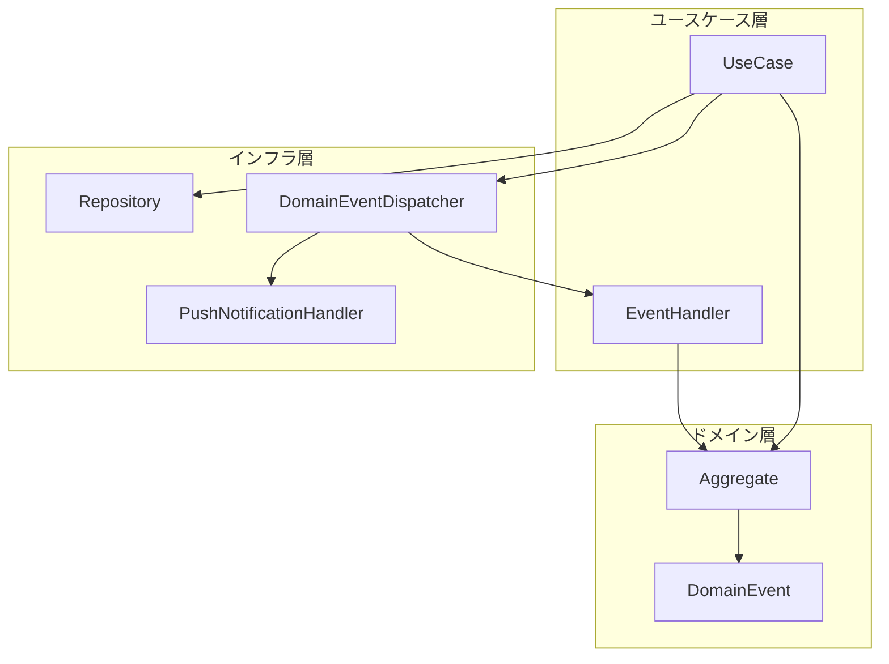
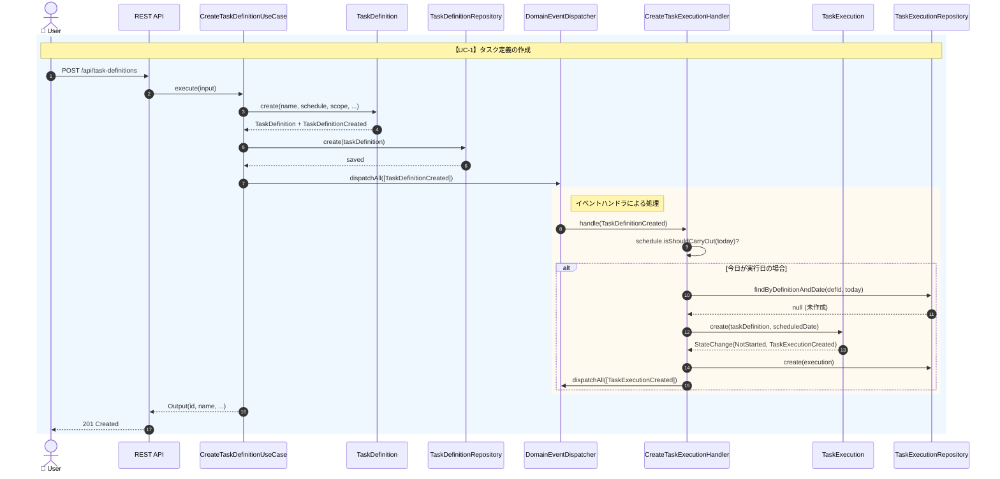
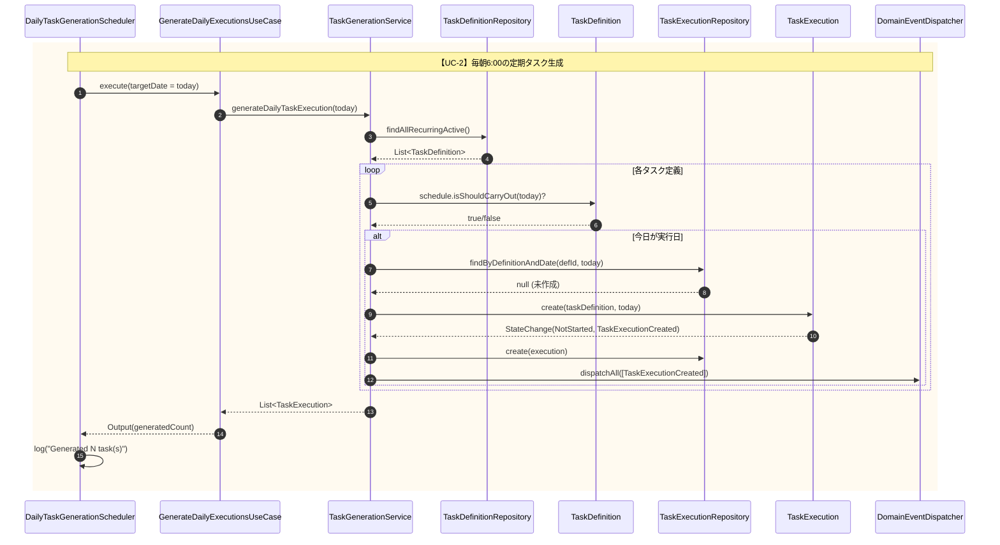
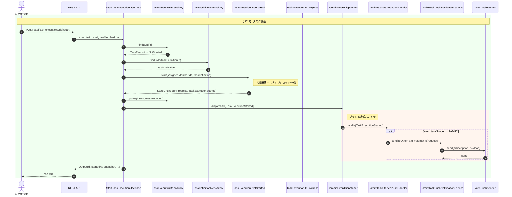
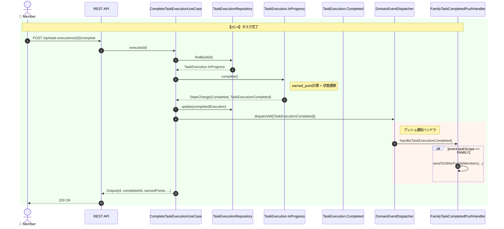
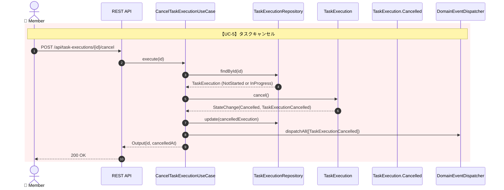
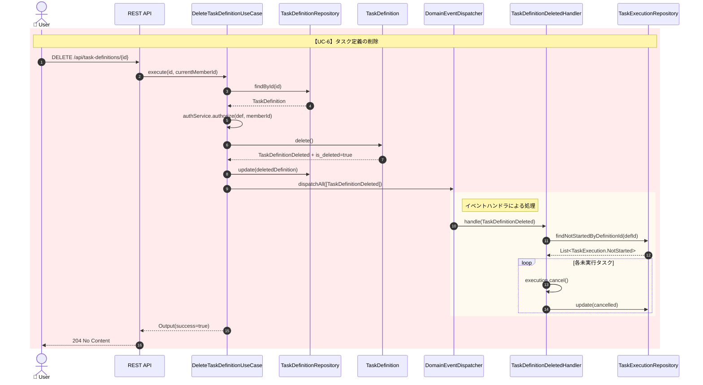
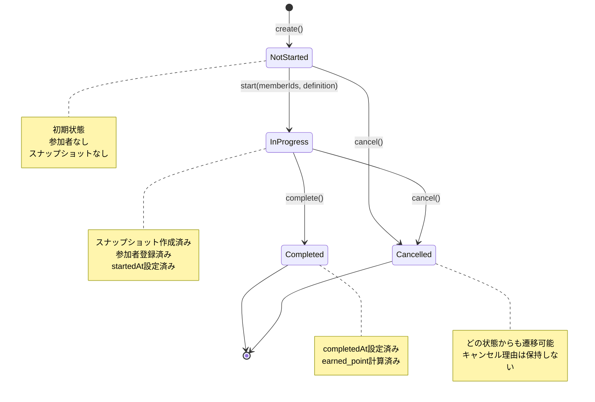
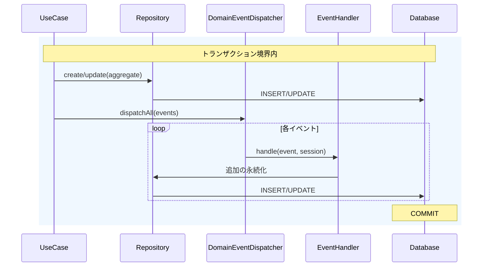

# シーケンス図

本ドキュメントでは、主要なユースケースにおけるドメインイベントの発行とハンドリングのフローを図示する。

---

## 概要：ドメインイベントフロー

---

## UC-1: タスク定義の作成

ユーザーがタスク定義を作成すると、`TaskDefinitionCreated`イベントが発行され、条件に応じてタスク実行が自動生成される。

---

## UC-2: 定期タスクの日次生成（スケジューラ）

毎朝6:00に`DailyTaskGenerationScheduler`が起動し、全ての定期タスク定義を走査してタスク実行を生成する。

---

## UC-3: タスクの開始

メンバーがタスクを開始すると、`TaskExecutionStarted`イベントが発行され、FAMILYスコープの場合は他の家族メンバーにプッシュ通知が送信される。

---

## UC-4: タスクの完了

メンバーがタスクを完了すると、`TaskExecutionCompleted`イベントが発行され、参加者にポイントが付与される。FAMILYスコープの場合はプッシュ通知も送信される。

---

## UC-5: タスクのキャンセル

メンバーがタスクをキャンセルすると、`TaskExecutionCancelled`イベントが発行される。

---

## UC-6: タスク定義の削除

タスク定義を論理削除すると、`TaskDefinitionDeleted`イベントが発行され、関連する未実行のタスク実行もキャンセルされる。

---

## 状態遷移図：TaskExecution

---

## ドメインイベント一覧

| イベント | 発行元 | トリガー | ハンドラ |
|---------|--------|----------|----------|
| `TaskDefinitionCreated` | TaskDefinition.create() | タスク定義作成 | CreateTaskExecutionOnTaskDefinitionCreatedHandler |
| `TaskDefinitionDeleted` | TaskDefinition.delete() | タスク定義削除 | TaskDefinitionDeletedHandler |
| `TaskExecutionCreated` | TaskExecution.create() | タスク実行生成 | (なし) |
| `TaskExecutionStarted` | TaskExecution.NotStarted.start() | タスク開始 | FamilyTaskStartedPushNotificationHandler |
| `TaskExecutionCompleted` | TaskExecution.InProgress.complete() | タスク完了 | FamilyTaskCompletedPushNotificationHandler |
| `TaskExecutionCancelled` | TaskExecution.cancel() | タスクキャンセル | (なし) |

---

## イベント発行タイミング

**重要**: イベントハンドラは同一トランザクション内で実行されるため、ハンドラ内の処理が失敗するとトランザクション全体がロールバックされる（強整合性）。
