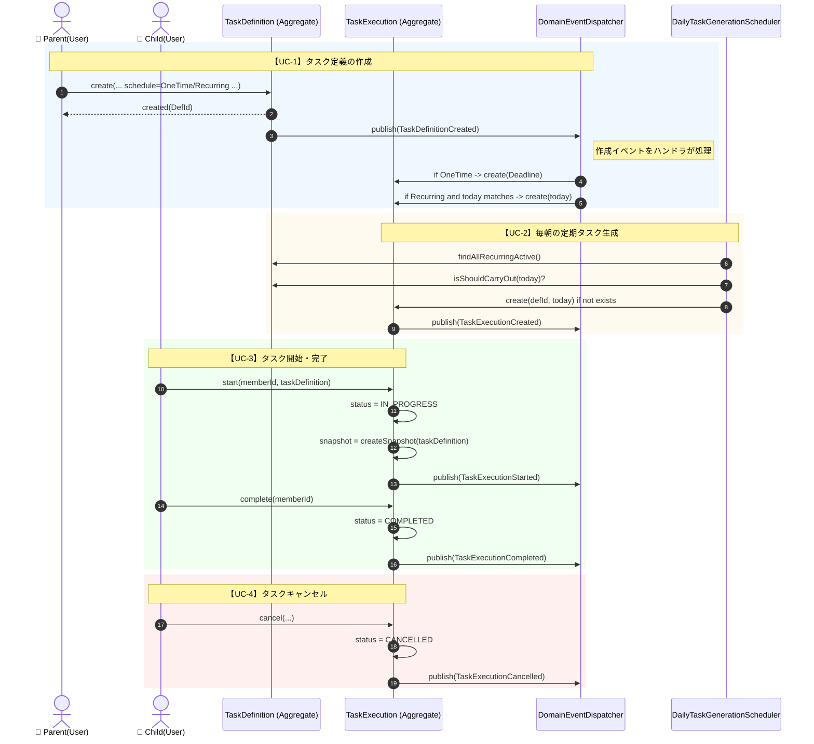

# シーケンス図

```mermaid
sequenceDiagram
    autonumber

    actor Parent as 👩 Parent(User)
    actor Child as 👦 Child(User)
    participant Def as TaskDefinition (Aggregate)
    participant Exec as TaskExecution (Aggregate)
    participant Bus as DomainEventDispatcher
    participant Scheduler as DailyTaskGenerationScheduler

    %% ============================================================
    %% UC-1: タスク定義の作成（単発/定期）
    %% ============================================================
    rect rgb(240, 248, 255)
        note over Parent, Bus: 【UC-1】タスク定義の作成
        Parent->>Def: create(... schedule=OneTime/Recurring ...)
        Def-->>Parent: created(DefId)
        Def->>Bus: publish(TaskDefinitionCreated)

        note right of Bus: 作成イベントをハンドラが処理
        Bus->>Exec: if OneTime -> create(Deadline)
        Bus->>Exec: if Recurring and today matches -> create(today)
    end

    %% ============================================================
    %% UC-2: 定期タスクの日次生成
    %% ============================================================
    rect rgb(255, 250, 240)
        note over Scheduler, Exec: 【UC-2】毎朝の定期タスク生成
        Scheduler->>Def: findAllRecurringActive()
        Scheduler->>Def: isShouldCarryOut(today)?
        Scheduler->>Exec: create(defId, today) if not exists
        Exec->>Bus: publish(TaskExecutionCreated)
    end

    %% ============================================================
    %% UC-3: タスク開始と完了
    %% ============================================================
    rect rgb(240, 255, 240)
        note over Child, Exec: 【UC-3】タスク開始・完了
        Child->>Exec: start(memberId, taskDefinition)
        Exec->>Exec: status = IN_PROGRESS
        Exec->>Exec: snapshot = createSnapshot(taskDefinition)
        Exec->>Bus: publish(TaskExecutionStarted)

        Child->>Exec: complete(memberId)
        Exec->>Exec: status = COMPLETED
        Exec->>Bus: publish(TaskExecutionCompleted)
    end

    %% ============================================================
    %% UC-4: タスクキャンセル
    %% ============================================================
    rect rgb(255, 240, 240)
        note over Child, Exec: 【UC-4】タスクキャンセル
        Child->>Exec: cancel(...)
        Exec->>Exec: status = CANCELLED
        Exec->>Bus: publish(TaskExecutionCancelled)
    end
```
