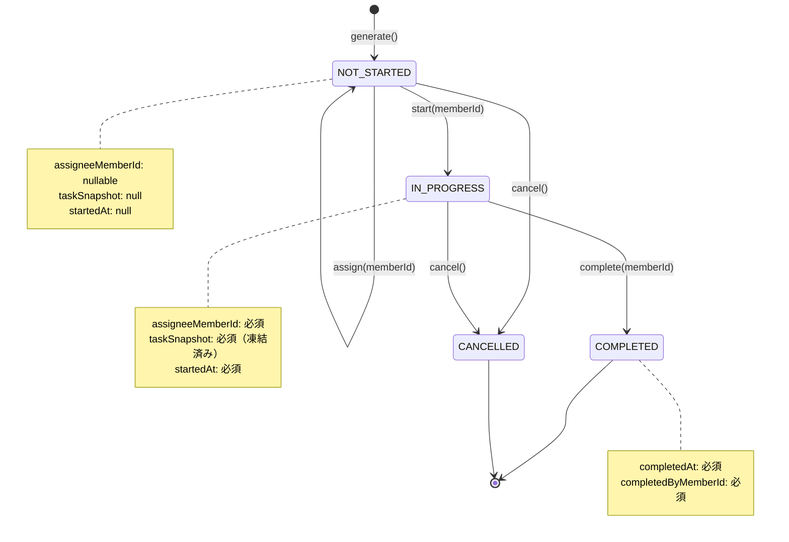

# TaskExecution API仕様書

このドキュメントは、TaskExecution機能を完成させるために必要なバックエンドAPIエンドポイントの詳細仕様を定義します。

## 目次

1. [概要](#概要)
2. [ドメインモデル](#ドメインモデル)
3. [エンドポイント一覧](#エンドポイント一覧)
4. [詳細仕様](#詳細仕様)
5. [型定義](#型定義)
6. [状態遷移図](#状態遷移図)
7. [実装チェックリスト](#実装チェックリスト)

---

## 概要

### 背景

TaskExecutionは、TaskDefinition（タスク定義）から生成される具体的なタスクの実行インスタンスです。家族のタスク管理において、「今日やるべきタスク」を表現し、その進捗状況（未着手/実行中/完了/キャンセル）を追跡します。

### 出典: 要件定義.md シーケンス図

```
【UC-2】本日のチケット生成
Scheduler->>Exec: create(defId, scheduledDate)
note: チケット発行時点ではスナップショットはまだ作成しない
      (status = NOT_STARTED, snapshot = null)
```

**つまり**: TaskDefinitionが「お風呂掃除は毎日やる」というルールを定義し、TaskExecutionが「2024年12月27日のお風呂掃除タスク」という具体的なインスタンスを表します。

---

## ドメインモデル

### 出典: 要件定義.md ドメインモデル図

```
TaskExecution (Sealed Class / Aggregate Root)
├── NotStarted
│   ├── assigneeMemberId?: MemberId (nullable)
│   ├── start(memberId, taskDef) -> InProgress
│   └── cancel() -> Cancelled
├── InProgress
│   ├── assigneeMemberId: MemberId (必須)
│   ├── taskSnapshot: TaskSnapshot (必須)
│   ├── startedAt: Instant (必須)
│   ├── complete(memberId) -> Completed
│   └── cancel() -> Cancelled
├── Completed (終端状態)
│   ├── completedAt: Instant (必須)
│   └── completedByMemberId: MemberId (必須)
└── Cancelled (終端状態)
    ├── cancelledAt: Instant
    └── assigneeMemberId?: nullable
```

### TaskSnapshot

```
TaskSnapshot (Value Object)
├── frozenName: String          // 着手時点のタスク名
├── frozenDescription: String   // 着手時点の説明
├── frozenEstimatedMinutes: Int // 着手時点の見積時間
├── definitionVersion: Int      // 元定義のバージョン
└── capturedAt: Instant        // スナップショット作成日時
```

**重要**: TaskSnapshotは`start()`時に作成されます。これにより、タスク実行中にTaskDefinitionが変更されても、「何を始めたか」の証拠が残ります。

---

## エンドポイント一覧

| エンドポイント | メソッド | 目的 | 実装状況 |
|--------------|---------|------|---------|
| `/api/task-executions` | GET | 一覧取得（フィルタ付き） | 未実装 |
| `/api/task-executions/{id}` | GET | 単一取得 | 未実装 |
| `/api/task-executions/{id}/assign` | POST | 担当者割り当て | 未実装 |
| `/api/task-executions/generate` | POST | バッチ生成 | 未実装 |
| `/api/task-executions/{id}/start` | POST | 開始 | 未実装 |
| `/api/task-executions/{id}/complete` | POST | 完了 | 未実装 |
| `/api/task-executions/{id}/cancel` | POST | キャンセル | 未実装 |

---

## 詳細仕様

### 1. 一覧取得 (GET /api/task-executions)

Dashboard画面で「今日のタスク」を表示するために必要です。

#### リクエスト

```
GET /api/task-executions?date=2024-12-27&status=NOT_STARTED&memberId=xxx&limit=20&offset=0
```

| パラメータ | 型 | 必須 | 説明 |
|-----------|-----|------|------|
| date | string (YYYY-MM-DD) | × | 実行予定日でフィルタ |
| status | string | × | ステータスでフィルタ（複数指定不可） |
| memberId | string (UUID) | × | 担当者IDでフィルタ |
| limit | number | × | 取得件数（デフォルト: 20） |
| offset | number | × | オフセット（デフォルト: 0） |

#### レスポンス

```json
{
  "taskExecutions": [
    {
      "id": "550e8400-e29b-41d4-a716-446655440000",
      "taskDefinitionId": "550e8400-e29b-41d4-a716-446655440001",
      "assigneeMemberId": "550e8400-e29b-41d4-a716-446655440002",
      "scheduledDate": "2024-12-27",
      "status": "IN_PROGRESS",
      "taskSnapshot": {
        "name": "お風呂掃除",
        "description": "浴槽と床を洗う",
        "estimatedMinutes": 15,
        "definitionVersion": 1,
        "createdAt": "2024-12-27T09:00:00Z"
      },
      "startedAt": "2024-12-27T09:00:00Z",
      "completedAt": null,
      "completedByMemberId": null,
      "createdAt": "2024-12-27T06:00:00Z",
      "updatedAt": "2024-12-27T09:00:00Z"
    }
  ],
  "total": 5,
  "hasMore": false
}
```

#### 注意事項

- `taskSnapshot`は`NOT_STARTED`状態の場合は`null`
- 論理削除されたTaskDefinitionに紐づくTaskExecutionも取得可能（履歴保持のため）

---

### 2. 単一取得 (GET /api/task-executions/{id})

タスク詳細画面、状態遷移後の最新情報取得に使用します。

#### リクエスト

```
GET /api/task-executions/550e8400-e29b-41d4-a716-446655440000
```

#### レスポンス

一覧取得の`taskExecutions`配列の1要素と同じ構造。

#### エラーレスポンス

```json
{
  "error": "TaskExecution not found"
}
```
HTTPステータス: 404

---

### 3. 担当者割り当て (POST /api/task-executions/{id}/assign)

`NOT_STARTED`状態のタスクに担当者を割り当てます。

#### 出典: 要件定義.md

```
class NotStarted {
    +MemberId? assigneeMemberId  // nullable = 割り当て前は空
    ...
}
```

#### リクエスト

```json
{
  "memberId": "550e8400-e29b-41d4-a716-446655440002"
}
```

#### レスポンス

更新後のTaskExecution（単一取得と同じ構造）

#### エラーレスポンス

| 条件 | HTTPステータス | error |
|-----|--------------|-------|
| TaskExecutionが見つからない | 404 | "TaskExecution not found" |
| NOT_STARTED以外の状態 | 400 | "Can only assign to NOT_STARTED task" |
| Memberが見つからない | 400 | "Member not found" |

---

### 4. バッチ生成 (POST /api/task-executions/generate)

TaskDefinitionのスケジュールに基づき、指定日のTaskExecutionを一括生成します。

#### 出典: 要件定義.md シーケンス図 UC-2

```
Scheduler->>Def: isScheduledFor(today)?
Def-->>Scheduler: true (実施日である)
Scheduler->>Exec: create(defId, scheduledDate)
```

#### リクエスト

```json
{
  "targetDate": "2024-12-27"
}
```

#### レスポンス

```json
{
  "generatedExecutions": [
    {
      "id": "...",
      "taskDefinitionId": "...",
      "assigneeMemberId": null,
      "scheduledDate": "2024-12-27",
      "status": "NOT_STARTED",
      "taskSnapshot": null,
      ...
    }
  ],
  "count": 3
}
```

#### 生成ロジック

1. 全ての有効な（isDeleted=false）TaskDefinitionを取得
2. 各TaskDefinitionのスケジュールを評価:
   - **Recurring (Daily)**: skipWeekendsを考慮して毎日
   - **Recurring (Weekly)**: 指定曜日のみ
   - **Recurring (Monthly)**: 指定日のみ
   - **OneTime**: deadline日のみ
3. 該当する日付の場合、TaskExecutionを生成
4. **PERSONALスコープ**の場合: `assigneeMemberId`に`ownerMemberId`を自動設定

#### 冪等性

同じ日付で複数回呼び出しても、既に存在するTaskExecutionは再生成しない（task_definition_id + scheduled_dateの組み合わせでユニーク）。

---

### 5. 開始 (POST /api/task-executions/{id}/start)

タスクを開始し、`NOT_STARTED` → `IN_PROGRESS`に遷移します。

#### 出典: 要件定義.md シーケンス図 UC-3

```
Child->>Exec: start(memberId, taskDefinition)
Exec->>Exec: assertStatus(NOT_STARTED)
Exec->>Exec: assigneeId = memberId
Exec->>Exec: taskSnapshot = createSnapshot(taskDefinition)
Exec->>Exec: status = IN_PROGRESS
```

#### リクエスト

```json
{
  "memberId": "550e8400-e29b-41d4-a716-446655440002"
}
```

#### 処理フロー

1. `NOT_STARTED`状態を検証
2. TaskDefinitionを取得（isDeleted=falseを検証）
3. `assigneeMemberId`を設定
4. **TaskSnapshotを作成**（重要）
5. `startedAt`を現在時刻に設定
6. `status`を`IN_PROGRESS`に変更

#### エラーレスポンス

| 条件 | HTTPステータス | error |
|-----|--------------|-------|
| TaskExecutionが見つからない | 404 | "TaskExecution not found" |
| NOT_STARTED以外の状態 | 400 | "Can only start NOT_STARTED task" |
| TaskDefinitionが削除済み | 400 | "TaskDefinition is deleted" |
| Memberが見つからない | 400 | "Member not found" |

---

### 6. 完了 (POST /api/task-executions/{id}/complete)

タスクを完了し、`IN_PROGRESS` → `COMPLETED`に遷移します。

#### 出典: 要件定義.md

```
Child->>Exec: complete(memberId)
Exec->>Exec: assertStatus(IN_PROGRESS)
Exec->>Exec: completedBy = memberId
Exec->>Exec: completedAt = now()
Exec->>Exec: status = COMPLETED
```

#### リクエスト

```json
{
  "memberId": "550e8400-e29b-41d4-a716-446655440002"
}
```

#### エラーレスポンス

| 条件 | HTTPステータス | error |
|-----|--------------|-------|
| TaskExecutionが見つからない | 404 | "TaskExecution not found" |
| IN_PROGRESS以外の状態 | 400 | "Can only complete IN_PROGRESS task" |
| Memberが見つからない | 400 | "Member not found" |

---

### 7. キャンセル (POST /api/task-executions/{id}/cancel)

タスクをキャンセルし、`NOT_STARTED`または`IN_PROGRESS` → `CANCELLED`に遷移します。

#### リクエスト

リクエストボディは不要（空オブジェクト `{}` を送信）

#### エラーレスポンス

| 条件 | HTTPステータス | error |
|-----|--------------|-------|
| TaskExecutionが見つからない | 404 | "TaskExecution not found" |
| 終端状態（COMPLETED/CANCELLED） | 400 | "Cannot cancel terminal state task" |

---

## 型定義

### バックエンド (Kotlin)

```kotlin
@Resource("api/task-executions")
class TaskExecutions {
    @Resource("")
    class List(
        val parent: TaskExecutions = TaskExecutions(),
        val date: String? = null,
        val status: String? = null,
        val memberId: String? = null,
        val limit: Int = 20,
        val offset: Int = 0
    ) {
        @Serializable
        data class Response(
            val taskExecutions: kotlin.collections.List<TaskExecutionDto>,
            val total: Int,
            val hasMore: Boolean
        )
    }

    @Resource("/{taskExecutionId}")
    class Get(
        val parent: TaskExecutions = TaskExecutions(),
        val taskExecutionId: String
    )

    @Resource("/{taskExecutionId}/assign")
    class Assign(
        val parent: TaskExecutions = TaskExecutions(),
        val taskExecutionId: String
    ) {
        @Serializable
        data class Request(val memberId: String)
    }

    @Resource("/generate")
    class Generate(
        val parent: TaskExecutions = TaskExecutions()
    ) {
        @Serializable
        data class Request(val targetDate: String)

        @Serializable
        data class Response(
            val generatedExecutions: kotlin.collections.List<TaskExecutionDto>,
            val count: Int
        )
    }

    @Resource("/{taskExecutionId}/start")
    class Start(
        val parent: TaskExecutions = TaskExecutions(),
        val taskExecutionId: String
    ) {
        @Serializable
        data class Request(val memberId: String)
    }

    @Resource("/{taskExecutionId}/complete")
    class Complete(
        val parent: TaskExecutions = TaskExecutions(),
        val taskExecutionId: String
    ) {
        @Serializable
        data class Request(val memberId: String)
    }

    @Resource("/{taskExecutionId}/cancel")
    class Cancel(
        val parent: TaskExecutions = TaskExecutions(),
        val taskExecutionId: String
    )
}

@Serializable
data class TaskExecutionDto(
    val id: String,
    val taskDefinitionId: String,
    val assigneeMemberId: String?,
    val scheduledDate: String,
    val status: String,
    val taskSnapshot: TaskSnapshotDto?,
    val startedAt: String?,
    val completedAt: String?,
    val completedByMemberId: String?,
    val createdAt: String,
    val updatedAt: String
)

@Serializable
data class TaskSnapshotDto(
    val name: String,
    val description: String?,
    val estimatedMinutes: Int,
    val definitionVersion: Int,
    val createdAt: String
)
```

### フロントエンド (TypeScript)

```typescript
// types/api.ts に追加

// ==========================================
// TaskExecution API Types
// ==========================================

export interface GetTaskExecutionsResponse {
  taskExecutions: TaskExecutionResponse[]
  total: number
  hasMore: boolean
}

export interface TaskExecutionResponse {
  id: string
  taskDefinitionId: string
  assigneeMemberId: string | null
  scheduledDate: string
  status: 'NOT_STARTED' | 'IN_PROGRESS' | 'COMPLETED' | 'CANCELLED'
  taskSnapshot: TaskSnapshotResponse | null
  startedAt: string | null
  completedAt: string | null
  completedByMemberId: string | null
  createdAt: string
  updatedAt: string
}

export interface TaskSnapshotResponse {
  name: string
  description: string | null
  estimatedMinutes: number
  definitionVersion: number
  createdAt: string
}

export interface StartTaskExecutionRequest {
  memberId: string
}

export interface CompleteTaskExecutionRequest {
  memberId: string
}

export interface AssignTaskExecutionRequest {
  memberId: string
}

export interface GenerateTaskExecutionsRequest {
  targetDate: string
}

export interface GenerateTaskExecutionsResponse {
  generatedExecutions: TaskExecutionResponse[]
  count: number
}
```

---

## 状態遷移図



---

## 実装チェックリスト

### バックエンド

- [ ] ドメイン層
  - [ ] `TaskExecution.kt` (Sealed Class)
  - [ ] `TaskExecutionId.kt` (Value Object)
  - [ ] `TaskSnapshot.kt` (Value Object)
  - [ ] `TaskExecutionRepository.kt` (Interface)
  - [ ] `TaskGenerationService.kt` (Domain Service)

- [ ] ユースケース層
  - [ ] `GetTaskExecutionsUseCase.kt`
  - [ ] `GetTaskExecutionUseCase.kt`
  - [ ] `AssignTaskExecutionUseCase.kt`
  - [ ] `GenerateTaskExecutionsUseCase.kt`
  - [ ] `StartTaskExecutionUseCase.kt`
  - [ ] `CompleteTaskExecutionUseCase.kt`
  - [ ] `CancelTaskExecutionUseCase.kt`

- [ ] インフラ層
  - [ ] `TaskExecutionRepositoryImpl.kt`

- [ ] プレゼンテーション層
  - [ ] `TaskExecutions.kt` (Routes)

### フロントエンド

- [x] 型定義
  - [x] `types/api.ts` にTaskExecution関連の型追加

- [x] API層
  - [x] `api/taskExecutions.ts` 作成

- [x] カスタムフック
  - [x] `hooks/useTaskExecution.ts` 作成

- [x] モックデータ
  - [x] `mocks/taskExecutions.ts` 作成

- [x] コンポーネント
  - [x] `Dashboard.tsx` のAPI統合対応

---

## 参考資料

- 要件定義.md - ドメインモデル図、シーケンス図
- CLAUDE.md - 技術スタック、コーディング規約
- backend/src/main/kotlin/com/task/presentation/TaskDefinitions.kt - 既存のAPI実装パターン
- frontend/src/types/api.ts - 既存の型定義パターン

